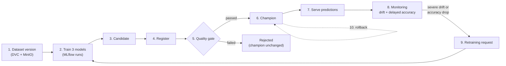
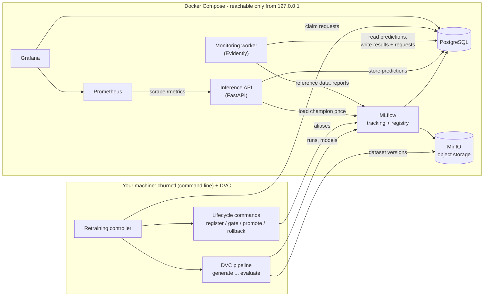

# Production ML Lifecycle Platform


A complete, fully local machine-learning platform that predicts which subscription
customers are about to cancel - and, more importantly, shows **everything that has to
happen around a model** so that it can be trusted in production: versioned data,
reproducible training, experiment tracking, a model registry, quality gates, controlled
promotion, online serving, monitoring, drift detection, automatic retraining and rollback.

Everything runs on one computer with Docker Compose. No cloud account is needed.

---

## Table of contents

- [What this project is](#what-this-project-is)
- [The problem it solves](#the-problem-it-solves)
- [How the lifecycle works, step by step](#how-the-lifecycle-works-step-by-step)
- [Main features](#main-features)
- [Technology stack](#technology-stack)
- [Architecture](#architecture)
- [Quick start](#quick-start)
- [The demo scenario](#the-demo-scenario)
- [Testing and verification](#testing-and-verification)
- [Stopping and cleaning up](#stopping-and-cleaning-up)
- [Repository layout](#repository-layout)
- [Limitations](#limitations)
- [Documentation](#documentation)

---

## What this project is

### The business question

A subscription company (think of a streaming service or a software product with monthly
plans) wants to know, for every active customer:

> **"How likely is it that this customer voluntarily cancels within the next 30 days?"**

If the company knows this early, it can act - offer a discount, fix a billing problem,
call the customer. The platform answers the question with a probability between 0 and 1
and a simple risk level (`low`, `medium`, `high`).

The answer is based only on what is known **today** about the customer, for example:

| What we know today | Example value |
|---|---|
| Plan and contract | `basic` plan, `monthly` contract |
| Tenure | customer for 3 months |
| Billing | 24.50 per month, price increased recently, 2 failed payments in 90 days |
| Usage | 4 hours of use this month, last login 21 days ago, usage falling by 40% |
| Support | 2 tickets, 1 complaint, 30 hours average resolution time |

For this customer the served model returns a churn probability of about **0.9996** and
the risk level **`high`**. A long-standing premium customer with a two-year contract,
autopay and daily logins gets about **0.009** and **`low`**.

### What the project really demonstrates

The prediction model itself is deliberately simple (logistic regression, random forest
and gradient boosting from scikit-learn). The focus of the project is the **machine
learning lifecycle** - the engineering that decides whether a model can be trusted, how it
reaches production, how it is watched once it is there, and how it is replaced or rolled
back safely:

```
versioned data -> reproducible training -> experiment tracking -> model registry
  -> quality gate -> promotion -> online predictions -> operational + ML monitoring
  -> drift detection -> controlled retraining -> rollback
```

Every stage exists as working code, configuration and tests. A complete scenario - from an
empty machine to a model that is automatically retrained after customer behaviour
changes, and then rolled back - runs in about ten minutes.

### Why the data is synthetic

Real customer data is private, and real data does not let you *choose* when the world
changes. This project contains a **simulated world** (a data generator with a hidden,
realistic churn logic). On a configured date - 1 January 2026 in simulated time - the world
changes: price increases become common and customers react to them much more strongly.
Because this change is controlled and reproducible, the platform can demonstrate drift
detection, delayed feedback and retraining with the same results on every run. The
monitoring and retraining components do **not** know about this date; they must discover
the change from the data, exactly as they would in a real company.

---

## The problem it solves

Most machine-learning examples end when a model reaches a good score in a notebook. In
real systems, most failures happen *after* that point. The platform turns each of these
common failure stories into an explicit, tested safeguard:

| What typically goes wrong | How this platform prevents or detects it |
|---|---|
| Nobody can say which data or code produced the model that is running | Every model version records the dataset hashes, the dataset date, the Git commit and the configuration it came from ([lineage](docs/experiment-tracking.md)) |
| Training data "knows the future", so the model looks better than it is | Time-aware data split with a safety gap, label-maturity checks and a list of forbidden "outcome" columns ([leakage controls](docs/leakage-controls.md)) |
| Production computes features differently from training | Feature engineering, preprocessing and the model are saved as **one** object; the API uses exactly that object ([training](docs/training-and-evaluation.md)) |
| A new model replaces a better one because nobody compared them fairly | An independent **quality gate** evaluates the new model and the current production model on the *same* recent data before any promotion ([quality gate](docs/quality-gate.md)) |
| A model file is corrupted or modified | Models are stored in a safe format and verified with a SHA-256 fingerprint on every load; unverified models are refused ([security](docs/security.md)) |
| The service is "up" but actually has no usable model | Separate liveness and readiness checks; the API reports "not ready" instead of serving without a verified model ([serving](docs/serving.md)) |
| Customer behaviour changes and nobody notices | A monitoring worker compares live inputs and predictions with the model's reference data using Evidently ([ML monitoring](docs/ml-monitoring.md)) |
| The true answer arrives weeks later and is never used | Predictions are stored, outcomes are attached when they become known, and real accuracy is measured then ([delayed ground truth](docs/delayed-ground-truth.md)) |
| Retraining runs on every small signal, or overwrites a good model | A policy decides when retraining is justified; the retrained model must still pass the gate; the current model stays in service until a better one is approved ([continuous training](docs/continuous-training.md)) |
| A bad model reached production and there is no quick way back | Rollback moves a registry pointer back to the previous approved model in seconds ([model lifecycle](docs/model-lifecycle.md)) |

---

## How the lifecycle works, step by step

The ten stages below describe one full turn of the lifecycle in plain words. Each stage
links to the document that explains it in detail.

1. **Create a dataset version.** The generator produces 12,000 customer snapshots as they
   would be exported from a company's data warehouse on a given date. The data is checked
   by 13 validation rules and split by time into training, validation and test periods.
   DVC stores the files in MinIO (a local, S3-compatible object store) and records their
   content hashes, so any version can be restored later.
   -> [data pipeline](docs/data-pipeline.md), [dataset versioning](docs/dataset-versioning.md)

2. **Train three models.** Logistic regression, random forest and gradient boosting are
   trained on the same data. Each one's decision threshold is tuned on the validation
   period. Every run - parameters, metrics, model file and data lineage - is recorded in
   MLflow. -> [training and evaluation](docs/training-and-evaluation.md)

3. **Pick a candidate.** The model with the best validation F1 score wins the training
   cycle and is evaluated once on the untouched test period. Winning only makes it a
   *candidate*; it is not trusted yet. -> [experiment tracking](docs/experiment-tracking.md)

4. **Register it.** The candidate becomes a numbered version in the MLflow Model Registry.
   Registration is refused if any lineage information is missing.
   -> [model lifecycle](docs/model-lifecycle.md)

5. **Check it with the quality gate.** Nine checks: minimum F1, recall and ROC-AUC,
   response time, quality in every important customer group, and a head-to-head
   comparison with the current production model on the same data. Passing makes the
   version a *challenger*. -> [quality gate](docs/quality-gate.md)

6. **Promote it.** The `champion` label (a registry *alias*) moves to the challenger. No
   files are copied; the switch is instant and can be undone.

7. **Serve predictions.** The FastAPI service loads the champion once at startup,
   verifies its fingerprint, and answers `POST /predict` requests. Every prediction is
   stored in PostgreSQL. Prometheus and Grafana show traffic, errors, latency and what the
   model predicts. -> [serving](docs/serving.md), [observability](docs/observability.md)

8. **Watch for change.** A monitoring worker compares recent live inputs and predictions
   with the model's reference data. It detects feature drift, prediction drift and data
   quality problems immediately, and measures real accuracy once the true outcomes
   arrive 30 days later. -> [ML monitoring](docs/ml-monitoring.md)

9. **Retrain when it is justified.** If the change is severe (or accuracy dropped), the
   monitoring policy files one retraining request. A controller trains new models on a
   newer data extract, registers the winner and runs the same quality gate. Only a model
   that beats the current one on the new data is promoted.
   -> [continuous training](docs/continuous-training.md)

10. **Roll back if needed.** One command points `champion` back to the previous approved
    version; the API picks it up on reload. -> [operations runbook](docs/operations.md)



---

## Main features

**Data**
- Deterministic synthetic customer data with three behaviour profiles (`baseline`,
  `pricing_shift`, `engagement_shift`) and a configurable timeline of when the world changes.
- A six-stage DVC pipeline (`generate -> validate -> prepare -> split -> train -> evaluate`);
  only stages whose inputs changed are re-run.
- Dataset versions stored in MinIO and restorable from Git + DVC.

**Training and tracking**
- Three algorithms per training cycle, fixed hyperparameters, F1-optimal decision thresholds.
- Metrics per customer segment (plan, contract, new vs. established customers) and a
  latency measurement for every candidate.
- Full lineage in MLflow: dataset hashes, dataset date, Git commit, configuration files.

**Governance**
- Registry aliases `candidate`, `challenger`, `champion` with an explicit set of allowed
  state changes.
- An independent, configurable quality gate; optional manual approval before promotion.
- Rollback to the previous approved champion; an audit trail of every lifecycle decision.

**Serving**
- FastAPI service with strict input validation (invalid requests never reach the model).
- Loads the champion once, verifies it, reports readiness honestly, records every prediction.
- Prometheus metrics and alert rules; a Grafana operations dashboard.

**Monitoring and continuous training**
- Evidently-based detection of feature, dataset and prediction drift, plus data-quality checks.
- Delayed ground truth: outcomes are attached after the 30-day window and real accuracy is measured.
- A retraining policy with severity levels, a cooldown and "one open request at a time".
- A retraining controller that cannot bypass the quality gate and never disturbs serving.

**Operations and security**
- One command (`churnctl bootstrap`) creates random secrets, starts and verifies the stack.
- Least-privilege database roles and storage keys, non-root containers, read-only file
  systems for the platform containers, all ports bound to `127.0.0.1`.
- 217 automated tests across five layers, including tests that restart and break real containers.

---

## Technology stack

| Technology | Role in this project | Why it was chosen |
|---|---|---|
| **Python 3.12**, **uv** | all platform code; reproducible environment from `uv.lock` | one language for data, ML, API and automation; uv is fast and locks exact versions |
| **pandas**, **NumPy** | data generation, validation, preparation | standard, readable data tooling |
| **scikit-learn** | preprocessing pipeline and the three models | mature, well understood, easy to serialise as one object |
| **DVC** | dataset versions and the reproducible pipeline | versions large files next to Git and re-runs only what changed, without a server |
| **MinIO** | S3-compatible storage for DVC data and MLflow artifacts | runs locally, same API as cloud object storage |
| **MLflow 3** | experiment tracking and model registry (aliases) | de-facto open-source standard; aliases make promotion and rollback instant |
| **PostgreSQL 18** | MLflow metadata; predictions, monitoring results, retraining requests, audit trail | one reliable database server with separate databases and roles |
| **FastAPI**, **Pydantic** | online prediction API and its request contract | typed validation, automatic API docs, simple to test |
| **Prometheus**, **Grafana** | operational metrics, alert rules, dashboards | standard monitoring stack; Grafana also reads monitoring results from PostgreSQL |
| **Evidently** | drift and data-quality analysis, HTML reports | purpose-built for ML monitoring |
| **Docker Compose** | runs all services locally with health checks | the simplest way to run a multi-service system on one machine |
| **pytest**, **ruff** | five layers of tests, linting | fast feedback and consistent code |

---

## Architecture



The design keeps responsibilities strictly apart:

- **Training never promotes.** The pipeline creates models; it cannot make them the champion.
- **Serving never trains or changes the registry.** The API only loads and uses the champion.
- **Monitoring never deploys.** It can only *ask* for retraining by creating a request.
- **The MLflow registry is the single source of truth** for which model is in production.
- **Administrative actions are local commands**, never HTTP endpoints of the public API.

Details: [architecture](docs/architecture.md), [how it works end to end](docs/how-it-works.md),
[design decisions](docs/design-decisions.md).

---

## Quick start

### Prerequisites

| Requirement | Notes |
|---|---|
| [Docker Desktop](https://www.docker.com/products/docker-desktop/) (or Docker Engine + Compose v2.20+) | give Docker about **6 GB of memory**; the containers are limited to about 4.7 GB in total |
| [uv](https://docs.astral.sh/uv/getting-started/installation/) 0.12 or newer | installs Python 3.12 and all dependencies from `uv.lock` |
| Git | DVC keeps dataset versions next to Git history |
| Free ports on `127.0.0.1` | 3000, 5000, 5432, 8000, 9000, 9001, 9090 |
| Disk space | about 8 GB for images, volumes and data |

The commands work in PowerShell, Command Prompt, bash and zsh. Run them from the
repository root.

### 1. Install the Python environment

```bash
uv sync
```

### 2. Start the platform

```bash
uv run churnctl bootstrap
```

This creates `.env` with random passwords, builds the images, starts all services, waits
until every health check passes and connects DVC to MinIO. The first run takes a few
minutes.

### 3. Build the first model and put it into production

```bash
uv run churnctl pipeline run
```

```bash
uv run churnctl model register
```

```bash
uv run churnctl model gate
```

```bash
uv run churnctl model promote
```

```bash
uv run churnctl serving reload
```

The last command should print `inference is ready and serving customer-churn-classifier
version 1`.

### 4. Ask for a prediction

bash, zsh or Git Bash:

```bash
curl -s -X POST http://127.0.0.1:8000/predict -H 'Content-Type: application/json' -d '{"customer_id": "C-1001", "snapshot_date": "2025-12-15", "features": {"plan_tier": "basic", "contract_type": "monthly", "autopay_enabled": false, "recent_price_increase": true, "tenure_months": 3, "monthly_charge": 24.5, "payment_failures_90d": 2, "late_payments_12m": 3, "monthly_usage_hours": 4.0, "sessions_30d": 3, "days_since_last_login": 21, "usage_trend_pct": -0.4, "support_tickets_90d": 2, "complaints_90d": 1, "avg_resolution_hours": 30.0, "features_adopted": 1}}'
```

PowerShell:

```powershell
$features = @{ plan_tier = "basic"; contract_type = "monthly"; autopay_enabled = $false; recent_price_increase = $true; tenure_months = 3; monthly_charge = 24.5; payment_failures_90d = 2; late_payments_12m = 3; monthly_usage_hours = 4.0; sessions_30d = 3; days_since_last_login = 21; usage_trend_pct = -0.4; support_tickets_90d = 2; complaints_90d = 1; avg_resolution_hours = 30.0; features_adopted = 1 }
Invoke-RestMethod -Method Post -Uri http://127.0.0.1:8000/predict -ContentType "application/json" -Body (@{ customer_id = "C-1001"; snapshot_date = "2025-12-15"; features = $features } | ConvertTo-Json -Depth 3)
```

Response:

```json
{
  "prediction_id": "6d608adc-df94-4213-b641-6d13a2f87915",
  "customer_id": "C-1001",
  "snapshot_date": "2025-12-15",
  "churn_prediction": true,
  "churn_probability": 0.999552,
  "risk_level": "high",
  "decision_threshold": 0.6,
  "model_name": "customer-churn-classifier",
  "model_version": "1"
}
```

You can also use the interactive API page at http://127.0.0.1:8000/docs.

### 5. Open the user interfaces

| Interface | Address | What you see | Login |
|---|---|---|---|
| Inference API docs | http://127.0.0.1:8000/docs | try the API in the browser | none |
| MLflow | http://127.0.0.1:5000 | experiments, runs, metrics, registered model versions | none |
| Grafana | http://127.0.0.1:3000 | *Churn Inference Operations* and *Churn Model Monitoring* dashboards | viewing needs no login; admin user `admin`, password `GRAFANA_ADMIN_PASSWORD` from `.env` |
| Prometheus | http://127.0.0.1:9090 | raw metrics and alert rules | none |
| MinIO console | http://127.0.0.1:9001 | stored models and dataset files | `MINIO_ROOT_USER` / `MINIO_ROOT_PASSWORD` from `.env` |

A complete setup guide with verification steps and environment variables is in
[docs/getting-started.md](docs/getting-started.md).

---

## The demo scenario

[docs/demo-walkthrough.md](docs/demo-walkthrough.md) runs the full lifecycle with real
output at every step: baseline traffic, a year of "shifted" traffic, drift detection,
delayed outcomes, automatic retraining, lineage inspection and rollback. Because the data
and training are seeded, you get the same numbers:

| Moment in the scenario | Result |
|---|---|
| First model (trained on pre-shift data) | test F1 **0.501** (a no-skill model scores 0.232), ROC-AUC **0.848** |
| Baseline production traffic | no drift, decision `no_action` |
| One simulated year after the pricing change | 7 of 16 inputs drifted, predicted churn share 22% -> 45%, **one** retraining request |
| Outcomes known 30 days later | real ROC-AUC fell to **0.796** |
| Retrained model vs. old champion on the new data | F1 **0.700 vs 0.643**, ROC-AUC **0.851 vs 0.764** -> promoted automatically |
| Rollback | version 1 is champion again within seconds |

---

## Testing and verification

| Layer | Count | What it protects | Command | Needs |
|---|---|---|---|---|
| Unit | 153 | rules: data generation, validation, leakage, split, metrics, quality gate, lifecycle states, policies | `uv run pytest` | nothing |
| Component | 19 | the HTTP contract of the API: validation, readiness, failure handling, metrics | `uv run pytest` | nothing |
| Integration | 21 | real MLflow, PostgreSQL, MinIO and DVC: storage, lineage, registry, monitoring, retraining | `uv run pytest -m integration` | running stack |
| End-to-end | 3 | initial lifecycle, drift-driven retraining, rollback - through the real CLI and a real server | `uv run pytest -m e2e` | running stack |
| Operational | 21 | the live containers: health, exposure, security boundaries, restarts, outages, corrupted models | `uv run pytest -m operational` | running stack with a champion |

Integration and end-to-end tests run in disposable sandboxes and never touch the demo
model. Full details: [docs/testing-strategy.md](docs/testing-strategy.md).

---

## Stopping and cleaning up

Stop everything but keep all data (models, runs, predictions, dataset versions):

```bash
uv run churnctl stack down
```

Start again later:

```bash
uv run churnctl stack up
```

Delete **everything** - containers, volumes, generated data and the DVC cache (your `.env`
file is kept):

```bash
uv run churnctl stack reset --yes
```

To repeat the demo from its first dataset version afterwards, set `dataset.as_of` in
`params.yaml` back to `"2026-01-01"` (the retraining step moves it forward) and run
`uv run churnctl bootstrap`.

---

## Repository layout

```
.
├── compose.yaml         all services of the local platform
├── dvc.yaml, dvc.lock   the data/training pipeline and the hashes of its outputs
├── params.yaml          the dataset version parameter (dataset.as_of)
├── config/              every policy: data, training, quality gate, serving, monitoring, retraining
├── deploy/              Dockerfiles, database/storage setup, Prometheus and Grafana provisioning
├── src/churn_platform/  the Python package (data, features, training, lifecycle, serving, monitoring, ...)
├── tests/               unit, component, integration, e2e and operational tests
├── reports/             small JSON outputs of the pipeline (tracked by Git)
└── docs/                detailed documentation
```

A module-by-module guide is in [docs/codebase-guide.md](docs/codebase-guide.md).

---

## Limitations

- **Single machine.** No high availability, no horizontal scaling, no backups beyond copying
  Docker volumes manually.
- **Local trust boundary.** MLflow, Prometheus and the prediction API have no
  authentication. Everything is reachable only from `127.0.0.1`, so the machine and its user
  are trusted. See [docs/security.md](docs/security.md).
- **Synthetic data.** The drift scenario is designed to be clear and reproducible, not to
  mirror a specific company.
- **Explicit reload.** A newly promoted model is served after `churnctl serving reload`;
  there is no hot swap inside a running service.
- **Local controller.** Retraining runs as a command in this repository, not as a scheduled
  service, and it does not commit the new dataset version to Git for you.

What would change for a real production deployment is described in
[docs/production-considerations.md](docs/production-considerations.md).

---

## Documentation

Start with [docs/README.md](docs/README.md) - it lists every document by the question it
answers and suggests a reading order.

| If you want to... | Read |
|---|---|
| understand the idea and the vocabulary | [project overview](docs/project-overview.md), [synthetic world](docs/synthetic-world.md), [glossary](docs/glossary.md), [FAQ](docs/faq.md) |
| install and run it | [getting started](docs/getting-started.md), [demo walkthrough](docs/demo-walkthrough.md) |
| understand the design | [architecture](docs/architecture.md), [how it works](docs/how-it-works.md), [design decisions](docs/design-decisions.md) |
| call or configure it | [API reference](docs/api-reference.md), [configuration reference](docs/configuration-reference.md) |
| operate it | [operations runbook](docs/operations.md), [CLI reference](docs/cli-reference.md), [failure recovery](docs/failure-recovery.md), [troubleshooting](docs/troubleshooting.md) |
| judge its quality and limits | [testing strategy](docs/testing-strategy.md), [security](docs/security.md), [production considerations](docs/production-considerations.md) |
