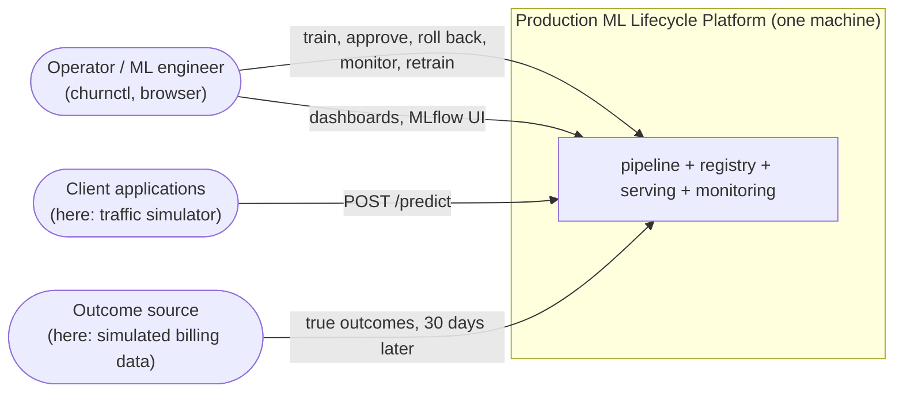
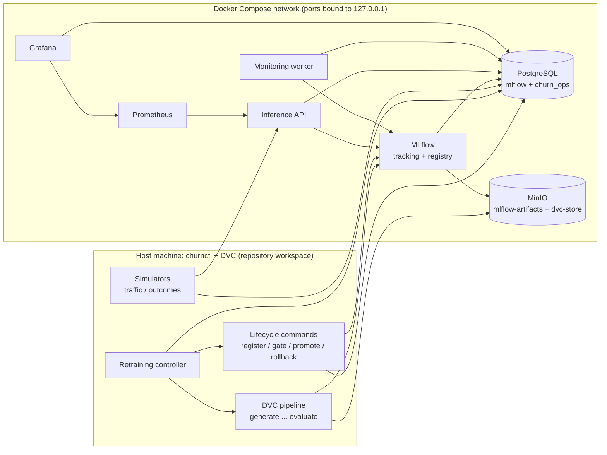
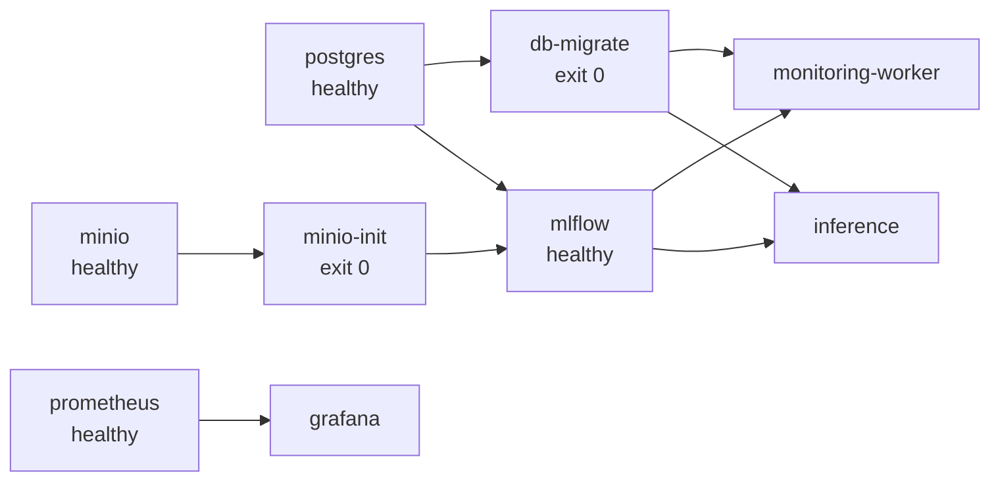
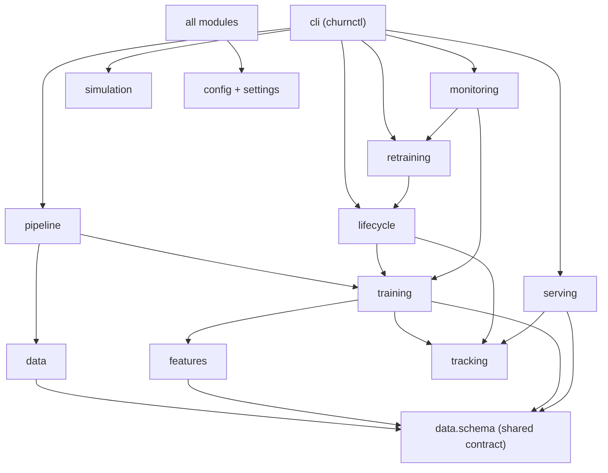

# Architecture

> **In short:** The platform consists of seven long-running services in Docker Compose
> (PostgreSQL, MinIO, MLflow, the inference API, a monitoring worker, Prometheus and
> Grafana), two one-shot setup containers, and a local command-line tool (`churnctl`) that
> runs the data pipeline and every administrative action. Each component has one clear
> responsibility, and the boundaries between them - who may train, who may promote, who may
> serve - are strict.

## Contents

- [Architectural goals](#architectural-goals)
- [System context](#system-context)
- [Components and responsibilities](#components-and-responsibilities)
- [Runtime view: containers and ports](#runtime-view-containers-and-ports)
- [Data stores](#data-stores)
- [How components communicate](#how-components-communicate)
- [Startup order and health checks](#startup-order-and-health-checks)
- [Code structure behind the components](#code-structure-behind-the-components)
- [Architecture invariants](#architecture-invariants)
- [Known architectural limits](#known-architectural-limits)

---

## Architectural goals

| Goal | How the architecture supports it |
|---|---|
| **Clear responsibilities** | training, promotion, serving and monitoring are separate processes with separate permissions |
| **Safety of production** | only one code path can change the production model, and it requires a passed quality gate |
| **Reproducibility** | data, pipeline and training are deterministic and versioned (Git + DVC + MLflow) |
| **Observability** | operational metrics (Prometheus) and ML monitoring (Evidently) are both built in |
| **Local-first simplicity** | one Docker Compose file, no cloud services, no cluster; one machine is enough |
| **Replaceability** | pipeline stages are plain Python functions, so the orchestrator can change without rewriting them |

---

## System context

Who and what interacts with the platform:

In this project the clients and the outcome source are simulators (`churnctl traffic send`,
`churnctl labels resolve`); in a real deployment they would be the company's applications
and its billing or CRM system.

---

## Components and responsibilities

| Component | Runs as | Responsible for | Deliberately not responsible for |
|---|---|---|---|
| **DVC pipeline** (`dvc.yaml`, `churn_platform.pipeline`) | local command | building dataset versions; training and evaluating models reproducibly | registering models or changing which model is in production |
| **Data modules** (`churn_platform.data`, pandas) | inside pipeline stages | generating, validating, preparing and splitting data | computing model features (that happens inside the model) |
| **Model pipeline** (`churn_platform.features`, scikit-learn) | inside every saved model | feature engineering + preprocessing + estimator as **one** object | - |
| **MLflow Tracking** | `mlflow` container | runs, parameters, metrics, artifacts, lineage tags | - |
| **MLflow Model Registry** | `mlflow` container | numbered model versions and the `candidate` / `challenger` / `champion` aliases | - |
| **Quality gate** (`churn_platform.lifecycle.quality_gate`) | local command | deciding whether a candidate may become challenger | moving the `champion` alias |
| **Promotion and rollback** (`churn_platform.lifecycle.promotion`) | local command | moving the `champion` alias after all checks | training |
| **Inference API** (`churn_platform.serving`) | `inference` container | online predictions, storing prediction observations, operational metrics | training, drift analysis, registry changes |
| **Monitoring worker** (`churn_platform.monitoring`) | `monitoring-worker` container | drift and data-quality analysis, delayed accuracy, retraining *requests* | training, registering, promoting |
| **Retraining controller** (`churn_platform.retraining`) | local command | turning a request into pipeline run -> candidate -> gate -> (maybe) promotion | promoting a model that failed the gate |
| **PostgreSQL** | `postgres` container | MLflow metadata; predictions, monitoring results, retraining requests, audit trail | storing model versions or aliases (the registry owns them) |
| **MinIO** | `minio` container | model files and reports; dataset versions | - |
| **Prometheus** | `prometheus` container | operational metrics and alert rules | statistical drift |
| **Grafana** | `grafana` container | dashboards (Prometheus + read-only PostgreSQL) | changing anything |
| **Simulators** (`churn_platform.simulation`) | local command | standing in for client apps and for the billing system | - |

**Why the lifecycle tools run on the host and not in containers.** The DVC pipeline works on
the Git repository (it reads `params.yaml`, writes `dvc.lock`, keeps a cache), so the
commands that run it - training, retraining - naturally live next to the repository. The
long-running services that must always be available - storage, tracking, serving,
monitoring, dashboards - run as containers.

---

## Runtime view: containers and ports

| Service | Image | Host port | Memory limit | Health check | Restart |
|---|---|---|---|---|---|
| `postgres` | `postgres:18.6-alpine` | 127.0.0.1:5432 | 512 MB | `pg_isready` on database `churn_ops` | unless stopped |
| `minio` | `quay.io/minio/minio:RELEASE.2025-09-07T16-13-09Z` | 127.0.0.1:9000 (S3 API), 127.0.0.1:9001 (console) | 512 MB | `mc ready local` | unless stopped |
| `minio-init` | `quay.io/minio/mc:RELEASE.2025-08-13T08-35-41Z` | - | - | one-shot: must exit 0 | no |
| `mlflow` | `churn-platform/mlflow:3.16.1` (built from `deploy/mlflow`) | 127.0.0.1:5000 | 1 GB | `GET /health` | unless stopped |
| `db-migrate` | `churn-platform/worker:1.0.0` | - | - | one-shot: must exit 0 | no |
| `inference` | `churn-platform/inference:1.0.0` | 127.0.0.1:8000 | 768 MB | `GET /health` | unless stopped |
| `monitoring-worker` | `churn-platform/worker:1.0.0` | - | 1 GB | none (a loop process) | unless stopped |
| `prometheus` | `prom/prometheus:v3.13.3` | 127.0.0.1:9090 | 512 MB | `GET /-/ready` | unless stopped |
| `grafana` | `grafana/grafana:13.0.9` | 127.0.0.1:3000 | 384 MB | `GET /api/health` | unless stopped |

The inference and worker images are two targets of the same Dockerfile
(`deploy/docker/platform.Dockerfile`), built from the locked dependencies: the inference
image contains only the serving libraries, the worker image only the monitoring libraries.

---

## Data stores

### PostgreSQL: one server, two databases, four application roles

| Database | Owner | Contents |
|---|---|---|
| `mlflow` | role `mlflow` | MLflow experiments, runs, metrics, registered models, aliases, tags |
| `churn_ops` | role `churn_ops` | schema `ops`: `prediction_observations`, `monitoring_runs`, `retraining_requests`, `lifecycle_events`, `schema_migrations`; schema `simulation`: `customer_outcomes` |

Two further roles have narrow rights: `churn_inference` may only insert into
`ops.prediction_observations`; `grafana_reader` may only read `ops` tables. The roles are
created on first start (`deploy/postgres/init/`), the tables by numbered SQL migrations
(`src/churn_platform/storage/migrations/`) applied by the `db-migrate` container.

### MinIO: two buckets with separate keys

| Bucket | Written by | Contents |
|---|---|---|
| `mlflow-artifacts` | only the MLflow server | model files, reference datasets, evaluation and gate reports, Evidently reports |
| `dvc-store` | DVC on the host | dataset versions (content-addressed files) |

Each bucket has its own access key that cannot touch the other bucket.

### Other state

- **Git working tree**: `params.yaml`, `dvc.lock`, `reports/*.json`, configuration.
- **DVC cache** (`.dvc/cache`): local copies of dataset files.
- **Prometheus volume**: 7 days of metrics. **Grafana volume**: Grafana's own settings.

Where each kind of information lives and who writes it: [how-it-works.md](how-it-works.md#where-information-lives).

---

## How components communicate

| From | To | Protocol / address | Purpose |
|---|---|---|---|
| host CLI, pipeline | MLflow | HTTP `127.0.0.1:5000` | tracking, registry, artifact upload/download |
| host CLI | PostgreSQL | TCP `127.0.0.1:5432` (role `churn_ops`) | audit events, monitoring, requests, outcomes |
| host DVC | MinIO | S3 over HTTP `127.0.0.1:9000` (DVC key) | push/pull dataset versions |
| traffic simulator | Inference API | HTTP `127.0.0.1:8000` | prediction requests |
| MLflow | PostgreSQL | `postgres:5432` (role `mlflow`) | metadata |
| MLflow | MinIO | `minio:9000` (MLflow key) | artifact storage behind MLflow's proxy |
| Inference API | MLflow | `mlflow:5000` | resolve and download the champion at startup |
| Inference API | PostgreSQL | `postgres:5432` (role `churn_inference`) | insert prediction observations |
| Monitoring worker | MLflow, PostgreSQL | `mlflow:5000`, `postgres:5432` (role `churn_ops`) | reference data, reports, observations, results |
| Prometheus | Inference API | `inference:8000/metrics` every 5 s | scrape metrics |
| Grafana | Prometheus, PostgreSQL | `prometheus:9090`, `postgres:5432` (role `grafana_reader`) | dashboards |

Two details matter:

- **All model files pass through MLflow.** Clients never talk to the `mlflow-artifacts`
  bucket directly; MLflow's artifact proxy does. Only the MLflow server holds that bucket's
  key ([design decision 3](design-decisions.md#3-artifacts-only-through-the-mlflow-proxy)).
- **Serving talks to MLflow only at startup.** Once the champion is loaded, the API keeps
  working even if MLflow is down.

---

## Startup order and health checks

Compose starts services in dependency order and waits for health checks:

The API's Docker health check uses `/health` (liveness), not `/ready`. A missing champion
therefore does not make Docker restart the container in a loop; readiness reports the real
state instead ([serving.md](serving.md#health-endpoints)).

---

## Code structure behind the components

All components share one Python package, `churn_platform`, which keeps the rules in one
place (for example, the feature schema used by validation, preprocessing and the API
contract). Heavy libraries are imported only where needed, so the inference image does not
contain the monitoring libraries and vice versa.

A module-by-module description is in [codebase-guide.md](codebase-guide.md).

---

## Architecture invariants

These rules hold everywhere. They are enforced by how the code is structured and checked by
the tests listed.

| Invariant | Enforced by | Checked by |
|---|---|---|
| Training never promotes | the `train`/`evaluate` stages contain no registry code; versions appear only through `churnctl model register` | code structure; integration tests register explicitly after training |
| Serving never trains or changes the registry | the API only loads models; its OpenAPI schema has no lifecycle routes | operational test on the running container |
| Monitoring never deploys | the monitoring package imports only the retraining *policy* and *request* modules, never promotion code | code structure; integration tests check that monitoring creates exactly one request |
| The registry is the single source of truth | aliases decide; the audit table is never read for decisions | code structure (`lifecycle/registry.py`) |
| A failed candidate never removes the champion | the alias moves only in the final promotion step after a passed gate | integration + E2E tests |
| Preprocessing and model are one artifact | the model pipeline contains feature engineering | unit test comparing API input with training rows |
| Accuracy is measured only with true outcomes | performance metrics require resolved outcomes | unit + integration tests |
| Administrative actions stay local | lifecycle operations exist only as CLI commands | operational test |

---

## Known architectural limits

- **Single instances.** One API worker, one MLflow server, one database - no failover.
- **No authentication inside the trust boundary.** MLflow, Prometheus and the API accept any
  local caller ([security.md](security.md)).
- **Local controller.** Retraining runs when an operator (or a scheduler you add) calls
  `churnctl retrain run`.
- **Explicit reload.** A new champion is served after `churnctl serving reload`.

How each limit would be addressed in production: [production-considerations.md](production-considerations.md).
