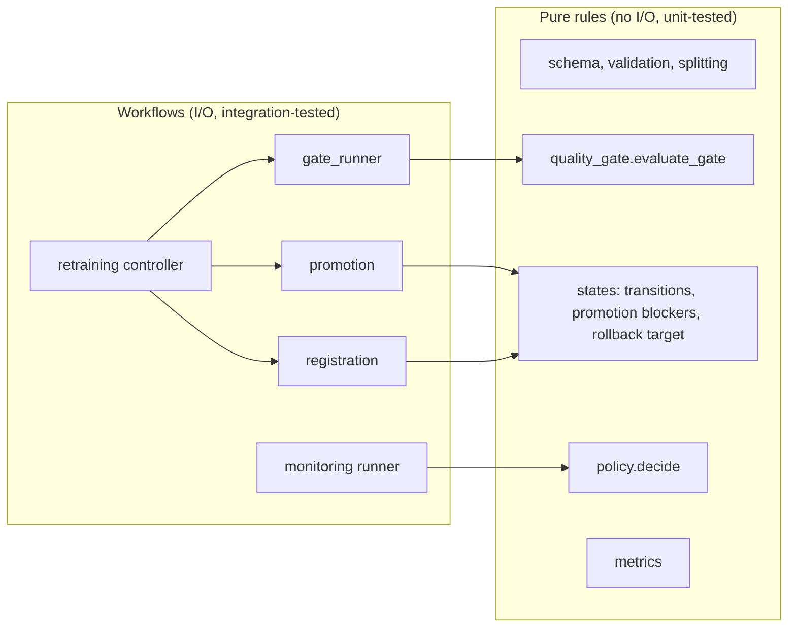

# Codebase guide

> **In short:** All platform code is one Python package, `churn_platform`, in
> `src/churn_platform/`. Its sub-packages follow the lifecycle: `data` -> `features` ->
> `training` -> `tracking` -> `lifecycle` -> `serving` -> `monitoring` -> `retraining`, plus
> `cli`, `pipeline`, `simulation` and `storage`. The rules (validation, gate, policy, state
> transitions) live in small modules without any I/O, which makes them easy to read and test.

## Contents

- [Repository layout](#repository-layout)
- [The Python package](#the-python-package)
- [Pure rules vs. workflows](#pure-rules-vs-workflows)
- [Shared contracts](#shared-contracts)
- [Tests](#tests)
- [Common changes](#common-changes)
- [Coding conventions](#coding-conventions)

---

## Repository layout

```
.
├── README.md                 project introduction
├── compose.yaml              the local platform: 7 services + 2 setup containers
├── pyproject.toml, uv.lock   Python project, dependencies (locked), pytest and ruff settings
├── dvc.yaml                  the six-stage data and training pipeline
├── dvc.lock                  content hashes of the current pipeline outputs (written by DVC)
├── params.yaml               dataset version parameter: dataset.as_of
├── .env.example              template for secrets (bootstrap creates .env from it)
├── config/                   all policies (see configuration-reference.md)
│   ├── data.yaml             generator, profiles, timeline, split, validation
│   ├── training.yaml         algorithms, threshold search, segments, reference size
│   ├── quality_gate.yaml     promotion checks and thresholds
│   ├── serving.yaml          risk levels, persistence policy, model-load retry
│   ├── monitoring.yaml       windows, drift methods and thresholds, worker interval
│   └── retraining.yaml       retraining policy and controller settings
├── deploy/
│   ├── docker/platform.Dockerfile   builds the inference and worker images
│   ├── mlflow/                      MLflow server image + pinned requirements
│   ├── postgres/init/               first-start script: databases and roles
│   ├── minio/init.sh                buckets and bucket-scoped users
│   ├── prometheus/                  scrape configuration and alert rules
│   └── grafana/                     data sources and the two dashboards
├── data/                     pipeline data files (managed by DVC, ignored by Git)
├── reports/                  small JSON results of the pipeline (tracked by Git)
├── src/churn_platform/       the Python package (below)
├── tests/                    unit / component / integration / e2e / operational
└── docs/                     this documentation
```

---

## The Python package

### Foundation

| Module | Responsibility |
|---|---|
| `settings.py` | reads environment variables and `.env`: service addresses, database URL, model and experiment names, workspace location |
| `config.py` | loads every `config/*.yaml` file into strict Pydantic models; rejects unknown keys and invalid values |
| `storage/db.py` + `storage/migrations/*.sql` | PostgreSQL connections and the numbered schema migrations of the operations database |

### Data

| Module | Responsibility |
|---|---|
| `data/schema.py` | **the shared contract**: column names, categories, value ranges, nullable columns, the leakage denylist |
| `data/generator.py` | the synthetic world: customer features, the hidden churn logic, per-row profiles |
| `data/validation.py` | the 13 dataset checks; returns a report instead of stopping at the first problem |
| `data/preparation.py` | fixes column order and types, sorts by time |
| `data/splitting.py` | time-aware split with purging |

### Pipeline

| Module | Responsibility |
|---|---|
| `pipeline/stages.py` | the six DVC stages as plain functions; file hashing |
| `pipeline/paths.py` | the file locations the stages share with `dvc.yaml` |
| `pipeline/__main__.py` | lets DVC call `python -m churn_platform.pipeline <stage>` |

### Features and training

| Module | Responsibility |
|---|---|
| `features/engineering.py` | `FeatureEngineer`: selects the 16 features, fixes types, adds 4 derived features |
| `features/preprocessing.py` | builds the full model pipeline; the list of types the safe model format may load |
| `training/algorithms.py` | creates the three classifiers from configuration |
| `training/metrics.py` | classification metrics, threshold selection, segment metrics, no-skill baseline |
| `training/cycle.py` | the `train` stage: fit, tune threshold, log runs to MLflow, pick the winner |
| `training/evaluation.py` | the `evaluate` stage (also reused by the quality gate): test metrics, segments, latency, reference data |

### Tracking

| Module | Responsibility |
|---|---|
| `tracking/mlflow_setup.py` | one configuration for every MLflow client (proxied artifacts, quiet output) |
| `tracking/model_io.py` | save a model, compute its fingerprint, load and verify it (`LoadedModel`) |
| `tracking/lineage.py` | dataset hashes, Git revision and the list of required lineage tags |

### Lifecycle (governance)

| Module | Responsibility |
|---|---|
| `lifecycle/states.py` | aliases, statuses, allowed transitions, promotion blockers, rollback target choice (**pure**) |
| `lifecycle/quality_gate.py` | the gate decision from two evaluations and a policy (**pure**) |
| `lifecycle/registry.py` | the only code that writes registry versions, aliases and tags |
| `lifecycle/registration.py` | checks a run's metadata and registers it as candidate (idempotent) |
| `lifecycle/gate_runner.py` | loads candidate and champion, evaluates both on the same data, records the decision |
| `lifecycle/promotion.py` | promotion and rollback workflows |
| `lifecycle/audit.py` | the lifecycle event log |

### Serving

| Module | Responsibility |
|---|---|
| `serving/app.py` | the FastAPI application: endpoints, middleware, startup |
| `serving/schemas.py` | request/response models built from the shared schema |
| `serving/model_state.py` | loads the champion once, verifies it, retries until the first success |
| `serving/observations.py` | stores each prediction in PostgreSQL |
| `serving/metrics.py` | the Prometheus metrics |
| `serving/risk.py` | risk levels from probability and threshold |

### Monitoring, retraining and simulation

| Module | Responsibility |
|---|---|
| `monitoring/datasets.py` | builds reference and current data from MLflow and PostgreSQL |
| `monitoring/analysis.py` | runs Evidently and turns its results into drift, quality and performance summaries |
| `monitoring/runner.py` | one monitoring cycle: analyse, decide, store, report |
| `retraining/policy.py` | the retraining decision (**pure**) |
| `retraining/requests.py` | create, claim and close retraining requests in PostgreSQL |
| `retraining/controller.py` | the retraining workflow |
| `simulation/traffic.py` | simulated customers sent to the API, with hidden outcomes |
| `simulation/outcomes.py` | delayed ground truth: reveals outcomes whose window closed |

### Command line

`cli/main.py` builds `churnctl` from one module per command group: `stack.py`
(bootstrap/stack), `pipeline.py` (pipeline/db), `model.py`, `serving.py`, `simulate.py`
(traffic/labels), `monitor.py`, `retrain.py`, plus `common.py` for shared helpers.

---

## Pure rules vs. workflows

The code separates **decisions** from **actions**:



A workflow collects facts (from MLflow, PostgreSQL, files), asks a pure function for a
decision and then applies it. This is why every rule - every gate check, every policy
branch, every allowed state change - has fast, focused unit tests, while the integration
tests only need to prove the wiring.

---

## Shared contracts

Some definitions must be identical in several places. Each exists exactly once:

| Contract | Defined in | Used by |
|---|---|---|
| Feature names, categories, value ranges, nullable columns | `data/schema.py` | generator, validation, preparation, `FeatureEngineer`, API request model, monitoring |
| Feature engineering and preprocessing | `features/` (saved inside every model) | training, evaluation, gate, serving, monitoring reference |
| Decision threshold | model metadata | evaluation, gate, serving |
| Model loading and verification | `tracking/model_io.load_model` | evaluation, gate, promotion, rollback, serving |
| MLflow client behaviour | `tracking/mlflow_setup.configure_mlflow` | every MLflow user |
| Lineage tags a model must have | `tracking/lineage.REQUIRED_LINEAGE_TAGS` | training, registration |

---

## Tests

```
tests/
├── unit/          pure rules and small components (no infrastructure)
├── component/     the FastAPI app over HTTP with in-process fakes
├── integration/   real MLflow, PostgreSQL, MinIO and DVC, in sandboxes
├── e2e/           complete workflows through the CLI and a real server
├── operational/   the live containers: health, security, restarts, outages
└── support/       shared helpers: sample data, sandboxes, processes, stack control
```

See [testing-strategy.md](testing-strategy.md) for what each layer protects.

---

## Common changes

### Add an algorithm

1. Add a factory entry in `training/algorithms.py` and the name to `SUPPORTED_ALGORITHMS` in
   `config.py`.
2. Configure its hyperparameters under `algorithms` in `config/training.yaml`.
3. Run `uv run pytest`. If the safe model format reports new internal object types, add them
   to `TRUSTED_MODEL_TYPES` in `features/preprocessing.py` - the round-trip test fails until
   you do.

### Add a feature

1. Add the column and its value range to `data/schema.py` and bump
   `FEATURE_SCHEMA_VERSION`.
2. Generate it in `simulate_customers` in `data/generator.py`. If it should influence churn,
   add a term to `true_churn_probability`, a coefficient to `ChurnModelParams` in
   `config.py` and a value to the profiles' `churn_model` in `config/data.yaml`.
3. Add the field to `CustomerFeatures` in `serving/schemas.py`. The contract test fails if the
   API and the schema disagree.

### Add a quality-gate check

1. Add the threshold to the policy model in `config.py` and to `config/quality_gate.yaml`.
2. Add the check in `lifecycle/quality_gate.py`.
3. Add unit tests for pass, fail and the exact boundary in `tests/unit/test_quality_gate.py`.

### Change the retraining policy

Change thresholds in `config/retraining.yaml`. For a new kind of evidence, extend
`MonitoringSignal` and `decide` in `retraining/policy.py`, fill the new field in
`monitoring/runner.py` and add unit tests.

### Add a table or column to the operations database

Add a new numbered SQL file in `storage/migrations/` (for example
`003_add_campaign_column.sql`) and run `uv run churnctl db migrate`. Never edit a migration
that has already been applied.

### Add a Prometheus metric or dashboard panel

Metrics are declared in `serving/metrics.py` and updated in `serving/app.py`. Dashboards are
JSON files in `deploy/grafana/dashboards/`; Grafana loads them on start (they are read-only
in the UI).

---

## Coding conventions

- Every important file starts with a short comment explaining why it exists and how it fits
  into the platform.
- Policy values live in `config/`, never as numbers in code.
- Heavy libraries (MLflow, Evidently) are imported inside the functions that need them, so the
  CLI starts quickly and each container image carries only what it uses.
- Lint with `uv run ruff check src tests` (rules and line length are configured in
  `pyproject.toml`).
