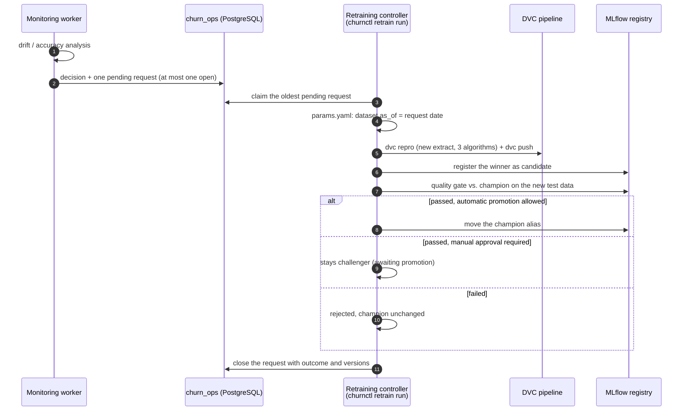

# Continuous training

> **In short:** Retraining is driven by evidence, performed by a separate controller, and held
> to the same quality gate as any other model. Monitoring only *asks* for retraining by
> creating a request; the controller then builds a newer dataset, trains all three
> algorithms, registers the winner and runs the gate against the current champion on the new
> data. Only a model that passes is promoted. Nothing in this process can remove the
> champion or interrupt serving.

## Contents

- [The flow at a glance](#the-flow-at-a-glance)
- [When a request is created](#when-a-request-is-created)
- [Retraining requests](#retraining-requests)
- [What the controller does](#what-the-controller-does)
- [Outcomes](#outcomes)
- [Failure semantics and safe retries](#failure-semantics-and-safe-retries)
- [Manual requests](#manual-requests)
- [Workspace changes to commit](#workspace-changes-to-commit)
- [Configuration](#configuration)
- [Limitations](#limitations)

---

## The flow at a glance



---

## When a request is created

At the end of every analysed monitoring cycle, the retraining policy
(`churn_platform/retraining/policy.py`) looks at the findings and decides. The rules are
applied in this order:

| # | Situation | Decision |
|---|---|---|
| 1 | fewer than **500** observations in the window | `insufficient_data` |
| 2 | a **data-quality** issue was found | `blocked` - "investigate before retraining" |
| 3 | production **F1 dropped by more than 0.05** vs. the test F1 (needs 200+ outcomes) | trigger |
| 4 | production **recall dropped by more than 0.10** vs. the test recall | trigger |
| 5 | **at least 25%** of the features drifted **and** the prediction distribution moved | trigger |
| 6 | no trigger, but some drift | `watch` |
| 7 | no trigger, no drift | `no_action` |
| 8 | a trigger, but a request is already **open** (pending or running) | `blocked` |
| 9 | a trigger within **12 hours** of the last request (cooldown) | `blocked` |
| 10 | a trigger otherwise | `request_retraining` |

Why these rules:

- **Severity, not sensitivity.** Mild drift is recorded ("watch") but does not start
  retraining; changed inputs alone do not prove the model is worse.
- **Accuracy trumps drift.** A measured accuracy drop is the strongest evidence and triggers
  retraining even without drift.
- **Never learn from broken data.** A data-quality issue blocks retraining - retraining would
  bake the problem into the next model.
- **No loops.** One open request per model and a cooldown prevent the same drift from
  creating request after request.

---

## Retraining requests

Requests live in `ops.retraining_requests`:

| Column | Meaning |
|---|---|
| `request_id`, `created_at` | identity and time |
| `trigger` | `policy` (from monitoring) or `manual` (from an operator) |
| `reasons` | the evidence, e.g. "drift: 44% of features drifted and the prediction distribution shifted" |
| `monitoring_run_id` | the monitoring run that created it |
| `data_as_of` | the dataset extract date to train on: the newest snapshot date in the monitored window |
| `status` | `pending` -> `running` -> `completed` or `failed` |
| `attempts` | how often it was started |
| `outcome`, `candidate_version`, `champion_version_before`, `champion_version_after` | what happened |
| `error` | the last lines of the error for failed requests |

A **partial unique index** in PostgreSQL allows only one `pending` or `running` request per
model. Even two monitoring processes racing each other cannot create a duplicate.

```bash
uv run churnctl retrain status
```

shows the recent requests.

---

## What the controller does

```bash
uv run churnctl retrain run
```

1. **Claim.** Atomically moves the oldest `pending` request to `running`. A `running` request
   older than 60 minutes counts as abandoned and can be claimed again. The database lock
   (`FOR UPDATE SKIP LOCKED`) guarantees that two controllers never work on the same request.
2. **Move the data window.** Sets `dataset.as_of` in `params.yaml` to the request's
   `data_as_of`. The file's comments are preserved and the result is re-read to confirm it.
3. **Run the pipeline.** `dvc repro` generates the new extract, validates and splits it,
   trains all three algorithms and evaluates the winner.
4. **Store the data version.** `dvc push` uploads the new dataset files to MinIO.
5. **Register.** The winner becomes the new `candidate` version.
6. **Gate.** The candidate and the current champion are evaluated on the **new** test period
   (the newest data) with all nine checks ([quality-gate.md](quality-gate.md)).
7. **Decide.** Passed and automatic promotion allowed -> promote. Passed but manual approval
   required -> leave it as challenger. Failed -> rejected, champion untouched.
8. **Close.** The request becomes `completed` with its outcome and the champion version
   before and after.

With `--reload-serving`, the command restarts the inference service after a promotion so the
new champion serves immediately. Without it, it prints the reload hint and the API keeps
serving the previous model.

---

## Outcomes

| Outcome | Meaning | Champion |
|---|---|---|
| `promoted` | the new model passed the gate and was promoted | new version |
| `awaiting_promotion` | passed, but manual approval is required | unchanged until `churnctl model promote --approved-by ...` |
| `rejected` | the new model failed the gate | unchanged |
| `unchanged` | DVC reused every stage - the champion was already trained on exactly this data | unchanged |
| `failed` | a step raised an error (pipeline, push, registry, ...) | unchanged |

Example from the demo:

```json
{
  "outcome": "promoted",
  "candidate_version": "2",
  "champion_before": "1",
  "champion_after": "2",
  "detail": "passed the quality gate and was promoted"
}
```

---

## Failure semantics and safe retries

- **Only the last step can move the champion.** Every earlier failure - pipeline, push,
  registration, gate - leaves the `champion` alias exactly where it was.
- **Serving is never involved.** The API keeps serving its loaded model during and after
  retraining. The end-to-end test checks that it stays ready and serves the old version
  throughout.
- **Failures are visible.** The request becomes `failed` with the error message
  (`churnctl retrain status`, Grafana).
- **Retrying is safe.** Every step can be repeated: DVC skips stages whose inputs did not
  change, registration returns the existing version for a known run, and the gate and
  promotion re-check the registry state.

Retry a failed request after fixing the cause:

```bash
uv run churnctl retrain run --request-id <request-id>
```

The integration tests exercise exactly this: a request fails because of a broken training
configuration (champion unchanged, no version registered), the configuration is fixed, and
the retried request completes with `attempts = 2`.

---

## Manual requests

Operators can ask for retraining without waiting for monitoring:

```bash
uv run churnctl retrain request --reason "new pricing campaign" --data-as-of 2026-12-31
```

A manual request bypasses the policy thresholds and the cooldown, but not the "one open
request per model" rule. Without `--data-as-of`, the newest production snapshot date is used
(or the current `params.yaml` date if there are no predictions yet).

---

## Workspace changes to commit

The controller changes `params.yaml`, `dvc.lock` and `reports/*.json` in the repository
working tree. Commit them to record the new dataset version in Git
([dataset-versioning.md](dataset-versioning.md#creating-a-new-version)). To repeat the demo
from the first dataset version, set `dataset.as_of` back to `"2026-01-01"`.

---

## Configuration

`config/retraining.yaml`:

| Key | Default | Meaning |
|---|---|---|
| `policy.min_observations` | 500 | minimum window size for any decision |
| `policy.severe_drift_share` | 0.25 | share of drifted features that can trigger retraining |
| `policy.require_prediction_drift` | true | severe feature drift must also move the predictions |
| `policy.max_f1_drop` | 0.05 | F1 drop that triggers retraining |
| `policy.max_recall_drop` | 0.10 | recall drop that triggers retraining |
| `policy.block_on_data_quality_issues` | true | never retrain on flagged data |
| `policy.cooldown_hours` | 12 | minimum time between requests |
| `controller.auto_promote` | true | promote a passing candidate automatically |
| `controller.stale_after_minutes` | 60 | when a `running` request counts as abandoned |
| `controller.push_data` | true | upload the new dataset version after the pipeline |

Manual approval is configured in `config/quality_gate.yaml`
(`approval.manual_approval_required`).

---

## Limitations

- The controller is a command, not a scheduled service: run it after monitoring created a
  request, or schedule it yourself.
- It works in this repository's workspace, so run only one controller per workspace.
- Each retraining uses the standard 365-day window ending at the new extract date; recent data
  is not weighted more heavily.
- The new dataset version is not committed to Git automatically.
