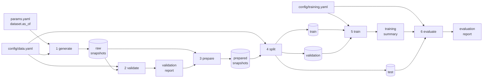

# Data and training pipeline

> **In short:** `dvc.yaml` defines six stages - `generate`, `validate`, `prepare`, `split`,
> `train`, `evaluate`. Each stage reads files, writes files and declares its inputs. DVC runs
> a stage only when one of its inputs changed and records a content hash of every output in
> `dvc.lock`. One command runs everything: `uv run churnctl pipeline run`.

## Contents

- [Why a pipeline](#why-a-pipeline)
- [The stages at a glance](#the-stages-at-a-glance)
- [Stage 1 - generate](#stage-1---generate)
- [Stage 2 - validate](#stage-2---validate)
- [Stage 3 - prepare](#stage-3---prepare)
- [Stage 4 - split](#stage-4---split)
- [Stage 5 - train](#stage-5---train)
- [Stage 6 - evaluate](#stage-6---evaluate)
- [Running the pipeline](#running-the-pipeline)
- [When does a stage re-run?](#when-does-a-stage-re-run)
- [Outputs and where they go](#outputs-and-where-they-go)
- [Failure behaviour](#failure-behaviour)

---

## Why a pipeline

Building a model involves several dependent steps. Writing them as a declared pipeline
gives three guarantees:

1. **Reproducibility** - the same inputs always produce the same outputs, and `dvc.lock`
   proves which inputs were used.
2. **Efficiency** - after changing only training settings, the data stages are not re-run.
3. **Safety** - a stage that fails (for example, validation) stops everything after it, so
   bad data never reaches training.

Each stage is a plain Python function in `churn_platform/pipeline/stages.py`. DVC starts it
with `python -m churn_platform.pipeline <stage>`.

---

## The stages at a glance



| Stage | Reads | Writes | Stops the pipeline when |
|---|---|---|---|
| `generate` | `params.yaml` (`dataset`), `config/data.yaml` (`generation`, `timeline`, `profiles`) | `data/raw/snapshots.parquet`, `reports/dataset.json` | the configuration is invalid |
| `validate` | raw data; `validation` settings | `reports/data_validation.json` | **any** of the 13 checks fails |
| `prepare` | raw data, validation report | `data/prepared/snapshots.parquet` | - |
| `split` | prepared data; `split` settings | `data/splits/{train,validation,test}.parquet`, `reports/split.json` | a period is too small |
| `train` | train and validation splits; `config/training.yaml` | MLflow runs and models; `reports/training_summary.json` | MLflow is unreachable or the algorithm settings are invalid |
| `evaluate` | training summary, test split | MLflow metrics and artifacts; `reports/evaluation.json` | the stored model fails its fingerprint check |

> [!IMPORTANT]
> The `train` stage does **not** depend on the test split. Choosing the algorithm and its
> threshold never sees test data, so the test score is an honest estimate.

---

## Stage 1 - generate

Creates a dataset **extract** as of the date `dataset.as_of` (see
[synthetic-world.md](synthetic-world.md#training-extracts-the-data-warehouse)):

- 12,000 customer snapshots spread over 365 days;
- the window ends 30 days before `as_of`, so every label is already known;
- deterministic: the same seed and settings produce a byte-identical file.

It also writes `reports/dataset.json`, a human-readable identity of the version:

```json
{
  "dataset": "customer-snapshots",
  "as_of": "2026-01-01",
  "seed": 20260101,
  "rows": 12000,
  "first_snapshot": "2024-12-03",
  "last_snapshot": "2025-12-02",
  "profiles": ["baseline"],
  "feature_schema_version": "1.0",
  "raw_md5": "3ffc6b350382603348ea01d336417752"
}
```

---

## Stage 2 - validate

Runs 13 checks (`churn_platform/data/validation.py`) and writes all results to
`reports/data_validation.json`. Every check is reported, not only the first failure, so one
look shows everything that is wrong.

| Check | Rule | Protects against |
|---|---|---|
| `no_outcome_leakage_columns` | no column that describes the outcome (cancellation, closure, exit survey, ...) | target leakage |
| `schema_columns` | exactly the expected 19 columns | missing or unexpected data |
| `minimum_rows` | at least 5,000 rows | an unusably small extract |
| `unique_customer_snapshots` | no duplicate `(customer_id, snapshot_date)` | double counting |
| `required_values_present` | empty values only in `avg_resolution_hours` | broken exports |
| `categorical_domains` | only known plan tiers and contract types | typos, new unmapped categories |
| `boolean_domains` | booleans are true/false | wrongly encoded flags |
| `numeric_ranges` | every number inside its allowed range | impossible values |
| `complaints_within_tickets` | complaints never exceed tickets | internally inconsistent records |
| `resolution_time_only_with_tickets` | resolution time is empty exactly when there were no tickets | inconsistent records |
| `binary_label` | the label is 0 or 1 | broken labels |
| `churn_rate_plausible` | churn rate between 5% and 45% | a broken label pipeline |
| `labels_matured` | every snapshot is at least 30 days before `as_of` | labels that could not be known yet (temporal leakage) |

If any check fails, the stage exits with an error and DVC stops.

---

## Stage 3 - prepare

Normalises the validated extract with pandas: fixed column order, text categories, real
booleans, integer and decimal columns with the right types, rows sorted by date and
customer. It deliberately does **not** create model features - those are computed inside the
model itself, so training and serving use the same code
([training-and-evaluation.md](training-and-evaluation.md#the-model-pipeline)).

---

## Stage 4 - split

Splits the data **by time** into three periods, with a safety gap (purge) between them:

```
|---- train ----|purge|---- validation ----|purge|---- test ----|
oldest          30 d     about 60 days     30 d   60 days    newest
                      \___________ 90 days ______/
                           (validation_days)
```

| Setting (`config/data.yaml`) | Value | Meaning |
|---|---|---|
| `split.test_days` | 60 | the newest 60 days form the test period |
| `split.validation_days` | 90 | the 90 days before the test period form the validation window; its last 30 days are purged, so about 60 days remain |
| `split.purge_days` | 30 | a row may only join a period if its 30-day outcome window ends before the next period starts; this removes the last 30 days before each boundary |
| `split.min_rows_per_split` | 500 | fewer rows in any period fails the stage |

Result for the first dataset (`as_of: 2026-01-01`), from `reports/split.json`:

| Period | Rows | Snapshot dates | Churn rate |
|---|---|---|---|
| train | 6,147 | 2024-12-03 to 2025-06-06 | 13.0% |
| validation | 1,956 | 2025-07-06 to 2025-09-04 | 13.7% |
| test | 1,991 | 2025-10-04 to 2025-12-02 | 13.1% |
| purged | 1,906 | at the two boundaries | - |

Why the purge is necessary is explained in [leakage-controls.md](leakage-controls.md).

---

## Stage 5 - train

One **training cycle**: all configured algorithms are trained, compared on the validation
period, and one winner is chosen. Every algorithm is logged to MLflow as its own run, with
the model file and its fingerprint. The stage writes `reports/training_summary.json` with
the cycle ID, every candidate's run, model location, threshold and validation scores, and
the winner. Details: [training-and-evaluation.md](training-and-evaluation.md).

---

## Stage 6 - evaluate

Loads the winner **back from MLflow** (verifying its fingerprint), scores it on the test
period and logs to the winner's run: test metrics, metrics per customer segment, latency, the
no-skill baseline and the monitoring reference dataset. It writes
`reports/evaluation.json`. The winner is now ready to be registered as a candidate.

---

## Running the pipeline

The standard way:

```bash
uv run churnctl pipeline run
```

This runs `dvc repro` (all stages that need it) and then `dvc push` (uploads new data files
to MinIO). Options:

| Option | Effect |
|---|---|
| `--no-push` | do not upload to MinIO |
| `--force` | re-run every stage even if nothing changed |

Show which stages are out of date without running anything:

```bash
uv run churnctl pipeline status
```

DVC can also be used directly, for example to run only up to the split:

```bash
uv run dvc repro split
```

> [!NOTE]
> Always run DVC through `uv run` (or inside the activated environment). The stages call
> `python`, which must be the project's interpreter.

---

## When does a stage re-run?

DVC compares the current inputs with those recorded in `dvc.lock`:

| You change... | Stages that re-run |
|---|---|
| `dataset.as_of` in `params.yaml` | `generate` and everything after it whose inputs changed |
| `generation`, `timeline` or `profiles` in `config/data.yaml` | `generate` (later stages only if the data really changed) |
| `split` settings | `split`, `train`, `evaluate` |
| `algorithms`, `threshold_search`, ... in `config/training.yaml` | `train`, `evaluate` |
| `evaluation` or `reference` settings | `evaluate` |
| the code of a stage (e.g. `src/churn_platform/training/cycle.py`) | that stage and its dependants |
| nothing | nothing ("Data and pipelines are up to date.") |

Because generation is deterministic, re-generating identical data produces identical hashes
and the later stages are skipped.

---

## Outputs and where they go

| Output | Stored by | Tracked by | Size |
|---|---|---|---|
| `data/raw/`, `data/prepared/`, `data/splits/` (parquet) | DVC cache + MinIO `dvc-store` | DVC (`dvc.lock`), ignored by Git | up to about 250 KB per file |
| `reports/*.json` | the working tree | Git (declared with `cache: false`, so changes are visible in `git diff`) | a few KB |
| runs, models, evaluation files, reference data | MLflow (PostgreSQL + MinIO `mlflow-artifacts`) | MLflow | about 200 KB for a logistic regression model, a few MB for a random forest |

---

## Failure behaviour

| Situation | What happens |
|---|---|
| a validation check fails | `validate` exits with an error listing every failed check; nothing after it runs |
| a split period is too small | `split` fails with the period sizes |
| MLflow is not reachable | `train` fails; no partial winner is recorded |
| a model file was changed after upload | `evaluate` refuses to load it (fingerprint mismatch) |
| the pipeline is interrupted | re-run it; completed stages are skipped |

Related: [dataset-versioning.md](dataset-versioning.md), [leakage-controls.md](leakage-controls.md),
[training-and-evaluation.md](training-and-evaluation.md).
