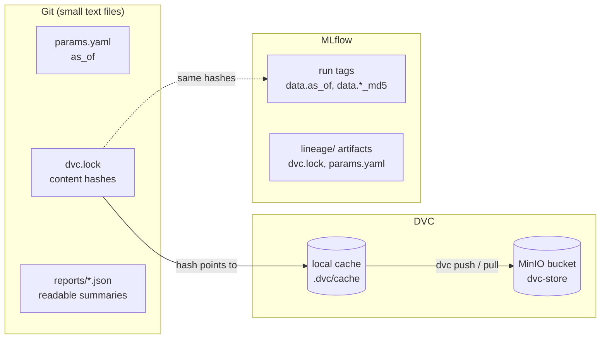

# Dataset versioning

> **In short:** A dataset version is defined by one parameter (`dataset.as_of` in
> `params.yaml`) plus the data configuration. DVC turns that into files with recorded content
> hashes (`dvc.lock`) and stores the files in MinIO; Git stores the small text files that say
> which version is current; MLflow stores, for every model, the hashes of the data it was
> trained and tested on. Together they let you restore any dataset and trace any model back
> to it.

## Contents

- [Why version datasets](#why-version-datasets)
- [Who stores what](#who-stores-what)
- [What defines a version](#what-defines-a-version)
- [How DVC tracks the files](#how-dvc-tracks-the-files)
- [The MinIO remote](#the-minio-remote)
- [Creating a new version](#creating-a-new-version)
- [Restoring an older version](#restoring-an-older-version)
- [From a model back to its data](#from-a-model-back-to-its-data)
- [Everyday DVC commands](#everyday-dvc-commands)
- [Limitations](#limitations)

---

## Why version datasets

A model is the product of code **and** data. To answer "why does this model behave like
this?" or "can we rebuild last month's model?", the exact data must be recoverable - not just
the code. Data files are too large for Git, and overwriting them in place loses history.
Dataset versioning solves both.

---

## Who stores what



| System | Stores | Example |
|---|---|---|
| **Git** | the small files that *describe* the version | `as_of: "2026-01-01"`; train split hash `43f36ecc...` |
| **DVC** (local cache + MinIO) | the data files themselves, addressed by content hash | the 144 KB `train.parquet` whose md5 is `43f36ecc...` |
| **MLflow** | which data each model was built from | run tags `data.as_of`, `data.train_md5`; a copy of `dvc.lock` in the cycle run |

---

## What defines a version

```yaml
# params.yaml
dataset:
  as_of: "2026-01-01"
```

`as_of` is the date of the (simulated) data-warehouse extract. Together with
`config/data.yaml` - seed, number of rows, time window, profiles, timeline and split
settings - it determines the data exactly. Because generation is deterministic, generating
the same version twice produces byte-identical files, even on another machine.

Every version also gets a readable identity, written to `reports/dataset.json` and to MLflow
as `data.id`:

```
customer-snapshots@2026-01-01#43f36ecc6359bd2d
      name           as-of     first 8 characters of the train hash + of the test hash
```

---

## How DVC tracks the files

`dvc.lock` records, for every stage, the hashes of its code and data inputs, the parameter
values it used and the hashes of its outputs. A shortened excerpt:

```yaml
generate:
  cmd: python -m churn_platform.pipeline generate
  deps:
  - path: src/churn_platform/data/generator.py
    hash: md5
    md5: 35aee998527bf3537ad4968dc4cbb3af
  params:
    params.yaml:
      dataset:
        as_of: '2026-01-01'
    config/data.yaml:
      generation:
        seed: 20260101
        rows: 12000
        # ... plus window, profiles and timeline
  outs:
  - path: data/raw/snapshots.parquet
    hash: md5
    md5: 3ffc6b350382603348ea01d336417752
    size: 258637
```

The files themselves live in DVC's content-addressed cache (`.dvc/cache`) and in the remote.
Git ignores them (DVC writes `.gitignore` files into `data/`). The JSON reports are declared
with `cache: false`, so they stay in the working tree and Git shows their changes as readable
diffs.

---

## The MinIO remote

`churnctl bootstrap` configures the DVC remote `minio`:

| Setting | Value | Stored in |
|---|---|---|
| URL | `s3://dvc-store/churn-platform` | `.dvc/config` (committed) |
| Endpoint | `http://127.0.0.1:9000` | `.dvc/config` |
| Access key and secret | `DVC_S3_ACCESS_KEY` / `DVC_S3_SECRET_KEY` from `.env` | `.dvc/config.local` (**not** committed) |

The DVC key can read and write only the `dvc-store` bucket; it cannot touch model files.

---

## Creating a new version

Change `dataset.as_of` (or the data configuration) and run the pipeline:

```bash
uv run churnctl pipeline run
```

DVC regenerates the data, re-runs the stages that depend on it, updates `dvc.lock` and pushes
the new files to MinIO.

**The retraining controller does exactly this automatically**: it sets `as_of` to the newest
production snapshot date of the retraining request, runs the pipeline and pushes the data
([continuous-training.md](continuous-training.md)).

Afterwards `params.yaml`, `dvc.lock` and `reports/` differ from the last commit. Commit them
to record the version in Git:

```bash
git add params.yaml dvc.lock reports
```

```bash
git commit -m "Dataset version as of 2026-12-31"
```

---

## Restoring an older version

With the version committed in Git:

```bash
git checkout <commit>
```

```bash
uv run dvc checkout
```

`dvc checkout` puts the files that `dvc.lock` describes back into `data/`, taking them from
the local cache. If the cache does not have them (for example on a new machine), download
them from MinIO:

```bash
uv run dvc pull
```

This round trip is covered by an integration test: it creates two versions in a throwaway
repository, restores the first one and checks that the files are byte-identical.

---

## From a model back to its data

Every model version carries the hashes of the data it was trained and tested on. To
rebuild that data:

1. **Find the lineage.** From the API (`GET /model`), `uv run churnctl model status`, or
   MLflow (*Models -> customer-churn-classifier -> version*): note `data.as_of`,
   `data.train_md5`, `data.test_md5` and `code.git_commit`.
2. **Get the matching description.** Check out that Git commit - or, if the version was never
   committed, download `lineage/params.yaml` and `lineage/dvc.lock` from the model's training
   cycle run in MLflow and copy them into the repository.
3. **Restore the files.** Run `uv run dvc pull` (or `uv run dvc repro`, which regenerates the
   identical files).
4. **Confirm.** The md5 of `data/splits/train.parquet` equals the model's `data.train_md5`.

If `code.git_commit` is `unavailable`, the model was trained in a repository without commits;
step 2 then uses the `lineage/` artifacts.

---

## Everyday DVC commands

| Task | Command |
|---|---|
| run what changed and upload | `uv run churnctl pipeline run` |
| run what changed, no upload | `uv run churnctl pipeline run --no-push` |
| which stages are out of date? | `uv run churnctl pipeline status` |
| upload the current version | `uv run dvc push` |
| download the version in `dvc.lock` | `uv run dvc pull` |
| restore files after `git checkout` | `uv run dvc checkout` |
| what changed since the last commit? | `uv run dvc diff` |

---

## Limitations

- The controller updates `params.yaml` and `dvc.lock` in the working tree but does not commit
  them; committing a dataset version is a deliberate operator step.
- Old dataset versions stay in MinIO until someone deletes them; there is no retention
  policy.
- Versions are identified by the extract date; two different configurations with the same
  date produce different hashes but the same `as_of` - the hashes are the true identity.
