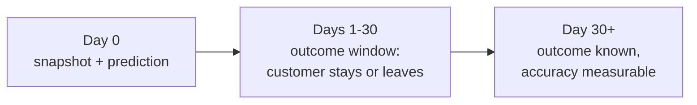

# Delayed ground truth

> **In short:** When the API predicts that a customer will churn within 30 days, nobody knows
> yet whether that is true. The real answer - the *ground truth* - arrives only after the 30
> days, typically from a billing or CRM system. The platform stores every prediction with an
> empty outcome, and a separate step fills in the true outcome once its 30-day window has
> closed. Only then can real accuracy be measured.

## Contents

- [Why outcomes arrive late](#why-outcomes-arrive-late)
- [How outcomes are stored](#how-outcomes-are-stored)
- [The simulated outcome source](#the-simulated-outcome-source)
- [Resolving outcomes](#resolving-outcomes)
- [Worked example](#worked-example)
- [What resolved outcomes enable](#what-resolved-outcomes-enable)
- [Immediate vs. delayed signals](#immediate-vs-delayed-signals)
- [Relation to training data](#relation-to-training-data)
- [Tests](#tests)

---

## Why outcomes arrive late



The label is defined as "churned within 30 days after the snapshot". Until those 30 days have
passed, the outcome simply does not exist yet. This delay is normal in many real problems
(fraud, credit risk, churn) and it shapes monitoring: drift can be seen immediately,
accuracy only weeks later.

---

## How outcomes are stored

Each row of `ops.prediction_observations` has two outcome columns that start empty:

| Column | Meaning |
|---|---|
| `actual_churn` | 0 or 1: did the customer really churn within 30 days? |
| `outcome_resolved_at` | when the outcome was written |

A database constraint (`outcome_complete`) makes sure both are always set together.

---

## The simulated outcome source

In a real company the outcome would come from the billing system. Here, the traffic
simulator plays that role: when it creates a customer it also decides - using the same hidden
churn logic as the training data - whether that customer will churn, and stores the answer in
`simulation.customer_outcomes`.

The platform never reads that table on its own. Only the resolution command below reveals
outcomes, and only for predictions whose window has closed - exactly like a billing system
reporting cancellations after the fact.

---

## Resolving outcomes

```bash
uv run churnctl labels resolve --as-of 2026-06-30
```

For every prediction that has no outcome yet, the rule is
(`churn_platform/simulation/outcomes.py`, `outcome_is_resolvable`):

```
the outcome is known  if  snapshot_date + 30 days <= as-of date
```

Exactly 30 days counts as closed. Matured predictions receive their outcome; the command
reports three numbers:

| Number | Meaning |
|---|---|
| resolved | predictions that received their outcome now |
| still inside their outcome window | predictions whose 30 days have not passed yet |
| without a known outcome | matured predictions the outcome source knows nothing about (for example manual test requests) |

`--as-of` is a **simulated** date, like the traffic dates, so months of outcomes can be
revealed in seconds. Running the command again is safe - only rows without an outcome are
updated.

---

## Worked example

From the demo, after 800 December-2025 and 1,200 year-2026 predictions (1,982 of them
recorded):

```bash
uv run churnctl labels resolve --as-of 2026-06-30
```

```
resolved 1290 outcomes as of 2026-06-30; 692 still inside their outcome window; 0 without a known outcome
```

Snapshots after 31 May 2026 are still inside their 30-day window. Moving time forward:

```bash
uv run churnctl labels resolve --as-of 2027-01-31
```

```
resolved 692 outcomes as of 2027-01-31; 0 still inside their outcome window; 0 without a known outcome
```

Now every prediction has its outcome, and the next monitoring cycle reports production
accuracy.

---

## What resolved outcomes enable

Once at least 200 predictions of the monitored version have an outcome, every monitoring
cycle adds production precision, recall, F1 and ROC-AUC and compares them with the model's
test metrics ([ml-monitoring.md](ml-monitoring.md#the-delayed-signal-accuracy)).

A drop beyond the policy limits - F1 by more than 0.05 or recall by more than 0.10 - is a
retraining trigger on its own, even without drift
([continuous-training.md](continuous-training.md)).

---

## Immediate vs. delayed signals

| Signal | Available | Tells you |
|---|---|---|
| data quality | immediately | whether the input data is intact |
| feature and dataset drift | immediately | whether the inputs changed |
| prediction drift | immediately | whether the model's answers changed |
| precision, recall, F1, ROC-AUC | 30+ days later, after resolution | whether the model is actually right |

Both kinds are stored side by side in each monitoring run, with the number of labelled
predictions, so it is always clear which signals were available when a decision was made.

---

## Relation to training data

Retraining extracts come from the simulated data warehouse
([synthetic-world.md](synthetic-world.md#training-extracts-the-data-warehouse)), which by
construction contains only snapshots whose outcome window closed before the extract date.
The logged predictions are used for monitoring, not as training rows.

---

## Tests

| Behaviour | Test |
|---|---|
| the window rule at its boundary (29 days: not known; 30 days: known) | `tests/unit/test_monitoring_analysis.py` |
| resolution at two dates updates only matured predictions, with exactly the hidden outcomes, and then enables accuracy monitoring | `tests/integration/test_monitoring_pipeline.py` |
