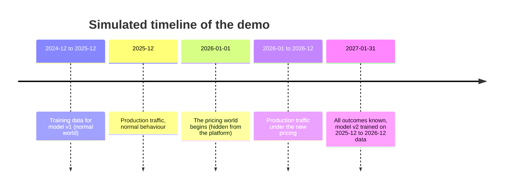

# Demo walkthrough

> **In short:** This walkthrough runs the complete lifecycle in about ten minutes: train and
> approve a first model, serve baseline traffic, let the simulated world change, watch
> monitoring detect it, reveal the true outcomes, retrain automatically, inspect the lineage
> of the new model and roll back. Every step shows the command, the real output and what to
> look at.

## Contents

- [Before you start](#before-you-start)
- [The story in one picture](#the-story-in-one-picture)
- [Step 1 - Build the first dataset and train](#step-1---build-the-first-dataset-and-train)
- [Step 2 - Approve the first model](#step-2---approve-the-first-model)
- [Step 3 - Serve normal traffic](#step-3---serve-normal-traffic)
- [Step 4 - Check that nothing has drifted](#step-4---check-that-nothing-has-drifted)
- [Step 5 - The world changes](#step-5---the-world-changes)
- [Step 6 - Monitoring detects the change](#step-6---monitoring-detects-the-change)
- [Step 7 - The true outcomes arrive](#step-7---the-true-outcomes-arrive)
- [Step 8 - Retrain under governance](#step-8---retrain-under-governance)
- [Step 9 - Inspect the lineage](#step-9---inspect-the-lineage)
- [Step 10 - Roll back](#step-10---roll-back)
- [Running the scenario again](#running-the-scenario-again)

---

## Before you start

- The platform is running and empty: follow [getting-started.md](getting-started.md)
  sections 1-5. If you already promoted a model there, you can continue from
  [Step 3](#step-3---serve-normal-traffic).
- Run all commands from the repository root.
- **Simulated time.** Commands such as `traffic send` and `labels resolve` take *simulated*
  dates. A year of production traffic takes seconds.
- **Reproducibility.** Data and training are seeded, so your numbers match the ones shown
  here. Prediction IDs, run IDs and timestamps differ.

---

## The story in one picture



Until 1 January 2026 customers behave "normally" (`baseline` profile). From that date the
`pricing_shift` profile applies: 55% of customers receive price increases of 15-30%, payment
problems rise, and - crucially - customers react to price much more strongly. The platform
is never told about this date. Details: [synthetic-world.md](synthetic-world.md).

---

## Step 1 - Build the first dataset and train

```bash
uv run churnctl pipeline run
```

**What happens.** DVC runs six stages. The generator creates 12,000 customer snapshots as
they would be exported on 1 January 2026, the data is validated and split by time, three
algorithms are trained and compared, the winner is evaluated once on the newest (test)
period, and the dataset version is uploaded to MinIO.

**Output (shortened):**

```
generated 12000 snapshots (2024-12-03 .. 2025-12-02) as of 2026-01-01
all 13 validation checks passed
split: train 6147 rows, validation 1956 rows, test 1991 rows (1906 rows purged)
logistic_regression: val F1=0.514 recall=0.712 ROC-AUC=0.856 threshold=0.60
random_forest: val F1=0.502 recall=0.566 ROC-AUC=0.845 threshold=0.54
hist_gradient_boosting: val F1=0.496 recall=0.528 ROC-AUC=0.839 threshold=0.67
winner: logistic_regression
test F1=0.501 recall=0.674 ROC-AUC=0.848 (no-skill F1=0.232), p95 latency 9.5 ms
4 files pushed
```

**How to read it.** About 13% of customers churn. A model with no skill (predict "churn"
for everyone) reaches F1 0.232; our winner reaches 0.501 and catches two out of three
churners (recall 0.674). ROC-AUC 0.848 means it ranks a random churner above a random
non-churner 85% of the time. The 1,906 "purged" rows sit at period boundaries where their
outcome window would overlap the next period ([why](leakage-controls.md)).

**Where to look.** MLflow -> *Experiments -> customer-churn*. The parent run
`cycle-...` has three child runs; select them and click *Compare* to see `val_f1`,
`val_recall` and `val_roc_auc` side by side. The parent run's *Artifacts -> lineage* folder
holds the exact `params.yaml`, `dvc.lock` and configuration files used.

---

## Step 2 - Approve the first model

```bash
uv run churnctl model register
```

```
registered customer-churn-classifier version 1 (alias: candidate)
```

```bash
uv run churnctl model gate
```

```
check                result  observed  threshold
loadable_and_intact  pass    ok        loads and matches fingerprint
f1_min               pass    0.5007    0.4
recall_min           pass    0.6743    0.5
roc_auc_min          pass    0.8476    0.75
latency_p95_ms       pass    7.67      50.0
segment_recall_min   pass    0.3333    0.25    8 reliable segments checked
champion_comparison  pass    None      None    no current champion: absolute checks only

version 1 vs champion none: PASSED -> challenger
```

```bash
uv run churnctl model promote
```

```bash
uv run churnctl serving reload
```

```
inference is ready and serving customer-churn-classifier version 1
```

**What happens.** Registration turns the training winner into version 1. The gate reloads
it from storage, verifies its fingerprint and checks quality, latency and every customer
segment. Because no champion exists yet, the head-to-head comparison is skipped. Promotion
moves the `champion` alias to version 1; the reload makes the API serve it.

**Where to look.** MLflow -> *Models -> customer-churn-classifier*: version 1 carries the
aliases `candidate` and `champion` and tags such as `gate.status = passed` and
`data.as_of = 2026-01-01`.

---

## Step 3 - Serve normal traffic

```bash
uv run churnctl traffic send --start 2025-12-01 --end 2025-12-31 --count 800 --invalid-share 0.02
```

```
"status_counts": {"200": 782, "422": 18},
"profiles": {"baseline": 800},
"predicted_churn_share": 0.215
```

**What happens.** The traffic simulator creates 800 customers dated December 2025 (still
the normal world), decides - secretly - whether each one will churn, and sends their
snapshots to the API. 2% are deliberately broken (a negative tenure) and are rejected with
HTTP 422 before they reach the model. The model predicts churn for about 22% of customers.

**Where to look.** Grafana -> *Churn Inference Operations*: the champion is `LOADED`
(`v1 - logistic_regression`), requests per second, the share of rejected input, latency
percentiles and the mix of `low`/`medium`/`high` risk predictions all move.

---

## Step 4 - Check that nothing has drifted

```bash
uv run churnctl monitor run
```

```
"observations": 782, "dataset_drift": false, "drift_share": 0.0, "prediction_drift": false,
"data_quality_ok": true, "decision": "no_action",
"reasons": ["no drift and no performance degradation"]
```

**What happens.** The monitoring cycle compares the 782 recorded predictions with the
reference data of version 1 (its own test period and its own predictions). No input
feature and not the prediction distribution moved beyond the drift threshold, so the
retraining policy decides `no_action`.

> [!NOTE]
> The monitoring worker container runs the same cycle every five minutes by itself when new
> predictions arrive. Running it manually just shows the result immediately.

---

## Step 5 - The world changes

```bash
uv run churnctl traffic send --start 2026-01-01 --end 2026-12-31 --count 1200
```

```
"profiles": {"pricing_shift": 1200},
"predicted_churn_share": 0.449
```

**What happens.** A simulated year of customers from the new pricing world. The model now
predicts churn for 45% of customers instead of 22%.

**Where to look.** Grafana -> *Churn Inference Operations* -> *Predicted churn share* jumps.
Operational monitoring can show *that* predictions changed; it cannot say *why* or whether
the model is still right. That is the job of the next steps.

---

## Step 6 - Monitoring detects the change

```bash
uv run churnctl monitor run
```

```
"observations": 1000,
"dataset_drift": true,
"drift_share": 0.4375,
"drifted_features": ["recent_price_increase", "monthly_charge", "payment_failures_90d",
                     "late_payments_12m", "sessions_30d", "support_tickets_90d", "complaints_90d"],
"prediction_drift": true,
"decision": "request_retraining",
"reasons": ["drift: 44% of features drifted and the prediction distribution shifted"],
"retraining_request_id": "937943bd-..."
```

**What happens.** Evidently compares the newest 1,000 predictions with the reference data.
7 of 16 input features - mostly price and payment related - drifted, and the distribution of
predicted probabilities moved too. This is *severe* drift under the policy (at least 25% of
the features plus prediction drift), so the policy creates **one** retraining request.

**Where to look.**

- Grafana -> *Churn Model Monitoring*: decision `RETRAINING REQUESTED`, the drift share over
  time and a table of per-feature drift distances (`payment_failures_90d` is the largest).
- MLflow -> *Experiments -> customer-churn-monitoring*: the latest run's artifact
  `monitoring/evidently_report.html` is the full Evidently report with distribution plots
  for every feature.

---

## Step 7 - The true outcomes arrive

At prediction time nobody knows who will really churn. The simulator now reveals outcomes
whose 30-day window has closed by a given (simulated) date:

```bash
uv run churnctl labels resolve --as-of 2026-06-30
```

```
resolved 1290 outcomes as of 2026-06-30; 692 still inside their outcome window; 0 without a known outcome
```

Predictions made after 31 May 2026 are still inside their 30-day window, so they stay
unresolved. Move time forward:

```bash
uv run churnctl labels resolve --as-of 2027-01-31
```

```bash
uv run churnctl monitor run
```

```
"labeled": 1982,
"production_performance": {"f1": 0.584, "recall": 0.668, "precision": 0.519,
                           "roc_auc": 0.796, "churn_rate": 0.277},
"f1_drop_vs_test": -0.0837,
"decision": "blocked",
"reasons": ["drift: 44% of features drifted and the prediction distribution shifted",
            "an open retraining request already exists"]
```

**Two lessons are visible here.**

1. **F1 can mislead when the churn rate changes.** Production F1 (0.584) is *higher* than
   the test F1 (0.501) although the model got worse. More customers churn now (27.7% vs.
   13%), which makes positive predictions correct more often. ROC-AUC, which does not depend
   on the churn rate, shows the real picture: it fell from 0.848 to 0.796. See
   [ml-monitoring.md](ml-monitoring.md#reading-the-results-correctly).
2. **Repeated evidence does not pile up work.** The drift is still there, but a retraining
   request is already open, so the policy reports `blocked` instead of creating another one.

---

## Step 8 - Retrain under governance

```bash
uv run churnctl retrain run --reload-serving
```

```json
{
  "outcome": "promoted",
  "candidate_version": "2",
  "champion_before": "1",
  "champion_after": "2",
  "detail": "passed the quality gate and was promoted"
}
```

```
inference is ready and serving customer-churn-classifier version 2
```

**What happens, in order:**

1. The controller claims the open request.
2. It sets `dataset.as_of` in `params.yaml` to 2026-12-31 - the newest production snapshot -
   so the new dataset covers December 2025 to December 2026, mostly the new world.
3. It runs the full DVC pipeline (new extract, validation, split, three algorithms,
   evaluation) and uploads the new dataset version.
4. It registers the winner as version 2 and runs the quality gate against version 1
   **on the new test period** - the fair comparison:

   ```
   f1_vs_champion           pass   +0.0575   candidate 0.7002 vs champion 0.6427
   roc_auc_vs_champion      pass   +0.0871   candidate 0.8510 vs champion 0.7638
   segment_f1_vs_champion   pass   8 shared segments checked (no segment got worse)
   ```

5. The candidate passed, automatic promotion is enabled, so version 2 becomes champion;
   `--reload-serving` restarts the API to serve it.

Until the reload, the API kept serving version 1 without interruption.

**Where to look.** Grafana -> *Churn Model Monitoring* -> *Retraining requests*: status
`completed`, outcome `promoted`, champion before `1`, after `2`.

---

## Step 9 - Inspect the lineage

```bash
uv run churnctl model status
```

```
version  aliases             status    gate    algorithm            data_as_of  test_f1  test_recall  test_roc_auc
1        -                   retired   passed  logistic_regression  2026-01-01  0.501    0.674        0.848
2        candidate,champion  champion  passed  logistic_regression  2026-12-31  0.700    0.700        0.851
```

```bash
curl http://127.0.0.1:8000/model
```

(PowerShell: `Invoke-RestMethod http://127.0.0.1:8000/model`) returns the served version's
full lineage: MLflow run, training cycle, dataset ID and hashes, dataset date, Git commit,
gate result, promotion time and metrics.

```bash
uv run churnctl model history
```

prints the audit trail: registration, gate result and promotion of each version, with the
user and the details.

**Follow the chain in MLflow:** *Models -> version 2 -> Source run* -> the run's tags
(`data.train_md5`, `data.as_of`, `training.cycle_id`) -> its parent cycle run -> *Artifacts
-> lineage* with the exact `dvc.lock`. How to restore that dataset:
[dataset-versioning.md](dataset-versioning.md#from-a-model-back-to-its-data).

---

## Step 10 - Roll back

Suppose the business decides the new model must not be used yet:

```bash
uv run churnctl model rollback --reason "demo: roll back to the pre-shift model"
```

```
champion rolled back to version 1. Restart serving to load it: churnctl serving reload
```

```bash
uv run churnctl serving reload
```

```
inference is ready and serving customer-churn-classifier version 1
```

```bash
uv run churnctl model status
```

```
version  aliases    status       gate    ...
1        champion   champion     passed
2        candidate  rolled_back  passed
```

**What happens.** Only the `champion` alias moved - no files were copied. Version 1's model
file was verified before the switch. Version 2 is marked `rolled_back` and can never become
champion again; the reason is stored in its tags and in the audit trail.

---

## Running the scenario again

Reset the platform (deletes all models, runs, predictions and dataset versions; `.env` is
kept):

```bash
uv run churnctl stack reset --yes
```

Set the dataset date back to the first version in `params.yaml` (retraining moved it to
2026-12-31):

```yaml
dataset:
  as_of: "2026-01-01"
```

Then start again:

```bash
uv run churnctl bootstrap
```

and continue with [Step 1](#step-1---build-the-first-dataset-and-train).

**Variations to try**

- Send `engagement_shift` traffic (`--profile engagement_shift`): inputs drift but the churn
  logic does not change - compare what monitoring and the gate say.
- Set `approval.manual_approval_required: true` in `config/quality_gate.yaml`: retraining then
  stops at `awaiting_promotion` until someone runs `churnctl model promote --approved-by <name>`.
- Make the gate stricter (for example `absolute.f1_min: 0.75`) and watch a retrained model be
  rejected while the champion keeps serving.
