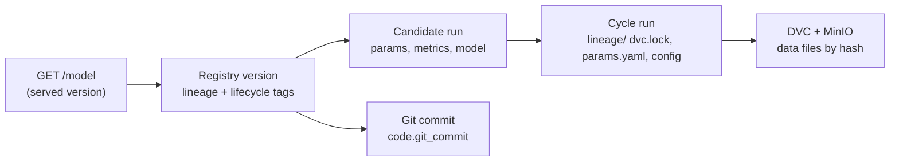

# Experiment tracking and lineage

> **In short:** MLflow (http://127.0.0.1:5000) records every training run - settings,
> scores, the model file - together with its **lineage**: which dataset (by content hash and
> date), which configuration and which Git commit produced it. From any production model you
> can follow the chain back to the exact data and code.

## Contents

- [What MLflow is used for](#what-mlflow-is-used-for)
- [How runs are organised](#how-runs-are-organised)
- [What a candidate run contains](#what-a-candidate-run-contains)
- [The saved model](#the-saved-model)
- [The registered model and its tags](#the-registered-model-and-its-tags)
- [Tracing a model back to data and code](#tracing-a-model-back-to-data-and-code)
- [Registration checks](#registration-checks)
- [Storage behind MLflow](#storage-behind-mlflow)

---

## What MLflow is used for

| MLflow feature | Used for |
|---|---|
| **Tracking** | one run per trained algorithm, one parent run per training cycle, one run per monitoring analysis |
| **Artifacts** | model files, lineage files, evaluation results, the monitoring reference, gate reports, Evidently reports |
| **Model Registry** | numbered versions of `customer-churn-classifier` and the aliases `candidate`, `challenger`, `champion` |

---

## How runs are organised

| Experiment | Contains |
|---|---|
| `customer-churn` | training cycles (the name comes from `CHURN_EXPERIMENT_NAME`) |
| `customer-churn-monitoring` | one run per monitoring cycle with its Evidently report |

A training cycle is a parent run with one child run per algorithm:

```
customer-churn
└── cycle-20260919T134233Z-f7afa7            parent run   (tag training.role = cycle)
    ├── logistic_regression                  child run    (training.role = candidate_run)
    ├── random_forest                        child run
    └── hist_gradient_boosting               child run
```

**In the MLflow UI:** open the experiment, expand the parent run, select the three child
runs and click **Compare** to see their validation metrics side by side.

**The parent run** carries:

| Kind | Content |
|---|---|
| tags | `training.cycle_id`, `training.winner_run_id`, `training.winner_algorithm`, plus all dataset and code tags below |
| parameters | `train_rows`, `validation_rows`, `algorithms` |
| metrics | `winner_val_f1`, `winner_val_recall`, ... |
| artifacts | `lineage/params.yaml`, `lineage/dvc.lock`, `lineage/data.yaml`, `lineage/training.yaml` - the exact files the cycle used |

---

## What a candidate run contains

**Tags - lineage and identity**

| Tag | Example | Meaning |
|---|---|---|
| `data.id` | `customer-snapshots@2026-01-01#43f36ecc6359bd2d` | readable dataset identity |
| `data.as_of` | `2026-01-01` | extract date |
| `data.train_md5`, `data.validation_md5`, `data.test_md5` | `43f36ecc2f80...` | content hashes of the split files (identical to DVC's hashes) |
| `code.git_commit` | a commit hash, or `unavailable` | code revision |
| `code.git_dirty` | `true` / `false` / `unknown` | whether there were uncommitted changes |
| `feature_schema_version` | `1.0` | version of the feature definitions |
| `training.cycle_id` | `cycle-20260919T134233Z-f7afa7` | the cycle this run belongs to |
| `training.algorithm` | `logistic_regression` | the algorithm |
| `model.fingerprint` | 64 hex characters | SHA-256 fingerprint of the saved model |
| `model.uri` | `models:/m-216d0ba1...` | where the logged model lives |

**Parameters** - `algorithm`, every hyperparameter as `model.<name>`, `decision_threshold`,
`random_state`, `new_customer_months`.

**Metrics** - `val_f1`, `val_recall`, `val_precision`, `val_roc_auc`, `val_pr_auc`,
`val_accuracy`, and the confusion counts `val_tp`, `val_fp`, `val_tn`, `val_fn`.

**Only on the winner, after evaluation** - `test_*` metrics, `latency_p50_ms`,
`latency_p95_ms`, `latency_max_ms`, `baseline_f1`, `baseline_roc_auc`, the artifacts
`evaluation/test_metrics.json`, `evaluation/segments.json`, `reference/reference.parquet`
and the tag `evaluation.completed=true`.

**Added later by the quality gate** - a `gate/report-v<version>-<timestamp>.json` artifact for
every gate evaluation of the registered version.

---

## The saved model

Each model is an MLflow "logged model" containing:

| File | Content |
|---|---|
| `model.skops` | the complete pipeline in the safe **skops** format |
| `MLmodel` | MLflow description: flavours, the input signature, the list of trusted object types, and metadata `decision_threshold`, `algorithm`, `feature_schema_version` |
| `input_example.json`, `serving_input_example.json` | three example rows |
| `requirements.txt`, `conda.yaml`, `python_env.yaml` | the exact scikit-learn and skops versions |

Right after upload, the training code downloads the model again and computes a **SHA-256
fingerprint** over all these files. Every later load recomputes it and refuses a mismatch
([security.md](security.md#model-artifact-integrity)).

---

## The registered model and its tags

Registration creates a numbered version of `customer-churn-classifier` (name from
`CHURN_MODEL_NAME`) and copies the lineage tags from the run onto the version. Lifecycle
steps add more tags:

| Tag | Set by | Meaning |
|---|---|---|
| `lifecycle.status` | every lifecycle step | `candidate`, `challenger`, `champion`, `rejected`, `retired`, `rolled_back` |
| `lifecycle.registered_at` | registration | when it was registered (UTC) |
| `gate.status`, `gate.evaluated_at`, `gate.champion_version`, `gate.failed_checks`, `gate.report_artifact` | quality gate | the last gate result and what it was compared with |
| `lifecycle.promoted_at`, `lifecycle.approved_by` | promotion | when and by whom (`policy` for automatic) |
| `lifecycle.retired_at` | promotion of a successor | when it stopped being champion |
| `lifecycle.rolled_back_at`, `lifecycle.rollback_reason` | rollback | why it was taken out of production |
| `lifecycle.restored_by_rollback` | rollback | it became champion again through a rollback |
| `lifecycle.rejected_reason` | gate | `failed quality gate` or `superseded by challenger vN` |

Which version holds which role is decided by the **aliases**, not by these tags
([model-lifecycle.md](model-lifecycle.md)).

---

## Tracing a model back to data and code



1. **What is running?** `curl http://127.0.0.1:8000/model` (PowerShell:
   `Invoke-RestMethod http://127.0.0.1:8000/model`) returns the version, run ID, training
   cycle, dataset identity and hashes, Git commit, gate result and metrics.
2. **The registry entry.** MLflow -> *Models* -> `customer-churn-classifier` -> the version:
   its tags repeat the lineage; *Source run* opens the candidate run.
3. **The run.** Parameters, validation and test metrics, the model files and the
   `training.cycle_id`.
4. **The cycle.** The parent run's `lineage/` folder holds the exact `params.yaml`, `dvc.lock`
   and configuration used.
5. **The data.** `data.train_md5` and `data.test_md5` identify the files in the DVC remote;
   [dataset-versioning.md](dataset-versioning.md#from-a-model-back-to-its-data) shows how to
   restore them.

From the command line:

```bash
uv run churnctl model status
```

```bash
uv run churnctl model history
```

---

## Registration checks

`churnctl model register` refuses a run unless:

- the run finished successfully;
- it carries every tag in `REQUIRED_LINEAGE_TAGS` (`data.id`, `data.as_of`, the three data
  hashes, `code.git_commit`, `feature_schema_version`, `training.cycle_id`,
  `training.algorithm`, `model.fingerprint`);
- it was evaluated on the test period (`evaluation.completed=true`);
- it has the metrics `val_f1`, `test_f1`, `test_recall`, `test_roc_auc` and `latency_p95_ms`;
- the evaluation report belongs to the same run as the training winner.

An untraceable model can therefore never enter the registry. Registering the same run a
second time returns the existing version instead of creating a duplicate.

---

## Storage behind MLflow

| Part | Stored in |
|---|---|
| experiments, runs, parameters, metrics, tags, registry | PostgreSQL database `mlflow` |
| artifacts (models, reports, reference data) | MinIO bucket `mlflow-artifacts`, only through MLflow's artifact proxy |

Clients never access the bucket directly; only the MLflow server holds its key. Both
survive container restarts (verified by an operational test).
