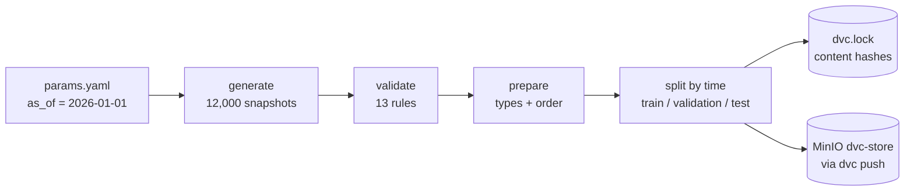
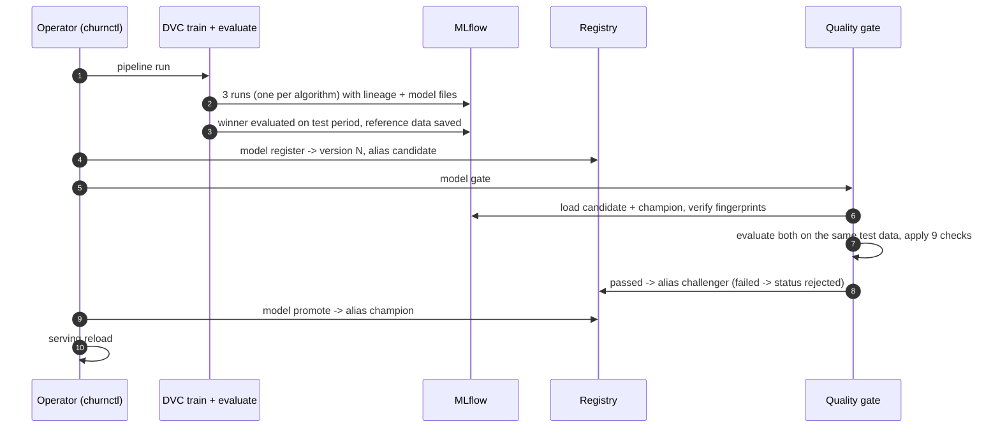
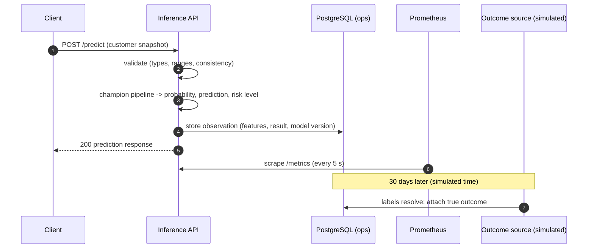
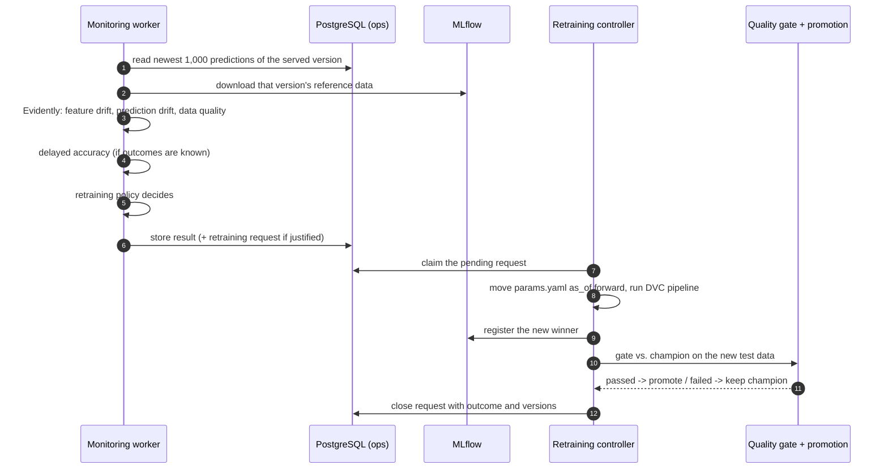

# How it works end to end

> **In short:** This document follows four journeys through the platform - the life of a
> dataset, the life of a model, the life of a prediction and the life of a change in the
> world - and shows at each step which component acts and where the result is stored. It
> connects the individual topics that other documents describe in depth.

## Contents

- [Where information lives](#where-information-lives)
- [Journey 1: the life of a dataset](#journey-1-the-life-of-a-dataset)
- [Journey 2: the life of a model](#journey-2-the-life-of-a-model)
- [Journey 3: the life of a prediction](#journey-3-the-life-of-a-prediction)
- [Journey 4: the world changes](#journey-4-the-world-changes)
- [Rollback](#rollback)
- [Who is allowed to do what](#who-is-allowed-to-do-what)

---

## Where information lives

Before following the journeys it helps to know where each kind of information is kept.
Every piece of state has exactly one home.

| Information | Stored in | Written by | Read by |
|---|---|---|---|
| Dataset files (parquet) | DVC cache on disk + MinIO bucket `dvc-store` | pipeline stages, `dvc push` | pipeline stages, `dvc pull` |
| Dataset version (hashes, date) | `dvc.lock`, `params.yaml`, `reports/*.json` (Git) | DVC, pipeline | people, Git history |
| Training runs, metrics, parameters | MLflow (metadata in PostgreSQL database `mlflow`) | `train` and `evaluate` stages | people, gate, registration |
| Model files, reference data, reports | MLflow artifacts in MinIO bucket `mlflow-artifacts` | training, evaluation, gate, monitoring | gate, serving, monitoring |
| Model versions and aliases | MLflow Model Registry | lifecycle commands only | everything that needs "the champion" |
| Predictions and their true outcomes | PostgreSQL `churn_ops`, table `ops.prediction_observations` | inference API; outcome resolution | monitoring, Grafana |
| Monitoring results | `ops.monitoring_runs` (+ reports in MLflow) | monitoring worker/CLI | people, Grafana, policy |
| Retraining requests | `ops.retraining_requests` | monitoring policy, operators | retraining controller, Grafana |
| Lifecycle audit trail | `ops.lifecycle_events` | lifecycle commands | people, Grafana (never used for decisions) |
| Hidden true outcomes of simulated customers | `simulation.customer_outcomes` | traffic simulator | outcome resolution only |
| Operational metrics | Prometheus time-series storage | Prometheus (scrapes the API) | Grafana, alert rules |

---

## Journey 1: the life of a dataset

A dataset version is an extract of the (simulated) data warehouse, taken on a date called
`as_of`.



1. **Generate.** The generator draws 12,000 customer snapshots spread over the 365 days
   before `as_of - 30 days`. Only snapshots whose 30-day outcome is already known on the
   extract date are included.
2. **Validate.** Thirteen rules check the schema, value ranges, internal consistency, the
   churn rate and that no "future" column (such as a cancellation date) exists. Any failure
   stops the pipeline.
3. **Prepare.** Column order and data types are fixed; rows are sorted by date.
4. **Split.** The newest 60 days become the test period, the 90 days before them the
   validation period, the rest the training period. Rows near the boundaries whose outcome
   window would overlap the next period are removed ("purged").
5. **Version.** DVC records the hash of every output in `dvc.lock` and `dvc push` uploads the
   files to MinIO. Committing `params.yaml`, `dvc.lock` and `reports/` to Git makes the
   version restorable with `git checkout` + `dvc checkout`.

Details: [data-pipeline.md](data-pipeline.md), [dataset-versioning.md](dataset-versioning.md),
[leakage-controls.md](leakage-controls.md).

---

## Journey 2: the life of a model



1. **Training cycle.** Each algorithm is trained on the training period. Its decision
   threshold is chosen on the validation period. MLflow receives one child run per
   algorithm under a parent "cycle" run, including the model file (saved in the safe
   `skops` format) and a SHA-256 fingerprint of that file.
2. **Winner and evaluation.** The algorithm with the best validation F1 wins. Only the
   winner is scored on the test period: overall metrics, metrics per customer segment and
   single-prediction latency. Its test rows plus its own predictions are saved as the
   **reference data** that monitoring will later compare against.
3. **Registration.** `churnctl model register` checks that the run is complete and
   traceable, creates version N and points the `candidate` alias at it.
4. **Quality gate.** `churnctl model gate` loads the candidate and the current champion
   (verifying both fingerprints), evaluates both on the candidate's test period and applies
   nine checks. Passing moves the `challenger` alias to version N.
5. **Promotion.** `churnctl model promote` re-verifies the model file and moves `champion` to
   version N. The previous champion becomes `retired`.
6. **Serving reload.** `churnctl serving reload` restarts the API, which then serves
   version N.

Every lifecycle action also appends an entry to the audit trail. Details:
[training-and-evaluation.md](training-and-evaluation.md),
[experiment-tracking.md](experiment-tracking.md), [model-lifecycle.md](model-lifecycle.md),
[quality-gate.md](quality-gate.md).

---

## Journey 3: the life of a prediction



1. **Validation.** The request must contain exactly the 16 features with valid types and
   ranges; otherwise the API answers 422 and the model is never called.
2. **Prediction.** The features go through the champion's own pipeline (feature
   engineering, preprocessing, model). The probability is compared with the model's stored
   decision threshold; the risk level is derived from the same threshold.
3. **Recording.** The prediction, its input features and the model version are stored in
   `ops.prediction_observations`. If this fails, the API answers 503 rather than serve an
   unrecorded prediction (configurable).
4. **Metrics.** Counters and latency histograms are updated and scraped by Prometheus.
5. **Outcome.** After the 30-day window, `churnctl labels resolve --as-of <date>` attaches
   the true outcome, which lets monitoring measure real accuracy.

Details: [serving.md](serving.md), [api-reference.md](api-reference.md),
[observability.md](observability.md), [delayed-ground-truth.md](delayed-ground-truth.md).

---

## Journey 4: the world changes



1. **Detection.** Every five minutes (only if new predictions or outcomes arrived) the
   monitoring worker compares the newest predictions of the served version with that
   version's reference data. It records which inputs drifted, whether the predictions
   drifted, data quality, and - once outcomes are known - real precision, recall, F1 and
   ROC-AUC.
2. **Decision.** The retraining policy asks for retraining only for severe evidence: at least
   25% of the inputs drifted **and** the predictions moved, or accuracy dropped beyond a
   limit. It never creates a second request while one is open, and waits 12 hours between
   requests.
3. **Retraining.** `churnctl retrain run` claims the request, sets the dataset date to the
   newest production snapshot, runs the full pipeline, registers the winner and runs the
   quality gate against the champion **on the new data**.
4. **Outcome.** If the new model passes, it is promoted (automatic by default); if not, it is
   rejected and the champion keeps serving. Either way, the request is closed with its
   outcome, and serving is not interrupted.

Details: [ml-monitoring.md](ml-monitoring.md), [continuous-training.md](continuous-training.md).

---

## Rollback

If a promoted model turns out to be wrong for production, one command restores the
previous approved champion:

```bash
uv run churnctl model rollback --reason "why the rollback is needed"
```

The command picks the most recently retired champion, verifies its model file, moves the
`champion` alias to it and marks the rolled-back version so it can never become champion
again. After `uv run churnctl serving reload` the API serves the restored version.
Details: [model-lifecycle.md](model-lifecycle.md#rollback).

---

## Who is allowed to do what

| Actor | Can | Cannot |
|---|---|---|
| DVC pipeline (`train`, `evaluate`) | create runs, models, reference data | register versions or move aliases |
| `churnctl model register / gate / promote / rollback` | create versions, move aliases, write audit events | skip the gate or promote an unverified model |
| Inference API | load the champion, predict, store observations | change the registry, read other data, train |
| Monitoring worker | read observations, write monitoring results, create retraining requests | train, register or promote |
| Retraining controller | run the pipeline, register, gate, promote a *passing* model | promote a model that failed the gate |
| Grafana | read metrics and ops tables | change anything |

The reasons behind these boundaries are explained in [design-decisions.md](design-decisions.md)
and [security.md](security.md).
