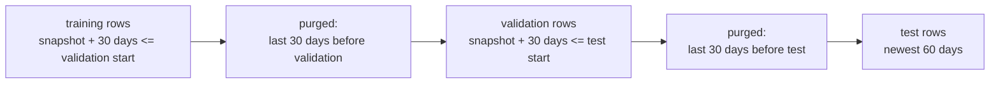

# Leakage controls

> **In short:** *Leakage* happens when a model is trained with information it will not have
> in production. It makes the model look better in development than it really is. The
> platform defends against three kinds: **target leakage** (columns that contain the answer),
> **temporal leakage** (learning from the future) and **training-serving skew** (production
> computes inputs differently). Each defence is built into the code and protected by tests.

## Contents

- [Target leakage](#target-leakage)
- [Temporal leakage](#temporal-leakage)
- [Training-serving skew](#training-serving-skew)
- [Tests that protect these rules](#tests-that-protect-these-rules)

---

## Target leakage

### The risk

Some columns are only known *because* the customer is leaving: a cancellation request, an
account-closure date, an exit survey, a retention offer. A model trained with them would look
almost perfect and be useless - in production, when a prediction is needed, these fields are
still empty.

### The defences

| Defence | Where | How it works |
|---|---|---|
| **Explicit schema** | `churn_platform/data/schema.py` | the dataset may contain exactly 19 known columns |
| **Denylist of outcome columns** | `find_leakage_columns` in the same file | exact names (`cancellation_status`, `churn_date`, `account_closed`, `days_until_churn`, ...) and name fragments (`cancel`, `churn`, `closed`, `exit_survey`, `retention_offer`, `final_invoice`, `win_back`) are rejected; the label `churned_30d` is the only allowed exception |
| **Validation stage** | `validate` | fails the pipeline on any unexpected or leaking column |
| **Strict API contract** | `churn_platform/serving/schemas.py` | unknown request fields are rejected (`422`), so `cancellation_status` cannot even be sent |
| **Selection by name inside the model** | `FeatureEngineer` | the model pipeline picks its 16 features by name; a label or ID passed by mistake never reaches the estimator |

---

## Temporal leakage

### Risk 1: labels that could not be known yet

The label describes the 30 days *after* the snapshot. A snapshot from last week has no
known outcome yet. If the data contained it anyway, the label would be a guess or simply wrong.

**Defence.** The generator only extracts snapshots dated at least 30 days before the
extract date (`as_of`), and the validation check `labels_matured` fails if any row violates
this.

### Risk 2: training on the future

Churn prediction is forecasting: we use the past to predict the future. With a *random*
split, the training set contains customers observed after the ones in the test set, and the
test score overstates what the model can do.

**Defence: a time-aware split.** Training uses the oldest data, validation the next period,
and the test period is always the newest data.

### Risk 3: labels that describe the next period

Even with a time-aware split, a training row from the last days before the validation
period has a label that describes the first days of the validation period. The model would
learn from outcomes it is later evaluated on.

**Defence: purging.** A row may join a period only if its 30-day outcome window ends before
the next period starts:

The configuration loader refuses a purge shorter than the label window
(`split.purge_days >= generation.label_window_days`), so this protection cannot be switched
off by accident. In the first dataset 1,906 of 12,000 rows are purged.

### Risk 4: tuning on the test data

Choosing the algorithm or the threshold by looking at test results would make the test score
optimistic. **Defence:** the `train` stage does not even have the test file as an input; the
winner and its threshold are chosen on validation data, and the test period is scored once,
afterwards.

---

## Training-serving skew

### The risk

If production computes an input differently from training - a different unit, a different
treatment of empty values, a missing derived feature - the model receives data it never saw
and its predictions degrade silently.

### The defences

| Defence | Where | How it works |
|---|---|---|
| **One model object** | `churn_platform/features/preprocessing.py` | feature engineering, missing-value handling, scaling, one-hot encoding and the estimator are one saved scikit-learn pipeline; the API calls exactly that object |
| **Threshold inside the model** | model metadata `decision_threshold` | gate, monitoring and API all use the threshold the model was validated with |
| **Shared value ranges** | `data/schema.py` | the API's field limits are generated from the same constants as dataset validation |
| **Fixed categories** | one-hot encoding with explicit category lists | an unknown category is refused instead of being silently scored |
| **Explicit empty values** | missing-value indicator for `avg_resolution_hours` | "no tickets, therefore no resolution time" is kept as information in training and serving alike |

---

## Tests that protect these rules

| Rule | Test file |
|---|---|
| leaking column names are detected; the label, IDs and features are not | `tests/unit/test_data_validation.py` |
| a dataset containing a leaking column fails validation | `tests/unit/test_data_validation.py` |
| labels that could not be known yet fail validation | `tests/unit/test_data_validation.py` |
| model features never include the label or identifiers | `tests/unit/test_data_validation.py` |
| extra or leaking columns do not change a single prediction | `tests/unit/test_features.py` |
| periods are in time order, purged, and share no customers | `tests/unit/test_time_split.py` |
| a purge shorter than the label window is rejected | `tests/unit/test_config.py` |
| the API contract has exactly the model's features and ranges | `tests/unit/test_serving_contract.py` |
| a request sent through the API conversion scores exactly like the training row | `tests/unit/test_serving_contract.py` |
| unknown categories are refused by the model | `tests/unit/test_features.py` |
| leaking request fields are rejected with 422 before the model is called | `tests/component/test_inference_api.py` |

Related: [data-pipeline.md](data-pipeline.md), [training-and-evaluation.md](training-and-evaluation.md).
