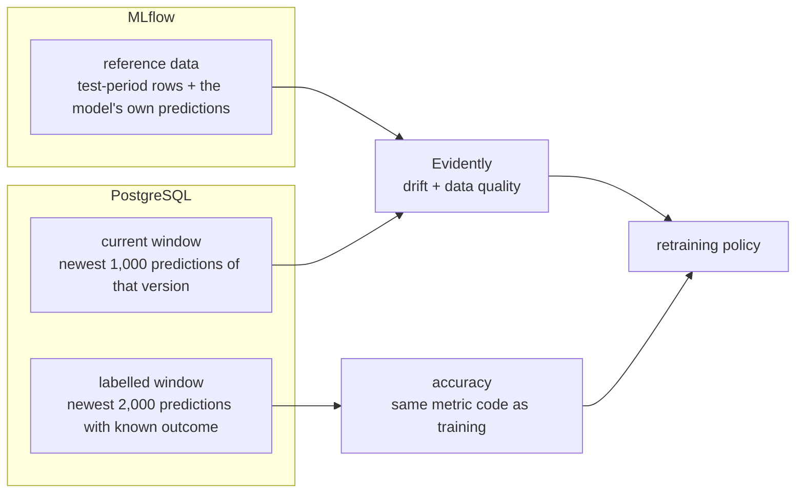

# ML monitoring

> **In short:** A monitoring worker regularly compares what production sees with what the
> served model was tested on. It detects **data quality problems**, **feature drift** (inputs
> changed), **dataset drift** (many inputs changed) and **prediction drift** (the model's
> answers changed) immediately, and measures **real accuracy** once true outcomes arrive 30
> days later. It records its findings and may ask for retraining - it never changes a model
> itself.

## Contents

- [Why ML monitoring is needed](#why-ml-monitoring-is-needed)
- [Where and when it runs](#where-and-when-it-runs)
- [What is compared](#what-is-compared)
- [Immediate signals](#immediate-signals)
- [The delayed signal: accuracy](#the-delayed-signal-accuracy)
- [Reading the results correctly](#reading-the-results-correctly)
- [From findings to a decision](#from-findings-to-a-decision)
- [Where results are stored](#where-results-are-stored)
- [Worked example from the demo](#worked-example-from-the-demo)
- [Configuration](#configuration)
- [Limitations](#limitations)

---

## Why ML monitoring is needed

A model can be "healthy" by every operational measure - fast, no errors, always available -
and still be wrong, because the world it was trained on no longer exists. Operational
metrics cannot see this. ML monitoring asks different questions:

- Do today's customers look like the customers the model was tested on?
- Does the model answer differently than before?
- Once we know what really happened: were the predictions right?

---

## Where and when it runs

| Way | Command | Behaviour |
|---|---|---|
| **Monitoring worker** (container `monitoring-worker`) | `churnctl monitor run --loop` | one cycle right after start, then one every 300 seconds; a cycle is **skipped** if no prediction was added and no outcome resolved since the last analysed cycle |
| **Manual** | `uv run churnctl monitor run` | one cycle immediately, always analysed |
| **Results** | `uv run churnctl monitor status` | the latest results as a table |

If a cycle fails (for example MLflow is briefly unreachable), the worker logs the error and
tries again at the next interval; it keeps running and never affects serving.

---

## What is compared

| Dataset | Content | Source |
|---|---|---|
| **Reference** | the monitored version's test-period rows (up to 5,000) with **that model's own** predictions | `reference/reference.parquet` on the version's MLflow run, written by the evaluate stage |
| **Current window** | the newest 1,000 predictions served by that version | `ops.prediction_observations` |
| **Labelled window** | the newest 2,000 predictions of that version whose true outcome is known | the same table, rows with `actual_churn` filled |

**Which version is monitored?** The version behind the newest prediction - what production
actually ran, not what the registry alias says. After a promotion and reload, the new
version starts with a clean history instead of inheriting its predecessor's drift.

---

## Immediate signals

These need no outcomes and are available as soon as enough predictions exist. They are
computed with Evidently (`DataDriftPreset`, `ValueDrift` and `DataSummaryPreset`).

### Feature drift

For every one of the 16 input features, the distribution in the current window is compared
with the reference:

| Feature type | Distance measure | Drifted when |
|---|---|---|
| numeric (12 features) | normalised **Wasserstein distance** - roughly, how far values had to "move" to turn one distribution into the other, relative to the reference spread | distance >= 0.1 |
| categorical and boolean (4 features) | **Jensen-Shannon distance** - how different the category proportions are | distance >= 0.1 |

Both methods are fixed on purpose: Evidently would otherwise switch between statistical
tests and distances depending on the number of rows, and "drifted" would mean different
things for different windows. For two samples of unchanged traffic the distances are
typically 0.00-0.07.

### Dataset drift

The input data as a whole has drifted when **at least 25%** of the 16 features drifted
(4 or more).

### Prediction drift

The distribution of `churn_probability` in the current window is compared with the model's
own predictions on the reference data (Wasserstein distance, threshold 0.1). This shows
whether the model *behaves* differently, even before outcomes are known.

### Data quality

| Rule | Flagged when |
|---|---|
| missing values | a **required** feature's share of empty values rose by more than 10 percentage points compared with the reference |
| duplicates | more than 5% of the window are repeated `(customer_id, snapshot_date)` pairs |

`avg_resolution_hours` is legitimately empty for customers without support tickets. Its
empty share follows the number of tickets and is therefore covered by drift analysis, not
counted as a quality defect. Because the API rejects invalid requests, quality problems in
practice mean replayed or duplicated requests.

**Too little data:** with fewer than 200 predictions in the window, no drift statistics are
computed and the run is recorded as `insufficient_data`.

---

## The delayed signal: accuracy

Once at least 200 predictions of the monitored version have a known outcome
([delayed-ground-truth.md](delayed-ground-truth.md)), each cycle computes the real precision,
recall, F1 and ROC-AUC of the predictions **that were actually served**. It uses the same
metric code as training, so the numbers are directly comparable with the model's test
metrics, and reports:

- `f1_drop` = test F1 - production F1
- `recall_drop` = test recall - production recall

Positive values mean the model got worse in production.

---

## Reading the results correctly

> [!IMPORTANT]
> **Drift is not proof that the model got worse.** Feature drift says the inputs changed. The
> model may still predict well (the relationship between inputs and churn is the same -
> *covariate drift*) or badly (the relationship changed - *concept drift*). Only true
> outcomes can tell these apart.

> [!IMPORTANT]
> **F1 moves with the churn rate.** When churn becomes more common, a model's F1 tends to rise
> even if the model got worse, because positive predictions are right more often. Always read
> F1 together with ROC-AUC (which does not depend on the churn rate) and the churn rate itself.

| You see | It means | Typical response |
|---|---|---|
| no drift, stable accuracy | business as usual | nothing |
| feature drift, no prediction drift | inputs changed but the model reacts little | watch |
| feature drift + prediction drift | inputs changed and the model answers differently | investigate; retrain if severe |
| accuracy drop (with outcomes) | the model really got worse | retrain |
| data-quality issue | the input data itself may be broken | fix the data first - do not retrain on it |

---

## From findings to a decision

At the end of each analysed cycle the retraining policy (`config/retraining.yaml`) turns the
findings into one decision:

| Decision | Meaning |
|---|---|
| `insufficient_data` | fewer than 500 observations - too early to decide |
| `no_action` | no drift, no accuracy drop |
| `watch` | some drift, but below the retraining threshold |
| `blocked` | retraining would be justified but is held back: a data-quality issue, an open request, or the cooldown |
| `request_retraining` | a retraining request was created |

The exact rules are in [continuous-training.md](continuous-training.md#when-a-request-is-created).

---

## Where results are stored

| Where | What |
|---|---|
| **PostgreSQL** `ops.monitoring_runs` | one row per analysed cycle: monitored version, reference run and dataset, window size and time range, data-quality summary, dataset drift flag, drift share, drifted features, per-feature distances, prediction drift and its score, labelled count, production and reference accuracy, the decision and its reasons, the retraining request ID, the MLflow report run ID and the input fingerprint |
| **MLflow** experiment `customer-churn-monitoring` | one run per cycle with metrics (`drift_share`, `prediction_drift_score`, `production_*`), `monitoring/summary.json` and the full Evidently report `monitoring/evidently_report.html` (about 4.5 MB, with a plot for every feature) |
| **Grafana** *Churn Model Monitoring* | the latest decision, drift over time, per-feature distances, accuracy over time and retraining requests |

---

## Worked example from the demo

| Situation | Window | Drift share | Prediction drift | Accuracy | Decision |
|---|---|---|---|---|---|
| December 2025 traffic (normal world) | 782 predictions | 0.0 | no | not yet known | `no_action` |
| after a simulated year of the pricing change | 1,000 predictions | 0.4375 (7 of 16) | yes | not yet known | `request_retraining` |
| after outcomes were resolved | 1,000 predictions, 1,982 labelled | 0.4375 | yes | F1 0.584, ROC-AUC 0.796 (test: 0.501 / 0.848) | `blocked` - a request is already open |

The drifted features were `recent_price_increase`, `monthly_charge`, `payment_failures_90d`,
`late_payments_12m`, `sessions_30d`, `support_tickets_90d` and `complaints_90d`. Note the
last row: F1 *rose* while ROC-AUC fell - the churn-rate effect described above.

---

## Configuration

`config/monitoring.yaml` (re-read on every cycle):

| Key | Default | Meaning |
|---|---|---|
| `window.max_observations` | 1000 | size of the current window |
| `window.min_observations` | 200 | minimum for drift statistics |
| `drift.numerical_method` / `categorical_method` | `wasserstein` / `jensenshannon` | fixed distance measures |
| `drift.feature_threshold` | 0.1 | per-feature drift threshold |
| `drift.dataset_drift_share` | 0.25 | share of drifted features for dataset drift |
| `drift.prediction_threshold` | 0.1 | prediction drift threshold |
| `data_quality.max_missing_share_increase` | 0.10 | allowed rise in missing values |
| `data_quality.max_duplicate_share` | 0.05 | allowed share of duplicate snapshots |
| `performance.min_labeled` / `max_labeled` | 200 / 2000 | outcomes needed / used |
| `worker.interval_seconds` | 300 | worker cycle interval (restart the worker after changing it) |

---

## Limitations

- One global drift threshold for all features; no per-feature tuning.
- Windows are "the newest N predictions", not calendar periods.
- Every analysed cycle stores a full Evidently report; there is no automatic clean-up.
- Monitoring needs the reference file written by this platform's evaluate stage; a model
  registered from elsewhere cannot be monitored.
