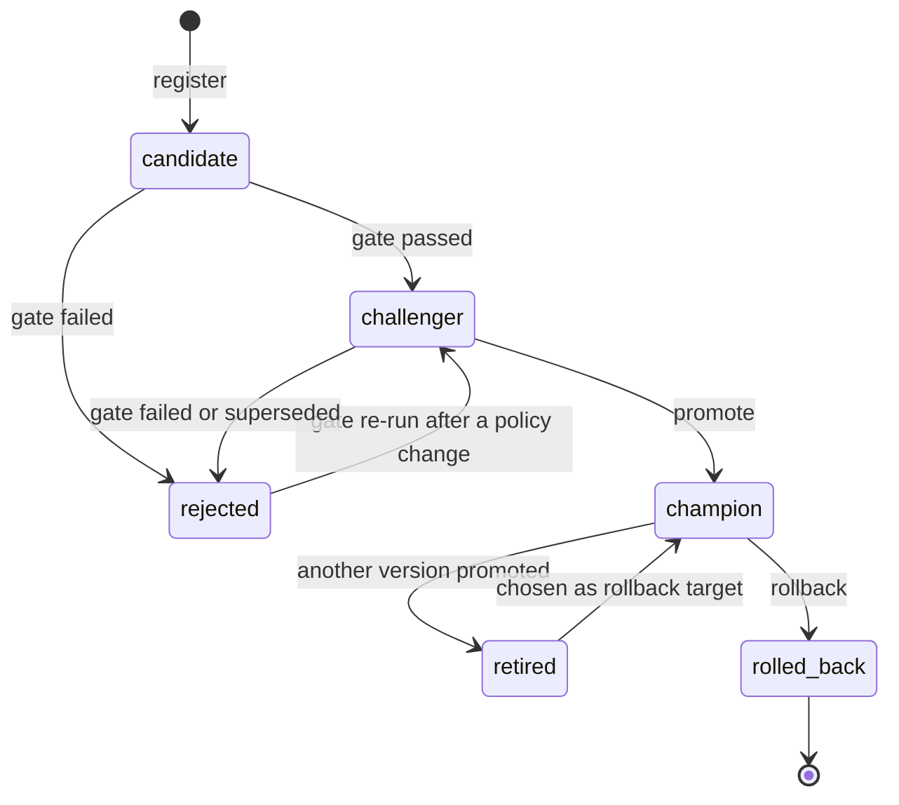

# Model lifecycle: registration, promotion and rollback

> **In short:** Every model that may ever serve customers goes through the same path:
> *registered* as a candidate, *checked* by the quality gate (becoming a challenger),
> *promoted* to champion, and eventually *retired* or *rolled back*. The roles are MLflow
> registry **aliases** - movable labels that point at a version - so changing the production
> model never copies files and can be undone in seconds. Only these commands can move the
> `champion` alias, and only after all checks pass.

## Contents

- [Key ideas](#key-ideas)
- [Aliases](#aliases)
- [Statuses and allowed transitions](#statuses-and-allowed-transitions)
- [Registration](#registration)
- [Quality gate](#quality-gate)
- [Promotion](#promotion)
- [Rollback](#rollback)
- [Serving picks up changes on reload](#serving-picks-up-changes-on-reload)
- [The audit trail](#the-audit-trail)
- [Commands at a glance](#commands-at-a-glance)
- [Failure behaviour and limits](#failure-behaviour-and-limits)

---

## Key ideas

- **Versions are immutable, roles are movable.** A registered version never changes. What
  changes is which alias points at it.
- **The registry is the single source of truth.** "Which model is in production?" is always
  answered by the `champion` alias in MLflow - never by a file on disk or a database row.
- **Every transition is checked.** A small, pure function (`churn_platform/lifecycle/states.py`)
  defines which status changes are allowed; anything else is refused with an explanation and
  changes nothing.

---

## Aliases

| Alias | Meaning | Moved by |
|---|---|---|
| `candidate` | the winner of the most recent training cycle | `churnctl model register` |
| `challenger` | a candidate that passed the quality gate and may replace the champion | `churnctl model gate` |
| `champion` | the approved production model - the API loads it | `churnctl model promote`, `churnctl model rollback` |

A version can hold several aliases at once: right after a promotion the newest version is
usually both `candidate` and `champion`. There is at most one challenger at any time.

---

## Statuses and allowed transitions

Each version also has a `lifecycle.status` tag that records where it is in its life:



| From | Allowed to | Refused (examples) |
|---|---|---|
| (unregistered) | `candidate` | anything else |
| `candidate` | `challenger`, `rejected` | `champion` - the gate cannot be skipped |
| `rejected` | `challenger`, `rejected` (re-gating) | `champion` |
| `challenger` | `champion`, `rejected`, `challenger` (re-gating) | - |
| `champion` | `retired`, `rolled_back` | `challenger` - a former champion is never re-gated |
| `retired` | `champion` (as a rollback target) | `challenger` |
| `rolled_back` | nothing | `champion` - a rolled-back model never returns |

---

## Registration

```bash
uv run churnctl model register
```

**What it does:**

1. Reads `reports/training_summary.json` and `reports/evaluation.json` from the last
   pipeline run and checks that both refer to the same winning run.
2. Checks the run in MLflow: finished, every lineage tag present, evaluated on the test
   period, required metrics present ([details](experiment-tracking.md#registration-checks)).
3. Creates version N of `customer-churn-classifier`, copies the lineage tags onto it and sets
   `lifecycle.status = candidate`.
4. Points the `candidate` alias at version N and writes an audit event.

**Idempotent:** if the run is already registered, the existing version is returned and
nothing is created.

---

## Quality gate

```bash
uv run churnctl model gate
```

Evaluates the candidate (or `--version N`) and the current champion **on the same data** and
applies nine checks. Result:

- **passed** -> the version gets the `challenger` alias and status `challenger`. If another
  version held that alias, it loses it and becomes `rejected` with the reason "superseded by
  challenger vN";
- **failed** -> status `rejected` (the alias `challenger` is removed if the version held it).

The `champion` alias is never touched by the gate. All rules and examples:
[quality-gate.md](quality-gate.md).

---

## Promotion

```bash
uv run churnctl model promote
```

Promotes the challenger (or `--version N`). The command first collects **every** reason
that could block the promotion and refuses if there is any:

| Rule | Why |
|---|---|
| the version holds the `challenger` alias | only gate-approved versions are eligible |
| its `gate.status` is `passed` | the gate result is recorded on the version |
| the gate compared it with the **current** champion (`gate.champion_version`) | if the champion changed after the gate ran (another promotion or a rollback), the comparison is stale and must be repeated |
| with manual approval enabled, `--approved-by <name>` is given | optional human sign-off |
| the version is not already the champion | nothing to do |
| its model file downloads and matches its fingerprint | a damaged artifact never becomes champion |

Then, in this order:

1. the `champion` alias moves to the new version - **the single moment of change**;
2. the `challenger` alias is removed;
3. the new champion gets `lifecycle.status = champion`, `lifecycle.promoted_at` and
   `lifecycle.approved_by` (`policy` when no approver was named);
4. the previous champion becomes `retired` with `lifecycle.retired_at`;
5. an audit event is written.

**Manual approval.** Set `approval.manual_approval_required: true` in
`config/quality_gate.yaml` to require a named approver:

```bash
uv run churnctl model promote --approved-by alice
```

---

## Rollback

```bash
uv run churnctl model rollback --reason "why the rollback is needed"
```

**Which version comes back?**

- By default, the **most recently retired champion** - the model that served just before
  the current one.
- With `--to-version N`, version N - but only if it is a retired former champion that passed
  the gate. Rejected, never-promoted and rolled-back versions are refused, and the error
  lists the eligible versions.

**What happens:**

1. the target's model file is verified (download + fingerprint);
2. the `champion` alias moves to the target;
3. the previous champion becomes `rolled_back` with `lifecycle.rolled_back_at` and
   `lifecycle.rollback_reason`;
4. the target becomes `champion` again with `lifecycle.restored_by_rollback = true`;
5. an audit event records both versions and the reason.

A rolled-back version can never become champion again. If it should be tried again, retrain
and register a new version.

---

## Serving picks up changes on reload

Promotion and rollback only move aliases. The running API keeps the model it loaded at
startup - it never swaps models on its own. To serve the new champion:

```bash
uv run churnctl serving reload
```

This restarts the inference container and waits until `/ready` reports the new version.
The retraining controller can do this automatically (`churnctl retrain run
--reload-serving`). Why there is no hot reload: [design-decisions.md](design-decisions.md#11-load-once-retry-only-until-loaded-reload-explicitly).

---

## The audit trail

Every registration, gate result, promotion and rollback appends a row to
`ops.lifecycle_events`:

```bash
uv run churnctl model history
```

```
time_utc             version  event                 actor  details
2026-09-19 13:46:04  2        promoted              doa19  {"approved_by": "policy", "previous_champion": "1"}
2026-09-19 13:46:03  2        gate_passed           doa19  {"report": "gate/report-v2-...json", "failed_checks": "none", "champion_version": "1"}
2026-09-19 13:45:55  2        registered_candidate  doa19  {"run_id": "4966e8a8...", "data_id": "customer-snapshots@2026-12-31#eb504e60c77f281d", ...}
2026-09-19 13:43:29  1        promoted              doa19  {"approved_by": "policy", "previous_champion": null}
```

The same table is shown on the Grafana dashboard *Churn Model Monitoring*. It is a history
only - no decision ever reads it; current state always comes from the registry.

---

## Commands at a glance

| Command | Changes | Exit code |
|---|---|---|
| `uv run churnctl model register` | new version, `candidate` alias | 0, or 1 if the run is not registrable |
| `uv run churnctl model gate [--version N]` | `challenger` alias or `rejected` status | 0 passed, 3 failed, 1 refused (e.g. wrong local test data) |
| `uv run churnctl model promote [--version N] [--approved-by NAME]` | `champion` alias | 0, or 1 with every blocking reason |
| `uv run churnctl model rollback --reason TEXT [--to-version N]` | `champion` alias | 0, or 1 if refused |
| `uv run churnctl model status` | nothing (shows versions, aliases, status, gate, data date, test metrics) | 0 |
| `uv run churnctl model history [--limit N]` | nothing (shows the audit trail) | 0 |

---

## Failure behaviour and limits

- **Nothing changes on refusal.** Every check runs before the first registry change.
- **Audit write after the change.** The audit event is written after the alias moved. If
  PostgreSQL is unavailable at that moment, the registry change stands and an error is
  logged; the history then lacks that row.
- **Tag updates after the alias.** If the process died between moving the alias and updating
  status tags, the alias (the truth) would be correct and a status tag stale.
- **No locking between operators.** Two people promoting at the same moment are protected
  only by MLflow's atomic alias update and the stale-comparison rule. Acceptable on one
  machine; see [production-considerations.md](production-considerations.md).
- **No authentication on MLflow.** Someone with access to this machine could move aliases
  directly through MLflow's own API, bypassing these checks ([security.md](security.md)).
