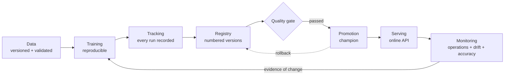

# Project overview

> **In short:** This project is a complete machine-learning platform that runs on one
> computer. It predicts which subscription customers will cancel within 30 days, but its
> real purpose is to show - with working code - the full *lifecycle* of a production model:
> how data is versioned, how models are trained and compared, how a model is approved and
> deployed, how it is watched, and how it is replaced or rolled back safely when the world
> changes.

## Contents

- [The business problem](#the-business-problem)
- [What "the ML lifecycle" means](#what-the-ml-lifecycle-means)
- [What the platform does, in one paragraph per stage](#what-the-platform-does-in-one-paragraph-per-stage)
- [Guiding principles](#guiding-principles)
- [Goals and non-goals](#goals-and-non-goals)
- [Why simulated data](#why-simulated-data)
- [Headline results](#headline-results)
- [Who this project is for](#who-this-project-is-for)

---

## The business problem

### Customer churn

Subscription businesses - streaming services, software tools, telecom plans - earn money
every month a customer stays. When a customer cancels, this is called **churn**. Winning a
new customer usually costs far more than keeping an existing one, so companies try to
recognise customers who are *about* to leave and act first: a better offer, a fix for a
billing problem, a call from customer support.

### The exact prediction question

The platform answers one precisely defined question for every **active** customer:

> Given everything we know about the customer **today**, what is the probability that the
> customer **voluntarily cancels** within the **next 30 days**?

Each word of that sentence matters:

| Part of the question | What it means in the platform | Why it matters |
|---|---|---|
| "active customer" | only customers who have not cancelled yet are scored | predicting churn for people who already left is pointless |
| "everything we know today" | the model sees a **snapshot**: plan, billing, usage, support history *as of one date* | information from after that date would be cheating (see [leakage controls](leakage-controls.md)) |
| "voluntarily" | the customer decides to leave | this is the kind of churn a retention team can influence |
| "within the next 30 days" | the outcome (the *label*) covers a fixed 30-day window after the snapshot | a fixed horizon makes predictions comparable and tells us when the true answer is known |

The answer is a probability (`churn_probability`, 0 to 1), a yes/no decision
(`churn_prediction`) and a business-friendly `risk_level` (`low`, `medium`, `high`).

### What the model looks at

Sixteen facts about each customer, grouped into five themes:

| Theme | Examples |
|---|---|
| Contract | plan tier (basic, standard, premium), contract type (monthly, annual, two-year), tenure |
| Billing | monthly charge, recent price increase, autopay, failed and late payments |
| Usage | usage hours, sessions, days since last login, usage trend |
| Support | tickets, complaints, average resolution time |
| Adoption | number of product features in use |

The full list with value ranges is in [synthetic-world.md](synthetic-world.md) and
[api-reference.md](api-reference.md).

---

## What "the ML lifecycle" means

A trained model is only a small part of a working machine-learning system. Around it, many
questions must be answered before and after it goes live:

- **Before production:** Which data was the model trained on? Can we produce the same model
  again? Is it really better than the model we already have - on the *same* data? Is it good
  for every group of customers, or only on average? Is the file we deploy the file we tested?
- **In production:** Is the service running and fast? Does it actually have a valid model?
  Are the incoming customers still similar to the training data? Once we know what really
  happened, were the predictions right?
- **When things change:** When is it worth retraining? How do we make sure the new model is
  better before it replaces the old one? How do we go back if something goes wrong?

The **ML lifecycle** is the set of steps and rules that answer these questions. This
project implements each of them:

---

## What the platform does, in one paragraph per stage

**Data versioning.** A generator creates a dataset of 12,000 customer snapshots, as if
exported from a data warehouse on a chosen date. The data passes 13 validation rules and is
split *by time* into training, validation and test periods. DVC (Data Version Control)
stores the files in MinIO, a local object store, and records a content hash for each file.
Any earlier version can be restored exactly.

**Reproducible training.** Three algorithms - logistic regression, random forest and
gradient boosting - are trained with fixed settings and fixed random seeds. The same inputs
always produce the same results. Each algorithm's *decision threshold* (the probability
above which a customer counts as "will churn") is tuned on the validation period.

**Experiment tracking.** MLflow records every training run: settings, scores, the model
file, and the *lineage* - the exact data hashes, dataset date, configuration files and Git
commit. Anyone can later trace a production model back to its origins.

**Model registry.** The best model of a training cycle is registered as a numbered
version. Its role is expressed with movable labels called *aliases*: `candidate` (newest
winner), `challenger` (passed the quality gate) and `champion` (in production).

**Quality gate.** Before a model may become champion it must pass nine checks: minimum
quality scores, a response-time limit, a minimum quality for every important customer
group, and a head-to-head comparison with the current champion on the same recent data.

**Promotion and rollback.** Promotion moves the `champion` alias to the approved version;
rollback moves it back to the previous approved champion. No files are copied, so both are
instant. An audit trail records who changed what and why.

**Serving.** A FastAPI web service loads the champion once at startup, verifies the model
file's fingerprint, validates every request strictly and answers within milliseconds. Every
prediction is stored in PostgreSQL together with the model version that produced it.

**Operational monitoring.** Prometheus collects metrics such as request rate, errors,
latency and the mix of predictions; Grafana shows them on a dashboard and alert rules flag
problems.

**ML monitoring.** A separate worker regularly compares recent live data with the data the
model was tested on, using Evidently. It detects *feature drift* (inputs changed),
*prediction drift* (outputs changed) and data-quality problems. When the true outcomes
arrive 30 days later, it measures the model's real accuracy.

**Continuous training.** A policy decides whether the evidence justifies retraining (severe
drift together with changed predictions, or a real accuracy drop), and prevents repeated
requests. A retraining controller then trains on newer data, registers the winner and runs
the same quality gate. Only a model that is better on the new data is promoted.

---

## Guiding principles

These rules shape the whole design. Each is enforced by the code structure and checked by
tests.

| Principle | What it means in practice | Why |
|---|---|---|
| Simple model, sophisticated lifecycle | classic scikit-learn models; all effort goes into data, governance, serving and monitoring | lifecycle problems cause more production incidents than model choice |
| Training never promotes | the pipeline creates models and records them; only the promotion command moves the `champion` alias | a model must pass an independent check before it serves customers |
| Serving never trains | the API only loads and uses the champion | a prediction service should be small, fast and predictable |
| Monitoring never deploys | monitoring can only *request* retraining | a monitoring bug must not be able to change production |
| One source of truth for models | the MLflow registry decides which version is champion | two sources of truth eventually disagree |
| One object for features and model | preprocessing and the estimator are saved together | production must compute features exactly like training |
| A failed candidate never removes the champion | every failure path leaves the alias unchanged | production stays stable while experiments fail |
| Drift is not proof of degradation | accuracy is measured only when true outcomes exist | changed inputs do not always mean worse predictions |
| Administrative actions stay local | promotion, rollback and retraining are command-line operations | the public API cannot be used to change models |

---

## Goals and non-goals

**Goals**

- Show every stage of a production ML lifecycle working together, end to end.
- Make each rule explicit (configuration + code) and verified (tests).
- Be reproducible: same inputs, same data, same models, same decisions.
- Run on one developer machine with free, open-source tools.
- Be understandable for someone learning MLOps.

**Non-goals**

- State-of-the-art prediction accuracy. The models are intentionally standard.
- Big-data or distributed processing. Datasets are thousands of rows, not billions.
- A cloud or Kubernetes deployment, streaming pipelines, feature stores or enterprise
  identity management. How the design would evolve towards these is described in
  [production-considerations.md](production-considerations.md).

---

## Why simulated data

The platform needs data in which *the world changes at a known moment*, so that drift,
delayed feedback and retraining can be demonstrated - and demonstrated identically every
time. Real data cannot offer that, and it would raise privacy issues.

The synthetic world therefore contains:

- realistic customer attributes with sensible relationships (for example, customers without
  autopay have more failed payments);
- a hidden churn logic (a formula the models never see) that turns attributes into a churn
  probability;
- a **timeline**: until 1 January 2026 customers follow the `baseline` behaviour; from then
  on the `pricing_shift` behaviour applies - many more price increases, more payment
  problems, and customers who react much more strongly to price.

The monitoring and retraining components are never told about this timeline. They have to
notice the change in the data, just as in a real company. Details:
[synthetic-world.md](synthetic-world.md).

---

## Headline results

From a real run of the [demo walkthrough](demo-walkthrough.md):

| Stage | Result |
|---|---|
| First champion (trained before the change) | test F1 0.501 vs. 0.232 for a "no-skill" model; ROC-AUC 0.848; single prediction in about 8 ms |
| Baseline production traffic | no drift, no action |
| After one simulated year of the new pricing world | 7 of 16 inputs drifted; predicted churn share rose from 22% to 45%; one retraining request |
| True outcomes 30 days later | the champion's real ROC-AUC fell to 0.796 |
| Retrained model vs. old champion on the new data | F1 0.700 vs. 0.643 and ROC-AUC 0.851 vs. 0.764 - promoted automatically |
| Rollback | previous champion restored and serving within seconds |

The terms used here (F1, ROC-AUC, drift) are explained in the [glossary](glossary.md).

---

## Who this project is for

- **Learners** who want to see how MLOps concepts fit together in running code rather than
  in isolated examples.
- **Engineers and reviewers** who want to evaluate lifecycle design: governance, failure
  handling, testing and security trade-offs.
- **Practitioners** who want a small, complete reference to experiment with policies - for
  example, how gate thresholds or drift thresholds change which models reach production.

Next: [how-it-works.md](how-it-works.md) follows a model and a prediction through the whole
system; [getting-started.md](getting-started.md) gets the platform running.
