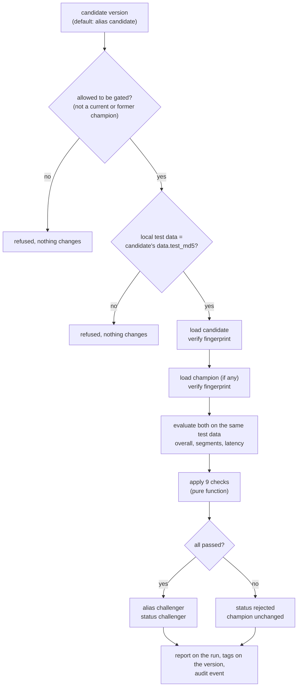

# Quality gate

> **In short:** The quality gate is the independent check a candidate must pass before it may
> become a challenger (and then champion). It reloads the registered model from storage,
> verifies it, evaluates it **and the current champion on the same recent data**, and applies
> nine configurable checks. Every check must pass. A failed candidate is marked `rejected`,
> and the champion keeps serving.

## Contents

- [Why a separate gate](#why-a-separate-gate)
- [Fair comparison](#fair-comparison)
- [How a gate run works](#how-a-gate-run-works)
- [The nine checks](#the-nine-checks)
- [Worked examples](#worked-examples)
- [Reading the output](#reading-the-output)
- [Changing the policy](#changing-the-policy)
- [Limitations](#limitations)

---

## Why a separate gate

Training chooses the best of *its* candidates. It does not know whether that winner is
better than the model already serving customers, whether it is good for every group of
customers, or whether the stored file is intact. The gate answers those questions
independently of training - so a training bug cannot promote a bad model, and the rules for
"good enough for production" live in one reviewable place: `config/quality_gate.yaml`.

---

## Fair comparison

The candidate and the champion are both evaluated on **the candidate's test period** - the
newest data available.

Why this matters: after the world changes, the champion's old test score describes a world
that no longer exists. In the demo, the first model scored F1 0.501 on its own (pre-change)
test period but only 0.643 on the new test period - while the retrained candidate scored
0.700 there. Comparing 0.700 with the old 0.501 would be meaningless; comparing both on the
same new data is fair.

Before evaluating anything, the gate checks that the local `data/splits/test.parquet` has
exactly the hash recorded on the candidate (`data.test_md5`). If the workspace holds a
different dataset version, the gate refuses to run instead of evaluating on the wrong data.

---

## How a gate run works



If the **champion** cannot be loaded (for example, its file was damaged), the gate stops with
an error and changes nothing - without a trustworthy comparison there is no safe decision.

---

## The nine checks

Defaults from `config/quality_gate.yaml`:

| # | Check | Rule | Default | Why |
|---|---|---|---|---|
| 1 | `loadable_and_intact` | the model downloads, matches its SHA-256 fingerprint and loads | - | a model that cannot be loaded safely is not judged further |
| 2 | `f1_min` | F1 >= limit | 0.40 | minimum on the primary metric |
| 3 | `recall_min` | recall >= limit | 0.50 | must catch at least half of the churners |
| 4 | `roc_auc_min` | ROC-AUC >= limit | 0.75 | minimum ranking quality, independent of the threshold |
| 5 | `latency_p95_ms` | single-prediction p95 latency <= limit | 50 ms | fit for online serving |
| 6 | `segment_recall_min` | every reliable segment's recall >= limit | 0.25 | no customer group may be ignored |
| 7 | `f1_vs_champion` | candidate F1 - champion F1 >= limit | -0.01 | no real regression; a tiny tolerance absorbs noise |
| 8 | `roc_auc_vs_champion` | candidate ROC-AUC - champion ROC-AUC >= limit | -0.01 | the same for ranking quality |
| 9 | `segment_f1_vs_champion` | no reliable segment loses more F1 than the limit | 0.08 | an overall improvement must not hide a loss for one customer group |

Notes:

- **No champion yet** (the very first model): checks 7-9 are replaced by one passing entry
  `champion_comparison` - "absolute checks only".
- **Segments** are `plan_tier`, `contract_type` and `tenure_segment`. A segment with fewer
  than 50 rows or only one class is reported but not enforced.
- **Why segments are compared on F1, not recall**: a candidate may trade a little recall for
  much better precision in a segment and still be the better model; recall is protected by
  the absolute floor in check 6. See [design-decisions.md](design-decisions.md#15-segments-are-compared-on-the-primary-metric).
- **Accuracy is never used** - with about 13% churners it rewards a model that never predicts
  churn.
- **Boundaries count as passes**: an F1 of exactly 0.40 passes `f1_min`.

---

## Worked examples

### 1. The first model (no champion)

```
check                result  observed  threshold
loadable_and_intact  pass    ok        loads and matches fingerprint
f1_min               pass    0.5007    0.4
recall_min           pass    0.6743    0.5
roc_auc_min          pass    0.8476    0.75
latency_p95_ms       pass    7.67      50.0
segment_recall_min   pass    0.3333    0.25    8 reliable segments checked
champion_comparison  pass    None      None    no current champion: absolute checks only

version 1 vs champion none: PASSED -> challenger
```

The weakest segment (two-year contracts, recall 0.333) is still above the floor.

### 2. A model retrained after the world changed

The candidate (version 2) and the champion (version 1) on the new test period:

| Metric | Candidate v2 | Champion v1 | Difference | Check |
|---|---|---|---|---|
| F1 | 0.7002 | 0.6427 | **+0.0575** | `f1_vs_champion` pass |
| ROC-AUC | 0.8510 | 0.7638 | **+0.0871** | `roc_auc_vs_champion` pass |
| largest segment F1 loss | - | - | -0.0139 (every segment improved) | `segment_f1_vs_champion` pass |

Result: **passed**, version 2 becomes challenger and - with automatic promotion - champion.

### 3. A weak model

A deliberately useless model (a random forest of a single tree with depth 1, used in the
integration tests) fails `f1_min` and `roc_auc_min`. It becomes `rejected`, cannot be
promoted even with `--version`, and the champion keeps serving.

### 4. A damaged model file

If the stored `model.skops` is modified after training, check 1 fails with
`ModelIntegrityError` and no further checks run. An operational test does exactly this to a
real artifact in MinIO.

---

## Reading the output

| Output | Where |
|---|---|
| a table with every check, the observed value, the threshold and a detail text | terminal |
| exit code: **0** passed, **3** failed, **1** refused (wrong test data, not allowed to be gated, champion unloadable) | terminal / scripts |
| a JSON report with the decision and the full metrics of candidate and champion | MLflow: the version's run -> `gate/report-v<version>-<timestamp>.json` |
| tags `gate.status`, `gate.evaluated_at`, `gate.champion_version`, `gate.failed_checks`, `gate.report_artifact` | MLflow: the registered version |
| a `gate_passed` or `gate_failed` event | `churnctl model history`, Grafana |

---

## Changing the policy

Edit `config/quality_gate.yaml`. The file is validated when loaded: unknown keys or values out
of range stop the command with a clear error.

```yaml
absolute:
  f1_min: 0.40
  recall_min: 0.50
  roc_auc_min: 0.75
segments:
  columns: [plan_tier, contract_type, tenure_segment]
  recall_min: 0.25
  max_f1_drop_vs_champion: 0.08
champion_comparison:
  min_f1_delta: -0.01      # negative = tolerate a small drop; positive = demand improvement
  min_roc_auc_delta: -0.01
operational:
  max_p95_latency_ms: 50
approval:
  manual_approval_required: false
```

A previously rejected version can be evaluated again under the new policy:

```bash
uv run churnctl model gate --version 3
```

The next gate run uses the file immediately; no restart is needed.

---

## Limitations

- The gate uses one test period; there is no statistical significance test for the
  difference between candidate and champion. The small negative tolerance (-0.01) absorbs
  noise instead.
- Segment reliability is based on row count and class presence. A segment with few churners
  (for example two-year contracts, about 6 churners in 259 rows) still counts as reliable,
  so its recall is noisy.
- The gate evaluates on historical data; it cannot predict how a model will do on future
  changes.
