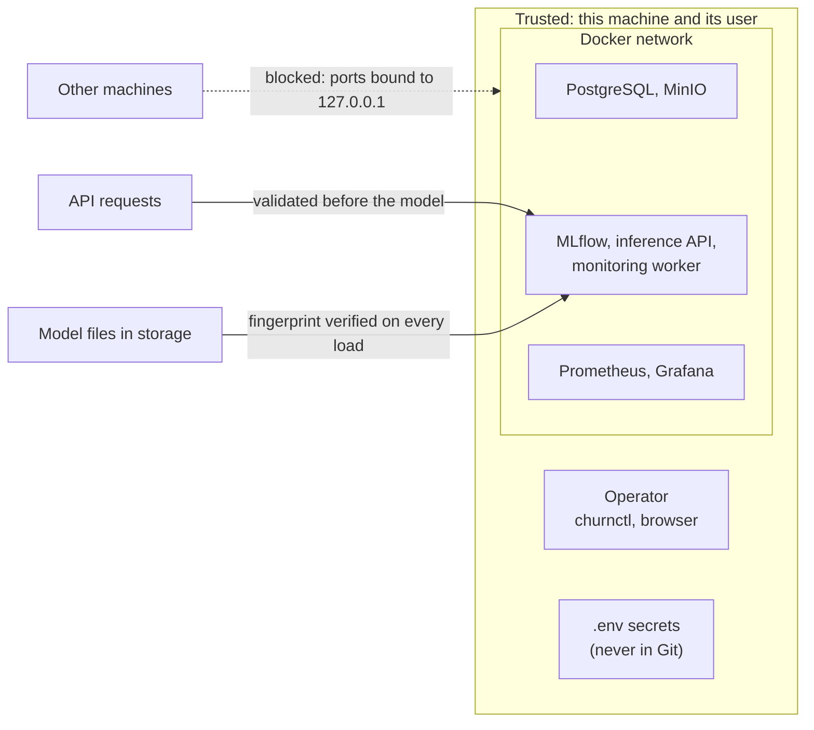
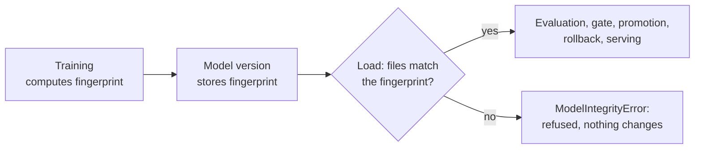

# Security

> **In short:** The platform is built for one machine and one operator, so its security is
> sized for that: nothing is reachable from other computers, no secret is stored in Git,
> every component gets only the database and storage rights it needs, the platform's own
> containers are locked down, every API request is checked before it reaches the model, and
> every model file is verified before it is used. Model changes are only possible through
> local commands, never through the prediction API. This document explains each measure, how
> it is verified, and where the limits are.

## Contents

- [Threat model in plain words](#threat-model-in-plain-words)
- [Trust boundaries](#trust-boundaries)
- [Secrets](#secrets)
- [Least privilege: who may do what](#least-privilege-who-may-do-what)
- [Network exposure](#network-exposure)
- [Container hardening](#container-hardening)
- [Input validation](#input-validation)
- [Model artifact integrity](#model-artifact-integrity)
- [Administrative actions stay off the network](#administrative-actions-stay-off-the-network)
- [Dependency scanning](#dependency-scanning)
- [How security is verified](#how-security-is-verified)
- [Known limits](#known-limits)

---

## Threat model in plain words

A *threat model* is a short list of "what could go wrong, and who could cause it". For this
platform the realistic risks are:

| Risk | Example | Main protection |
|---|---|---|
| another computer on the network reaches a service | someone on the same Wi-Fi opens MLflow and moves the `champion` alias | every port is bound to `127.0.0.1` (this machine only) |
| a secret leaks through Git | a database password is committed and pushed | secrets live only in `.env`, which Git ignores |
| one leaked credential opens everything | the dataset storage key is used to overwrite model files | a separate, narrowly scoped credential per component |
| a malicious or broken request harms the model service | a huge body, wrong types, unknown fields | strict request validation and a 16 KB size limit |
| a model file is swapped or damaged in storage | a changed file is loaded and serves wrong predictions, or runs unexpected code | safe model format plus a fingerprint check on every load |
| the prediction API is used to change production | a request "promotes" another model | the API has no endpoints that change models |
| a compromised container damages its host or other files | code writes into the image or gains extra rights | non-root users, read-only filesystems, no Linux capabilities |

Out of scope: attackers who already control this machine or its user account. Anyone with
that access can read `.env` and use the local services directly (see
[Known limits](#known-limits)).

---

## Trust boundaries

A *trust boundary* is a line where data or requests come from a less trusted place and must
be checked.



| Inside the boundary (trusted) | Crossing the boundary (checked) |
|---|---|
| the operator and their `churnctl` commands | prediction request bodies |
| processes on this machine | model files read back from storage |
| the Docker network between containers | configuration files (validated when loaded, [configuration-reference.md](configuration-reference.md#validation-examples)) |

---

## Secrets

| Rule | How it is implemented |
|---|---|
| no secret in Git | `.env` and `.dvc/config.local` are listed in `.gitignore`; `.env.example` contains only placeholders |
| strong, unique values | `churnctl bootstrap` fills every placeholder with its own random 48-character hexadecimal value (unit test: every value is distinct and random) |
| never overwritten by accident | `bootstrap` never replaces an existing `.env` (unit test) |
| one place for all secrets | Docker Compose reads `.env`; a missing value stops startup with "run churnctl bootstrap to create .env" |
| DVC credentials stay local | `bootstrap` writes the DVC storage key to `.dvc/config.local`, which Git ignores |

`.env` holds these values: `POSTGRES_SUPERUSER_PASSWORD`, `MLFLOW_DB_PASSWORD`,
`OPS_DB_PASSWORD`, `INFERENCE_DB_PASSWORD`, `GRAFANA_DB_PASSWORD`, `MINIO_ROOT_USER`,
`MINIO_ROOT_PASSWORD`, `MLFLOW_S3_ACCESS_KEY`/`SECRET_KEY`, `DVC_S3_ACCESS_KEY`/`SECRET_KEY`
and `GRAFANA_ADMIN_PASSWORD`.

**Good to know:**

- Containers receive secrets as environment variables. Anyone who can run `docker inspect`
  on this machine can read them - acceptable inside the trust boundary, not in production.
- The databases and storage are initialised with the passwords that existed at first start.
  Changing a password in `.env` later requires `uv run churnctl stack reset --yes`, which
  deletes all data.
- Hexadecimal values are used on purpose: they never start with `-` and contain no
  characters that shells, URLs or the MinIO client would interpret.

---

## Least privilege: who may do what

*Least privilege* means every component gets only the rights it needs, so a bug or leaked
credential in one component cannot damage the others.

### Database roles (PostgreSQL)

| Role | Used by | Allowed | Not allowed |
|---|---|---|---|
| `mlflow` | MLflow server | owns the `mlflow` database (runs, registry) | the `churn_ops` database |
| `churn_ops` | `churnctl` lifecycle commands, monitoring worker, `db-migrate` | owns the `churn_ops` database | the `mlflow` database |
| `churn_inference` | inference API | **insert** rows into `ops.prediction_observations` | reading any row, touching any other table, connecting to `mlflow` |
| `grafana_reader` | Grafana dashboards | **read** tables in the `ops` schema | any change; the `mlflow` database |

Nobody else may connect to either database (`REVOKE ALL ... FROM PUBLIC`). The superuser
password is only used by PostgreSQL's own initialisation.

Why the API's role is insert-only: the API is the component that faces requests. If it were
ever tricked into running unexpected database statements, it still could not read customer
predictions, delete the audit trail or change registry data.

### Storage keys (MinIO)

| Key | Used by | Bucket it may use | Contents |
|---|---|---|---|
| `MLFLOW_S3_*` | MLflow server only | `mlflow-artifacts` | model files, reports, monitoring evidence |
| `DVC_S3_*` | DVC on the host | `dvc-store` | dataset versions and pipeline outputs |
| MinIO root | `minio-init` only (one-shot setup) | all | creates buckets, users and policies |

Model files flow only through MLflow's artifact proxy. The API, the worker and `churnctl`
download models *through* MLflow and never hold a storage key for the model bucket. A leaked
DVC key therefore cannot overwrite a model, and a leaked MLflow key cannot change dataset
versions.

---

## Network exposure

| Port | Service | Bound to |
|---|---|---|
| 5432 | PostgreSQL | `127.0.0.1` |
| 9000 / 9001 | MinIO S3 API / console | `127.0.0.1` |
| 5000 | MLflow | `127.0.0.1` |
| 8000 | inference API | `127.0.0.1` |
| 9090 | Prometheus | `127.0.0.1` |
| 3000 | Grafana | `127.0.0.1` |

`127.0.0.1` (the *loopback* address) means "this machine only": other computers cannot
connect even if the firewall is open. Other settings:

- Grafana allows anonymous **viewing** of dashboards; changing anything needs the admin
  password from `.env`.
- MLflow only accepts requests addressed to known host names (`MLFLOW_SERVER_ALLOWED_HOSTS`),
  which protects against *DNS rebinding* - a trick where a web page in the browser talks to
  local services under a foreign name.
- MinIO's console redirect is disabled (`MINIO_BROWSER_REDIRECT=false`).
- Telemetry (usage reporting to vendors) is off: DVC (`analytics = false`), Evidently
  (`DO_NOT_TRACK=1`) and Grafana (analytics and update checks disabled).

---

## Container hardening

| Container | Runs as | Filesystem | Linux capabilities | `no-new-privileges` | Memory limit |
|---|---|---|---|---|---|
| inference | uid 10001 | read-only, writable `/tmp` only | all dropped | yes | 768 MB |
| monitoring-worker | uid 10001 | read-only, writable `/tmp` only | all dropped | yes | 1 GB |
| db-migrate (one-shot) | uid 10001 | read-only, writable `/tmp` only | all dropped | yes | - |
| MLflow | uid 10001 (own image) | writable | default | yes | 1 GB |
| Prometheus, Grafana | non-root user of the official image | writable data volume | default | yes | 512 MB / 384 MB |
| PostgreSQL | switches to the `postgres` user after start | writable data volume | default | yes | 512 MB |
| MinIO | **root** (official image default; its data volume is root-owned) | writable data volume | default | yes | 512 MB |

What these settings mean:

- **Non-root user:** a process that breaks out of the application has no administrator rights
  inside the container.
- **Read-only filesystem:** code cannot be changed or planted inside a running container.
- **Capabilities dropped:** Linux *capabilities* are pieces of administrator power (for
  example changing file owners). The platform's Python containers need none of them.
- **`no-new-privileges`:** a process can never gain more rights than it started with.
- **Memory limits:** one runaway service cannot starve the others or the host.

All images are pinned to exact versions: `postgres:18.6-alpine`, MinIO and `mc` release tags,
`prom/prometheus:v3.13.3`, `grafana/grafana:13.0.9`, and the platform's own images built from
`python:3.12-slim-trixie` with MLflow 3.16.1. Pinning means a rebuild cannot silently pull a
different, untested version.

---

## Input validation

Every prediction request passes these checks **before** the model is called:

| Check | Result when broken |
|---|---|
| body larger than 16 KB | `413 request body too large` |
| missing, unknown or misspelled field | `422`, naming the field |
| wrong type (for example `3.5` for an integer, `"true"` for a boolean) | `422` |
| value outside the allowed range or category list | `422` |
| inconsistent values (complaints above tickets; resolution time without tickets) | `422` |

Unexpected internal errors return a generic message without internal details. The full
contract is in [api-reference.md](api-reference.md#fields).

---

## Model artifact integrity

A model file is code-like: loading it rebuilds Python objects. Two protections make loading
safe.

**1. A safe file format (skops).** Python's common `pickle` format can run any code while
loading. The platform stores models with **skops**, which only rebuilds object types from an
explicit allow-list (`TRUSTED_MODEL_TYPES` in `src/churn_platform/features/preprocessing.py`)
and refuses everything else.

**2. A fingerprint checked on every load.** When a model is trained, a SHA-256 *fingerprint*
(a short value that changes completely if a single byte of the files changes) is computed and
stored with the model version. Every load compares it again:



| Where the model is loaded | What happens when the fingerprint does not match |
|---|---|
| quality gate | check `loadable_and_intact` fails; the version is rejected |
| promotion / rollback | refused |
| inference API | the API stays alive but not ready; `/predict` answers 503 |

The fingerprint is calculated the same way on Windows and Linux (files are sorted by their
POSIX path), so a model trained on a Windows host verifies inside a Linux container.

---

## Administrative actions stay off the network

Registration, quality gate, promotion, rollback, retraining and resets exist only as local
`churnctl` commands. The inference API's published interface lists exactly four paths:
`/predict`, `/health`, `/ready` and `/model` (plus `/metrics` for Prometheus). An operational
test checks the running container: requests such as `POST /promote`, `POST /rollback` or
`POST /retrain` are answered with 404 or 405.

---

## Dependency scanning

Known vulnerabilities in installed Python packages can be listed with:

```bash
uv run pip-audit --skip-editable
```

It currently reports two advisories for which no fixed version exists:

| Package | Pulled in by | Advisory | Why it is accepted for local use |
|---|---|---|---|
| `diskcache` 5.6.3 | DVC | PYSEC-2026-2447: unsafe deserialisation of cache entries | exploiting it needs write access to the local DVC cache directory, which means the attacker is already inside the trust boundary |
| `nltk` 3.10.3 | Evidently | PYSEC-2026-3740: path traversal in language-model loading functions | the platform never calls those functions, and no file paths come from outside input |

Both should be upgraded as soon as fixed versions are published. Container images are not
scanned automatically; a scanner such as Trivy or Docker Scout can be pointed at
`churn-platform/inference:1.0.0`, `churn-platform/worker:1.0.0` and
`churn-platform/mlflow:3.16.1`.

---

## How security is verified

| Property | Test |
|---|---|
| every published port is bound to `127.0.0.1` | operational: `test_published_ports_are_bound_to_loopback_only` |
| each storage key is denied on the other bucket (listing and writing) | operational: `test_each_storage_key_is_limited_to_its_own_bucket` |
| API, worker, MLflow, Grafana and Prometheus run as non-root | operational: `test_services_run_as_non_root_users` |
| the API and worker containers cannot write their filesystem | operational: `test_platform_containers_have_a_read_only_filesystem` |
| the API exposes no lifecycle operations | operational: `test_public_api_exposes_no_lifecycle_operations` |
| a corrupted model file is refused by gate, promotion and API | operational: `test_corrupted_model_artifact_is_refused_everywhere` |
| the inference role cannot read predictions, delete audit rows or connect to `mlflow` | integration: `test_inference_role_may_insert_but_not_read_observations` |
| a changed model file is detected by the fingerprint | unit: `test_fingerprint_detects_any_changed_file` |
| invalid requests never reach the model; oversized bodies are refused | component tests in `tests/component/test_inference_api.py` |
| generated secrets are distinct, random and never overwritten | unit tests in `tests/unit/test_stack_cli.py` |

How to run these suites: [testing-strategy.md](testing-strategy.md#how-to-run-the-tests).

---

## Known limits

These are deliberate simplifications for a single machine, not hidden gaps:

- **No authentication on MLflow, Prometheus and the inference API.** Any process on this
  machine can call them - including MLflow's own API, which could move registry aliases. The
  platform's code keeps responsibilities apart (serving and monitoring have no code path that
  moves an alias), but on this machine that separation is not enforced by credentials.
- **Secrets as environment variables** readable with `docker inspect`.
- **Plain HTTP** between containers and to the browser.
- **MinIO runs as root** inside its container.
- **No automated image scanning** and no signed model files (the fingerprint detects
  changes, but does not prove who created the model).

What a production deployment would add - authentication per component, TLS, a secret
manager, network policies, signed artifacts, scanning in CI - is described in
[production-considerations.md](production-considerations.md#security).

## Related documents

- [architecture.md](architecture.md) - where each component runs
- [serving.md](serving.md) - the inference API's behaviour
- [failure-recovery.md](failure-recovery.md) - what happens when a model file is damaged
- [configuration-reference.md](configuration-reference.md#environment-variables) - all environment variables
