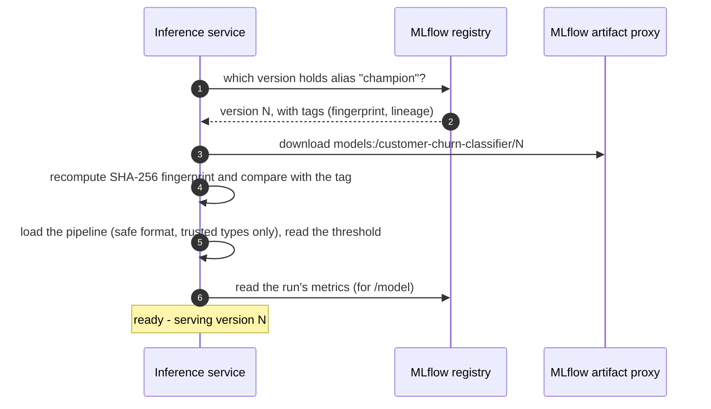
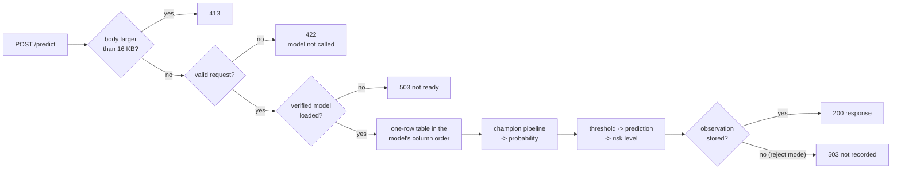

# Serving: the inference service

> **In short:** The inference service is a small FastAPI application in the `inference`
> container. At startup it loads the registry champion once and verifies its fingerprint.
> For each request it validates the input, predicts with the champion's own pipeline, stores
> the prediction in PostgreSQL and updates Prometheus metrics. If it has no verified model it
> stays alive but reports "not ready" - it never predicts with a missing or unverified model.

## Contents

- [Responsibilities and non-responsibilities](#responsibilities-and-non-responsibilities)
- [Startup: loading the champion](#startup-loading-the-champion)
- [When loading fails](#when-loading-fails)
- [The request path](#the-request-path)
- [Prediction observations](#prediction-observations)
- [Health endpoints](#health-endpoints)
- [Configuration](#configuration)
- [Process and container](#process-and-container)
- [Tests](#tests)

---

## Responsibilities and non-responsibilities

| The service does | The service never does |
|---|---|
| load and verify the champion at startup | train or evaluate models |
| validate requests and answer predictions | detect drift or analyse data |
| store every prediction with its model version | change registry aliases |
| expose health, readiness, lineage and metrics | offer any administrative operation |

Keeping the service this narrow makes it fast, predictable and safe to expose to client
applications. Endpoint details are in [api-reference.md](api-reference.md).

---

## Startup: loading the champion



Three rules make this safe:

1. **Resolve first, then download that exact version.** The alias is turned into a concrete
   version number before anything is downloaded, so an alias change during startup cannot
   mix two versions.
2. **Verify before use.** The version must have a `model.fingerprint` tag, and the downloaded
   files must match it. Otherwise the model is refused with `ModelIntegrityError`.
3. **No fallback.** There is no "use the previous model" or "use a local file" path. Either
   the verified champion is served, or nothing is.

After a successful load the service logs `serving customer-churn-classifier version N` and
sets the metrics `churn_model_loaded = 1` and `churn_model_info{model_version="N", ...} = 1`.

**Once loaded, the model is never replaced.** A new champion (after promotion or rollback)
is served after a restart:

```bash
uv run churnctl serving reload
```

---

## When loading fails

The process keeps running but is **not ready**:

| Endpoint | Answer while no model is loaded |
|---|---|
| `GET /health` | 200 `{"status": "alive", "model_loaded": false}` |
| `GET /ready` | 503 `{"status": "not_ready", "reason": "<why>"}` |
| `POST /predict` | 503 `{"status": "not_ready", "reason": "no verified champion model is loaded"}` |
| `GET /model` | 503 with the reason |

The failure is counted in `churn_model_load_failures_total{reason=...}`:

| `reason` | Typical cause |
|---|---|
| `no_champion` | no model is registered yet, or no version holds the `champion` alias |
| `registry_unavailable` | MLflow is not reachable (for example still starting) |
| `integrity` | the model files do not match the recorded fingerprint, or metadata is missing |
| `error` | anything else (the full message is in `/ready` and the log) |

A background thread **retries every 15 seconds until the first successful load**
(`model_loading.retry_interval_seconds`). This covers the common case where MLflow starts
after the API, or where the first champion is promoted after the API started. Once a model is
loaded, the retry thread stops.

---

## The request path



**Validation.** Pydantic models built from the shared schema check every field: allowed
categories, integer vs. decimal types, strict booleans, value ranges, and consistency rules
(complaints never exceed tickets; a resolution time exactly when there were tickets).
Unknown fields are rejected. Invalid requests get 422 and never reach the model.

**Prediction.**

- `churn_probability` - the pipeline's probability of churn;
- `churn_prediction` - `true` when the probability is at or above the model's own
  `decision_threshold` (stored inside the model);
- `risk_level` - `high` exactly when churn is predicted; `medium` when the probability is at
  least 60% of the threshold (`risk_levels.medium_ratio`); otherwise `low`. With a threshold
  of 0.60: high >= 0.60, medium 0.36-0.60, low < 0.36;
- `snapshot_date` defaults to today (UTC) if the request omits it.

**Error handling.** Any unexpected error returns `{"detail": "internal error"}` with status
500 - no stack traces or internal details leave the service.

---

## Prediction observations

Every served prediction becomes a row in `ops.prediction_observations`:

| Column | Content |
|---|---|
| `prediction_id` | the ID returned to the client |
| `predicted_at` | when the prediction was made |
| `customer_id`, `snapshot_date` | who and as of when |
| `features` | the complete input exactly as received (JSON) |
| `churn_probability`, `churn_prediction`, `risk_level` | the answer |
| `model_name`, `model_version`, `model_run_id` | exactly which model answered |
| `actual_churn`, `outcome_resolved_at` | empty at first; filled when the true outcome arrives ([delayed-ground-truth.md](delayed-ground-truth.md)) |

**What if the database write fails?** This is an explicit policy
(`observations.on_persistence_failure` in `config/serving.yaml`):

| Mode | Behaviour | Readiness also checks the database? |
|---|---|---|
| `reject` (default) | answer 503 "prediction could not be recorded; retry later" | yes |
| `serve` | answer the prediction anyway | no |

Both modes count the failure in `churn_observation_write_failures_total`. The default is
`reject` because monitoring and accuracy measurement depend on complete logs
([design decision 12](design-decisions.md#12-every-served-prediction-is-recorded)).

The service connects with the `churn_inference` database role, which may **only insert**
into this one table - it cannot read predictions or touch anything else. The connection pool
(1-4 connections) checks each connection before use, so a PostgreSQL restart does not fail
the next prediction.

---

## Health endpoints

| Endpoint | Question it answers | Used by |
|---|---|---|
| `/health` | "Is the process alive?" - always 200 while it runs | Docker's health check |
| `/ready` | "Can it serve verified predictions right now?" - a champion is loaded and, in `reject` mode, the observation store answers | operators, `churnctl serving reload`, load balancers in a production setup |

Why two endpoints? If Docker's health check used readiness, a missing champion would make
Docker restart the container again and again, and the helpful "not ready: reason" message
would be lost. With liveness for Docker and readiness for traffic decisions, the container
stays up and tells the truth.

---

## Configuration

`config/serving.yaml` (read once at startup; restart the service after changes):

| Key | Default | Meaning |
|---|---|---|
| `risk_levels.medium_ratio` | 0.6 | `medium` starts at 60% of the model's threshold |
| `observations.on_persistence_failure` | `reject` | `reject` or `serve` |
| `model_loading.retry_interval_seconds` | 15 | retry interval while no model is loaded (0 disables retrying) |
| `max_request_bytes` | 16384 | larger request bodies get 413 |

Container environment (`compose.yaml`): `MLFLOW_TRACKING_URI=http://mlflow:5000`,
`OPS_DATABASE_URL` for the `churn_inference` role, `CHURN_MODEL_NAME`, and
`MLFLOW_HTTP_REQUEST_MAX_RETRIES=1` / `MLFLOW_HTTP_REQUEST_TIMEOUT=20` so that a registry
outage fails quickly and the service's own retry loop takes over.

---

## Process and container

| Aspect | Setting |
|---|---|
| server | `uvicorn churn_platform.serving.app:create_app --factory`, one worker process, port 8000 |
| concurrency | the prediction endpoint is synchronous and runs in FastAPI's thread pool, so the server stays responsive |
| user | non-root (uid 10001) |
| file system | read-only root file system; only `/tmp` is writable (model downloads) |
| privileges | all Linux capabilities dropped, `no-new-privileges` |
| memory limit | 768 MB |
| port | `127.0.0.1:8000` only |
| configuration | `./config` mounted read-only |

Typical latency on a laptop: about 8 ms inside the model; end-to-end requests are measured
by Prometheus ([observability.md](observability.md)).

---

## Tests

| Behaviour | Layer | Test file |
|---|---|---|
| response contract, invalid input never reaches the model, liveness vs. readiness, lineage, load failures, recovery after a failed load, both persistence modes, metrics content, oversized bodies | component | `tests/component/test_inference_api.py` |
| the real registry champion is loaded and verified; predictions are stored with the serving version; the database role cannot read or delete | integration | `tests/integration/test_serving_with_registry.py` |
| database restart, MLflow outage while serving and during startup, corrupted and missing model files, no lifecycle routes | operational | `tests/operational/` |
