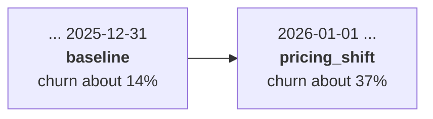

# The synthetic world

> **In short:** All customer data is generated by a small, explicit model of a subscription
> business (`churn_platform/data/generator.py`). It produces realistic customer attributes,
> decides each customer's churn with a hidden formula, and can switch between behaviour
> "profiles" on configured dates. The same code produces the training data and the
> production traffic, so production behaves exactly like the world the model learned from -
> until the world changes.

## Contents

- [Why a simulated world](#why-a-simulated-world)
- [What one row represents](#what-one-row-represents)
- [How customer attributes are generated](#how-customer-attributes-are-generated)
- [The hidden churn logic](#the-hidden-churn-logic)
- [Profiles](#profiles)
- [The timeline: when the world changes](#the-timeline-when-the-world-changes)
- [Training extracts: the "data warehouse"](#training-extracts-the-data-warehouse)
- [Production traffic and hidden outcomes](#production-traffic-and-hidden-outcomes)
- [Characteristics of the data](#characteristics-of-the-data)
- [Limitations](#limitations)

---

## Why a simulated world

The platform must demonstrate three things that are hard to show with real data:

1. **Drift** - customer behaviour changes at a known moment;
2. **Delayed ground truth** - the true outcome of a prediction becomes known only later;
3. **Retraining** - a model trained on newer data does better after the change.

A simulated world makes all three controllable and reproducible, with no privacy concerns.
The important rule: only the **generator and the simulators** know how the world works and
when it changes. Monitoring and retraining are never told - they must discover the change from
data.

---

## What one row represents

One row is one **active customer observed on a snapshot date**. Every attribute describes
the customer *as of* that date. The label `churned_30d` says whether the customer
voluntarily cancelled during the **30 days after** the snapshot.

| Column | Type | Allowed values | Meaning |
|---|---|---|---|
| `customer_id` | text | - | identifier (not used by the model) |
| `snapshot_date` | date | - | the "as of" date (not used by the model) |
| `plan_tier` | category | `basic`, `standard`, `premium` | subscription plan |
| `contract_type` | category | `monthly`, `annual`, `two_year` | contract length |
| `autopay_enabled` | boolean | true / false | automatic payment active |
| `recent_price_increase` | boolean | true / false | the price went up in the last 60 days |
| `tenure_months` | integer | 0-240 | months since the customer joined |
| `monthly_charge` | number | 1-1000 | current monthly price |
| `payment_failures_90d` | integer | 0-30 | failed payments in the last 90 days |
| `late_payments_12m` | integer | 0-24 | late payments in the last 12 months |
| `monthly_usage_hours` | number | 0-744 | product usage this month |
| `sessions_30d` | integer | 0-3000 | log-ins in the last 30 days |
| `days_since_last_login` | integer | 0-365 | days since the last log-in |
| `usage_trend_pct` | number | -1 to 5 | usage change vs. the previous period (-0.2 = 20% less) |
| `support_tickets_90d` | integer | 0-100 | support contacts in the last 90 days |
| `complaints_90d` | integer | 0-100, at most the tickets | complaints among those contacts |
| `avg_resolution_hours` | number or empty | 0-2000 | average ticket resolution time; **empty when there were no tickets** |
| `features_adopted` | integer | 0-10 | product features the customer uses |
| `churned_30d` | 0 / 1 | - | **label**: voluntary churn in the next 30 days |

The allowed values are defined once in `churn_platform/data/schema.py` and enforced both by
dataset validation and by the prediction API.

---

## How customer attributes are generated

Attributes are drawn from probability distributions whose parameters come from the active
profile. Many attributes depend on each other, as in a real business:

| Attribute | How it is generated | Realistic dependency |
|---|---|---|
| `tenure_months` | skewed distribution (gamma, mean about 22 months), capped at 180 | many young customers, fewer long-standing ones |
| `plan_tier` | drawn from the profile's plan mix | - |
| `contract_type` | drawn from the profile's contract mix; two-year contracts are switched to monthly for customers under 3 months | new customers rarely hold long contracts yet |
| `autopay_enabled` | profile's autopay rate, +12 points for annual/two-year contracts | contract customers use autopay more |
| `recent_price_increase` | yes with the profile's price-increase rate | - |
| `monthly_charge` | plan's base price (19 / 39 / 69) with ±6% noise, raised by the price increase (profile range), plus optional add-ons (5, 10 or 15 for 30% of customers) | premium costs more; increases raise the price |
| `payment_failures_90d` | random count, 2.5 times more likely without autopay | manual payment fails more often |
| `late_payments_12m` | random count, higher without autopay and with more payment failures | billing problems cluster |
| `monthly_usage_hours` | skewed distribution around the profile's median, scaled by plan (0.8 / 1.0 / 1.3) | premium customers use more |
| `sessions_30d` | about 0.9 sessions per usage hour, plus randomness | more use means more log-ins |
| `days_since_last_login` | longer gaps for customers with few sessions, scaled by the profile's login-gap factor | inactive customers log in rarely |
| `usage_trend_pct` | normal distribution with the profile's mean and spread | - |
| `support_tickets_90d` | profile's ticket rate, +60% after payment failures, +40% after a price increase | billing trouble creates tickets |
| `complaints_90d` | a share (profile's complaint share) of the tickets | complaints are a subset of tickets |
| `avg_resolution_hours` | skewed distribution around the profile's median; empty without tickets | - |
| `features_adopted` | out of 10, depending on the profile's adoption rate, the plan and tenure | loyal, premium customers adopt more |

---

## The hidden churn logic

Each customer's churn probability comes from a formula the models never see (a *logistic
model*: the factors below are added up and turned into a probability between 0 and 1).
Positive factors raise the risk, negative factors lower it. The label is then drawn
randomly from that probability, so even a perfect model makes mistakes.

| Factor | `baseline` | `pricing_shift` | Meaning |
|---|---|---|---|
| starting value (intercept) | 0.45 | 0.15 | overall level |
| new customer (tenure < 6 months) | +1.0 | +1.0 | new customers leave more easily |
| tenure (log scale) | -0.45 | -0.45 | loyalty grows with time |
| monthly contract | +1.2 | **+0.3** | monthly contracts are easy to cancel |
| two-year contract | -1.2 | **-0.3** | long contracts protect |
| recent price increase | +0.8 | **+2.5** | price increases trigger churn |
| monthly charge, per 10 above 40 | +0.12 | **+0.45** | expensive customers are price sensitive |
| autopay enabled | -0.5 | **+0.3** | autopay normally helps; after the change, customers charged the new price automatically react when they notice |
| each payment failure | +0.55 | +0.55 | billing trouble |
| each late payment | +0.25 | +0.25 | billing trouble |
| usage hours (log scale) | -0.7 | -0.7 | engaged customers stay |
| days since last login, per 10 | +0.4 | +0.4 | inactivity |
| usage trend | -2.5 | -2.5 | falling usage is a warning sign |
| each complaint | +0.7 | +0.7 | unhappy customers leave |
| resolution time, per 24 hours | +0.3 | +0.3 | slow support |
| each adopted feature | -0.2 | -0.2 | adoption creates lock-in |

The bold values are the **concept drift**: after the change, the same customer profile has a
different churn risk than before. The `engagement_shift` profile keeps the baseline logic.

---

## Profiles

Profiles are defined in `config/data.yaml`. `baseline` defines every parameter; other
profiles `extend` it and override only what changes.

| Parameter | `baseline` | `pricing_shift` | `engagement_shift` |
|---|---|---|---|
| plan mix (basic / standard / premium) | 45% / 35% / 20% | 40% / 38% / 22% | as baseline |
| contract mix (monthly / annual / two-year) | 55% / 30% / 15% | as baseline | as baseline |
| customers with a recent price increase | 10% | **55%** | as baseline |
| size of the increase | 4-10% | **15-30%** | as baseline |
| payment failure rate | 0.15 | **0.45** | as baseline |
| support ticket rate | 0.6 | **0.8** | as baseline |
| usage median (hours) | 22 | as baseline | **13** |
| usage trend (mean) | 0.0 | as baseline | **-0.20** |
| login-gap factor | 1.0 | as baseline | **1.8** |
| feature adoption rate | 0.45 | as baseline | **0.32** |
| churn logic | baseline | **changed** (see above) | as baseline |

- **`pricing_shift`** is covariate drift *and* concept drift: inputs change and customers
  react to them differently. A model trained before the change keeps working technically but
  ranks customers noticeably worse.
- **`engagement_shift`** is pure covariate drift: inputs change, the churn logic does not. It is
  available for experiments with `churnctl traffic send --profile engagement_shift`.

---

## The timeline: when the world changes

```yaml
timeline:
  - {start: "2000-01-01", profile: baseline}
  - {start: "2026-01-01", profile: pricing_shift}
```

Each generated customer uses the profile that is active on its snapshot date. Snapshots up
to 31 December 2025 follow `baseline`; from 1 January 2026 they follow `pricing_shift`. The
configuration loader checks that the entries are in order and refer to existing profiles.



---

## Training extracts: the "data warehouse"

A training dataset is an extract taken on the date `dataset.as_of` in `params.yaml`:

- 12,000 snapshots (`generation.rows`) with snapshot dates spread evenly over 365 days
  (`generation.window_days`);
- the window **ends 30 days before `as_of`** (`generation.label_window_days`), because only
  snapshots whose 30-day outcome is already known on the extract date can carry a label;
- customer IDs look like `C20260101-000123` (seed plus row number).

| Extract | Snapshot dates | World |
|---|---|---|
| `as_of: 2026-01-01` (first version) | 2024-12-03 to 2025-12-02 | all `baseline` |
| `as_of: 2026-12-31` (after retraining in the demo) | 2025-12-02 to 2026-12-01 | one month `baseline`, eleven months `pricing_shift` |

The retraining controller moves `as_of` to the newest production snapshot date, so newer
extracts contain more of the changed world.

---

## Production traffic and hidden outcomes

```bash
uv run churnctl traffic send --start 2026-01-01 --end 2026-12-31 --count 1200
```

The traffic simulator (`churn_platform/simulation/traffic.py`):

1. draws `--count` snapshot dates evenly between `--start` and `--end`;
2. picks each customer's profile from the timeline (or `--profile` if given);
3. generates the customers **and their true outcomes** with the same generator;
4. stores the outcomes in `simulation.customer_outcomes` - hidden from the platform, like a
   billing system that will report cancellations later;
5. sends each snapshot to `POST /predict`.

| Option | Default | Purpose |
|---|---|---|
| `--count` | 500 | number of customers |
| `--profile` | from the timeline | force a profile, e.g. `engagement_shift` |
| `--seed` | derived from the dates and profile | same arguments replay the same customers; set a seed for new ones |
| `--invalid-share` | 0 | share of deliberately broken requests (tenure -1), to exercise validation and error metrics |
| `--concurrency` | 4 | parallel requests |

Customer IDs look like `T963580-000042` (seed plus number). The hidden outcomes are revealed
by `churnctl labels resolve` - see [delayed-ground-truth.md](delayed-ground-truth.md).

---

## Characteristics of the data

Measured on large samples from the generator:

| Property | `baseline` | `pricing_shift` |
|---|---|---|
| churn rate | about 13.6% | about 37% |
| best achievable ROC-AUC (using the hidden formula itself) | about 0.85 | about 0.88 |
| ROC-AUC of the *baseline* formula applied to the shifted world | - | about 0.77 |

The last row is the core of the demo: knowledge from before the change is still useful but
clearly worse after it, so retraining on newer data pays off.

Generation is **deterministic**: the same seed, row count, `as_of` date and configuration
produce byte-identical files. Re-running the pipeline therefore does not create a new
dataset version by accident.

---

## Limitations

- Each customer appears in only one snapshot; there is no customer history across months.
- The churn logic is a single logistic formula - realistic in its effects, simpler than
  real behaviour.
- Profiles switch on one date; gradual transitions are not modelled.

Related: [data-pipeline.md](data-pipeline.md), [leakage-controls.md](leakage-controls.md),
[demo-walkthrough.md](demo-walkthrough.md).
