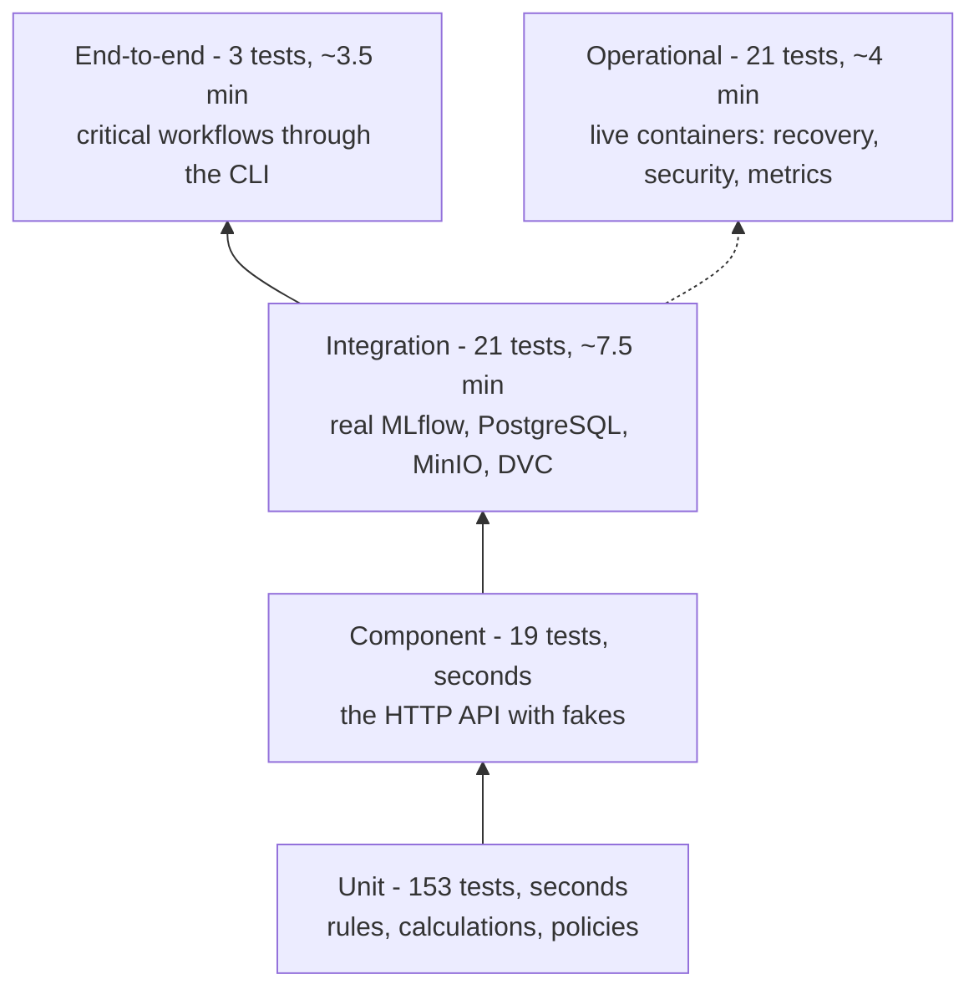

# Testing strategy

> **In short:** The platform has 217 automated tests in five layers. Each behaviour is tested
> at the **cheapest layer that can prove it**: pure rules (quality gate, retraining policy,
> leakage protection, lifecycle transitions) are fast unit tests; behaviour that depends on
> real MLflow, PostgreSQL, MinIO or DVC is tested against the running stack; three end-to-end
> tests cover the critical workflows; and operational tests break real containers to prove
> recovery, security and observability. The 172 unit and component tests run in about 20
> seconds without Docker.

## Contents

- [The test layers](#the-test-layers)
- [How to run the tests](#how-to-run-the-tests)
- [Choosing the layer for a behaviour](#choosing-the-layer-for-a-behaviour)
- [Unit tests](#unit-tests)
- [Component tests](#component-tests)
- [Integration tests](#integration-tests)
- [End-to-end tests](#end-to-end-tests)
- [Operational tests](#operational-tests)
- [Test isolation](#test-isolation)
- [Deliberately not tested](#deliberately-not-tested)
- [Linting and dependency audit](#linting-and-dependency-audit)
- [Adding a test](#adding-a-test)

---

## The test layers



| Layer | Tests | Needs | Duration | Command |
|---|---|---|---|---|
| unit | 153 | nothing | ~20 s together with component | `uv run pytest` |
| component | 19 | nothing (the API runs in-process with fakes) | (included above) | `uv run pytest` |
| integration | 21 | the running stack | ~7.5 min | `uv run pytest -m integration` |
| end-to-end | 3 | the running stack | ~3.5 min | `uv run pytest -m e2e` |
| operational | 21 | the running stack **with a served champion** | ~4 min | `uv run pytest -m operational` |

The shape follows the project rule "many cheap tests, few expensive ones": most rules can be
proven in milliseconds, so only behaviour that truly depends on real infrastructure pays for
the slower layers.

---

## How to run the tests

**Fast tests** (no Docker needed, run by default):

```bash
uv run pytest
```

Expected: `172 passed, 45 deselected`. The 45 deselected tests are the stack-based layers.

**Stack-based tests** need the platform running:

```bash
uv run churnctl bootstrap
```

```bash
uv run pytest -m integration
```

```bash
uv run pytest -m e2e
```

**Operational tests** additionally need a served champion (the state after the
[demo walkthrough](demo-walkthrough.md), or after promoting any model and running
`uv run churnctl serving reload`):

```bash
uv run pytest -m operational
```

Good to know:

- Run the operational suite **on its own**. It restarts and breaks containers (always
  restoring them), which would disturb other tests running at the same time.
- If the stack is not running, stack-based tests fail at once with "not reachable - start the
  stack with `churnctl bootstrap`" instead of hanging. If no champion is served, operational
  tests say "promote a champion first".
- The layers are selected with pytest *markers* (labels on tests) defined in
  `pyproject.toml`; `--strict-markers` rejects misspelled markers.
- A single test can be run by name, for example
  `uv run pytest tests/unit/test_quality_gate.py -k segment`.

---

## Choosing the layer for a behaviour

| Question | Layer |
|---|---|
| Is it a rule or calculation that works on plain Python data? | **unit** |
| Is it about what the HTTP API accepts, answers or exposes? | **component** |
| Does it only work correctly together with real MLflow, PostgreSQL, MinIO or DVC? | **integration** |
| Is it a workflow an operator depends on, crossing many components? | **end-to-end** (only if it is critical) |
| Is it a property of running containers (health, restarts, users, ports, scraping)? | **operational** |

A behaviour is tested at one layer. Higher layers check that components work *together*;
they do not repeat the edge cases of lower layers. For example, every quality gate threshold
is a unit test, the integration test checks that a weak candidate is rejected *through the
real registry*, and the end-to-end test only checks that the full flow reaches promotion.

---

## Unit tests

Location: `tests/unit/`. Pure logic, no network, no files outside `tmp_path`.

| Module | What it protects |
|---|---|
| `test_data_generation.py` | the same seed reproduces identical data; different seeds give different customers; data satisfies the schema; labels only for closed 30-day windows; the timeline switches profile on the configured date; shift profiles move their target features |
| `test_data_validation.py` | every domain rule; outcome-leaking columns are detected; features never contain the label or identifiers; duplicates, open outcome windows and implausible churn rates are rejected |
| `test_time_split.py` | periods follow each other in time; outcome windows never reach into the next period (the purge gap); every row is assigned or purged; no customer appears in two periods; too little data fails loudly |
| `test_config.py` | profiles inherit the baseline; invalid settings are rejected when loaded |
| `test_features.py` | derived feature values; the new-customer boundary; missing columns rejected; label and extra columns cannot reach the model; column order does not matter; unknown categories are refused instead of scored |
| `test_model_quality.py` | every algorithm beats the no-skill baseline; the skops round trip keeps predictions identical; the fingerprint detects any change and is identical on every operating system |
| `test_metrics.py` | confusion counts; threshold selection maximises validation F1; the no-skill baseline; segment metrics and reliability; winner selection with ROC-AUC tie-break |
| `test_quality_gate.py` | every threshold (including the exact boundary); damaged models fail first; weak reliable segments reject; unreliable segments are not enforced; champion comparison tolerance; an overall gain cannot hide a segment regression; accuracy never decides |
| `test_lifecycle_states.py` | allowed and forbidden alias transitions; promotion blockers (stale gate, missing approval, current champion); rollback target choice; registration requirements |
| `test_serving_contract.py` | the API schema covers exactly the model features with training ranges; rows converted by the API score exactly like training rows; risk levels follow the threshold |
| `test_monitoring_analysis.py` | how predictions become a monitoring dataset; how Evidently results are read; drift threshold boundaries; prediction drift judged separately; structural vs. real missing values; performance waits for enough outcomes; the outcome window rule |
| `test_retraining_policy.py` | minimum observations; severe vs. mild drift; delayed performance drops; the exact limit is tolerated; data-quality issues block; open requests and cooldown prevent duplicates |
| `test_traffic_simulator.py` | deterministic replay; dates follow the timeline; every valid simulated request satisfies the API contract |
| `test_stack_cli.py` | distinct random secrets; an existing `.env` is never overwritten; reset removes read-only DVC cache files |

---

## Component tests

Location: `tests/component/test_inference_api.py`. The real FastAPI application is called
over HTTP (FastAPI's test client), with a small in-process model and a fake prediction store
instead of MLflow and PostgreSQL. This is the cheapest way to prove the API contract.

| Behaviour | Why it matters |
|---|---|
| a valid request returns a prediction from the served version and records it | the core contract, including lineage in every answer |
| invalid requests are rejected with 422 before reaching the model | bad input never produces a score |
| `/health`, `/ready` and `/model` report the loaded champion and its lineage | orchestration and operators rely on them |
| a load failure (damaged model, no champion) keeps the service alive but not ready, and is counted | the service never serves without a verified model |
| the service becomes ready once the registry is reachable again | automatic recovery |
| an unrecorded prediction is refused in `reject` mode and served in `serve` mode | both persistence policies behave as documented |
| readiness requires the prediction store in `reject` mode | load balancers stop sending traffic that would fail |
| metrics expose requests, predictions and model identity | dashboards and alerts depend on them |
| bodies above 16 KB are refused | protection against oversized requests |

---

## Integration tests

Location: `tests/integration/`. Each test runs against the real Docker Compose services inside
an isolated sandbox ([Test isolation](#test-isolation)).

| Module | Behaviour proven with real infrastructure |
|---|---|
| `test_tracking_storage.py` | run metadata is readable by an independent client; artifacts are physically in the MinIO bucket |
| `test_dvc_versioning.py` | data pushed to MinIO, deleted locally and pulled back is byte-identical; an older dataset version can be restored from Git + DVC |
| `test_training_and_registration.py` | one run per algorithm with lineage matching `dvc.lock`; the run keeps its configuration; the winner ships its monitoring reference; the stored model loads in a fresh process; a wrong fingerprint is refused; registration creates exactly one candidate |
| `test_promotion_lifecycle.py` | a weak candidate is rejected and the champion is untouched; promotion and rollback only move aliases and write audit events |
| `test_serving_with_registry.py` | the API loads the verified champion from the registry; predictions are stored with the serving version; the inference role may insert but not read |
| `test_monitoring_pipeline.py` | drift is detected only after the world changes, and exactly one retraining request is created; each run is recorded with its Evidently report; delayed outcomes resolve only closed windows and enable performance monitoring |
| `test_retraining_controller.py` | a retraining request trains on the requested data; a rejected candidate leaves the champion; a failed pipeline is isolated and the request can be retried; only one open request and one claim per request |

---

## End-to-end tests

Location: `tests/e2e/test_lifecycle_e2e.py`. Three critical workflows, driven exactly like an
operator would: through the real `churnctl` commands and a real inference server process.

| Workflow | Proves |
|---|---|
| **initial lifecycle** | data -> DVC -> training -> MLflow -> register -> gate -> promote -> the server answers with the promoted version |
| **drift lifecycle** | baseline and shifted traffic -> monitoring detects drift -> retraining request -> controller -> new candidate -> gate -> promotion, while the running server stays ready and keeps serving the old version until reloaded |
| **rollback** | the champion alias returns to the previous version -> reload -> the previous model serves again |

The workflows build on each other, so each is a module-scoped fixture that runs once and in
order. Gate thresholds, policy rules and API validation are deliberately not repeated here.

---

## Operational tests

Location: `tests/operational/`. They check the **live** stack - the actual containers a user
runs - and restore everything they break.

| Module | Checks |
|---|---|
| `test_stack_runtime.py` | all long-running services are healthy; every published port is bound to `127.0.0.1`; MLflow runs and artifacts survive restarts of PostgreSQL, MinIO and MLflow |
| `test_observability.py` | Prometheus scrapes the API; generated traffic moves the dashboard metrics by the expected amounts; Grafana's data sources work and its dashboards are provisioned |
| `test_security_boundaries.py` | each storage key is denied on the other bucket; services run as non-root; the API and worker have read-only filesystems; the API exposes no lifecycle operations |
| `test_failure_recovery.py` | a PostgreSQL restart does not break serving; a loaded champion keeps serving while MLflow is down; an API started during an MLflow outage becomes ready by itself; a corrupted model file is refused by gate, promotion and API; a missing model file leaves the API not ready |

The recovery behaviour these tests prove is described in
[failure-recovery.md](failure-recovery.md).

---

## Test isolation

Stack-based tests must never change the demo model or data, and must not depend on each
other.

| Mechanism | What it isolates |
|---|---|
| **Isolated workspace** (`tests/support/workspace.py`) | a copy of the project with its own Git repository, DVC cache and MinIO prefix, so tests can commit, change parameters and push data freely |
| **Lifecycle sandbox** (`tests/support/lifecycle.py`) | adds a unique MLflow experiment and registered-model name, and pins the dataset date to `2026-01-01`, so results do not depend on the state of your working copy |
| **Clean-up** | the sandbox deletes its registered model, experiments, database rows, simulated outcomes and stored objects afterwards |
| **Deterministic data** | fixed seeds everywhere; the same test always sees the same customers |

Operational tests are the one deliberate exception: their purpose is to check the live stack
itself, including the model it currently serves.

---

## Deliberately not tested

| Not tested | Why |
|---|---|
| configuration files as text | the loaders reject invalid files (unit-tested), and operational tests check the resulting runtime behaviour |
| Evidently's statistics themselves | that is the library's job; the tests check how its results are interpreted and that a real shift is detected |
| third-party behaviour (MLflow's registry, DVC's hashing) | used through integration tests, not re-tested |
| Grafana panel rendering | data sources and dashboard provisioning are tested; panel appearance was checked by hand |
| hardware-dependent timings | latency is checked by the quality gate with a generous limit, not by strict test timings |

---

## Linting and dependency audit

Code style and common mistakes (unused imports, undefined names, import order):

```bash
uv run ruff check src tests
```

Expected: `All checks passed!`

Known vulnerabilities in dependencies:

```bash
uv run pip-audit --skip-editable
```

The two current findings and why they are accepted are in
[security.md](security.md#dependency-scanning).

---

## Adding a test

1. Decide the layer with the table in [Choosing the layer](#choosing-the-layer-for-a-behaviour).
2. Name the test after the behaviour, as a sentence:
   `test_weak_reliable_segment_rejects_the_candidate`, not `test_gate_3`.
3. Keep the Arrange-Act-Assert structure: prepare the input, perform one action, check the
   result.
4. Reuse the helpers in `tests/support/` (`small_dataset`, `valid_payload`,
   `LifecycleSandbox`) instead of building infrastructure in the test.
5. Stack-based tests get a marker (`pytestmark = pytest.mark.integration`) and must clean up
   everything they create.

## Related documents

- [failure-recovery.md](failure-recovery.md) - failure behaviour proven by operational tests
- [security.md](security.md) - security properties and their tests
- [codebase-guide.md](codebase-guide.md) - where the tested code lives
