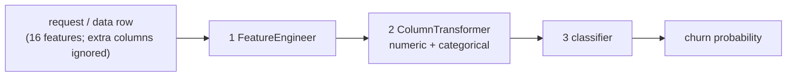

# Training and evaluation

> **In short:** Each training cycle trains three standard algorithms on the training period,
> tunes each one's decision threshold on the validation period, and picks the one with the
> best validation F1 as the winner. Only the winner is then scored on the untouched test
> period - overall, per customer segment and for response time. Everything is recorded in
> MLflow. Winning makes a model a *candidate*; it still has to pass the
> [quality gate](quality-gate.md) before it can serve customers.

## Contents

- [The model pipeline](#the-model-pipeline)
- [The algorithms](#the-algorithms)
- [One training cycle, step by step](#one-training-cycle-step-by-step)
- [Choosing the decision threshold](#choosing-the-decision-threshold)
- [Choosing the winner](#choosing-the-winner)
- [Metrics](#metrics)
- [Evaluation on the test period](#evaluation-on-the-test-period)
- [Segment evaluation](#segment-evaluation)
- [Latency measurement](#latency-measurement)
- [The monitoring reference](#the-monitoring-reference)
- [Outputs](#outputs)
- [Tests](#tests)

---

## The model pipeline

Every model is a single scikit-learn `Pipeline` with three steps. The whole object is saved
as one MLflow model, so the API, the quality gate and monitoring use exactly what was
evaluated.

**Step 1 - `FeatureEngineer`** (`churn_platform/features/engineering.py`)

- selects the 16 schema features **by name** (a label, an ID or any other extra column is
  dropped - a built-in leakage guard);
- fixes data types (categories as text, booleans as 0/1, numbers as decimals);
- adds four derived features:

| Derived feature | Formula | Idea |
|---|---|---|
| `charge_per_usage_hour` | monthly charge / (usage hours + 1) | paying a lot for little use |
| `complaint_ratio` | complaints / max(tickets, 1) | how many support contacts were complaints |
| `payment_issues` | payment failures + late payments | overall billing trouble |
| `is_new_customer` | tenure < 6 months (1/0) | new customers leave more easily |

**Step 2 - `ColumnTransformer`** (`churn_platform/features/preprocessing.py`)

| Branch | Columns | Processing | Why |
|---|---|---|---|
| numeric | 12 numeric + 2 boolean + 4 derived features | fill empty values with the median **and add a "was empty" indicator**, then standardise | an empty resolution time means "no tickets" - information worth keeping |
| categorical | `plan_tier`, `contract_type` | one-hot encoding with **fixed category lists**; unknown values raise an error | stable layout across dataset versions; nothing unknown is scored silently |

**Step 3 - classifier**: one of the three algorithms below.

---

## The algorithms

Three well-understood algorithms with fixed settings (`config/training.yaml`). There is no
automatic hyperparameter search - the project is about the lifecycle, not about squeezing
out the last percent.

| Algorithm | Settings | Character |
|---|---|---|
| `logistic_regression` | `C=0.5`, `class_weight=balanced`, `max_iter=2000` | linear, fast, easy to interpret |
| `random_forest` | 150 trees, `max_depth=10`, `min_samples_leaf=10`, `class_weight=balanced_subsample`, 2 parallel jobs | non-linear, robust |
| `hist_gradient_boosting` | `learning_rate=0.05`, 200 iterations, 15 leaves, `min_samples_leaf=40`, `l2_regularization=1.0`, `class_weight=balanced` | strong non-linear learner |

`class_weight=balanced` makes each algorithm pay more attention to the minority class
(churners). `random_state: 42` makes every cycle reproducible.

---

## One training cycle, step by step

The `train` stage (`churn_platform/training/cycle.py`):

1. Loads the training and validation periods. **The test period is not loaded.**
2. Starts a parent MLflow run named `cycle-<timestamp>-<id>` and attaches the lineage files
   (`params.yaml`, `dvc.lock`, `config/data.yaml`, `config/training.yaml`).
3. For each algorithm, in a child run:
   1. builds the pipeline and fits it on the training period;
   2. predicts probabilities for the validation period and chooses the threshold;
   3. computes validation metrics;
   4. logs parameters, metrics and lineage tags;
   5. saves the model (skops format, with the threshold in its metadata), downloads it
      again, computes its SHA-256 fingerprint and records it.
4. Chooses the winner and records it on the parent run.
5. Writes `reports/training_summary.json`.

Results of the first cycle:

| Algorithm | Validation F1 | Recall | ROC-AUC | Threshold |
|---|---|---|---|---|
| **logistic_regression** (winner) | **0.514** | 0.712 | 0.856 | 0.60 |
| random_forest | 0.502 | 0.566 | 0.845 | 0.54 |
| hist_gradient_boosting | 0.496 | 0.528 | 0.839 | 0.67 |

The data's churn logic is close to linear, so the simplest model wins - a useful reminder
that more complex is not automatically better.

---

## Choosing the decision threshold

A model outputs a probability; the business needs a yes/no decision. The **decision
threshold** is the probability at or above which a customer counts as "will churn".

For each model, the platform tries every threshold from 0.05 to 0.90 in steps of 0.01 on the
validation period and keeps the one with the highest F1. If several thresholds tie, the
lowest wins, which favours catching churners (recall) - missing a churner is usually more
expensive than one unnecessary retention offer.

The chosen threshold is stored **inside the saved model** (`decision_threshold` in the MLflow
model metadata), so the gate, monitoring and the API all use the same value.

---

## Choosing the winner

The winner has the highest validation F1 (`selection_metric: f1`). Ties are broken by
ROC-AUC, then by algorithm name, so the choice is always deterministic.

---

## Metrics

| Metric | Plain meaning | Role |
|---|---|---|
| **F1** | balance of precision and recall | **primary** - used for the winner and by the gate |
| **Recall** | share of real churners the model catches | required - the gate enforces a minimum |
| **ROC-AUC** | how well the model *ranks* churners above non-churners, independent of the threshold | required - the gate enforces a minimum |
| Precision | share of churn warnings that are right | reported |
| PR-AUC | ranking quality focused on the minority class | reported |
| Confusion counts (tp, fp, tn, fn) | the four kinds of right and wrong answers | reported |
| Accuracy | share of all answers that are right | **recorded only** - with about 13% churners, a model that never predicts churn would score about 87% |

Every evaluation also reports the **no-skill baseline**: predicting "churn" for everyone
gives F1 = 2p / (1 + p) where p is the churn rate, and ROC-AUC 0.5. A useful model must beat
it clearly.

---

## Evaluation on the test period

The `evaluate` stage (`churn_platform/training/evaluation.py`):

1. Loads the winner **back from MLflow** through the verified loader. This also proves the
   stored file is complete and loadable.
2. Scores the test period (the newest 60 days) with the model's own threshold.
3. Computes overall metrics, segment metrics, latency and the no-skill baseline.
4. Logs everything to the winner's MLflow run and writes `reports/evaluation.json`.

First model on its test period:

| F1 | Recall | Precision | ROC-AUC | No-skill F1 |
|---|---|---|---|---|
| 0.501 | 0.674 | 0.398 | 0.848 | 0.232 |

In plain words: the model finds two out of three churners; when it raises a churn warning it
is right about 40% of the time - three times better than chance, since only 13% of customers
churn.

---

## Segment evaluation

An average can hide a group the model serves badly, so metrics are also computed per
customer group:

| Segment column | Values |
|---|---|
| `plan_tier` | basic, standard, premium |
| `contract_type` | monthly, annual, two_year |
| `tenure_segment` | `new` (tenure below 6 months), `established` |

A segment with fewer than 50 rows, or with only churners or only non-churners, is still
reported but marked `reliable: false`; the quality gate ignores it because metrics on a
handful of rows are mostly noise. `tenure_segment` exists only for evaluation - it is never a
model input.

First model, test period:

| Segment | Rows | Churn rate | F1 | Recall |
|---|---|---|---|---|
| plan_tier = basic | 909 | 12.7% | 0.518 | 0.739 |
| plan_tier = standard | 690 | 13.3% | 0.475 | 0.620 |
| plan_tier = premium | 392 | 13.8% | 0.504 | 0.630 |
| contract_type = monthly | 1,121 | 18.4% | 0.533 | 0.752 |
| contract_type = annual | 611 | 8.0% | 0.339 | 0.388 |
| contract_type = two_year | 259 | 2.3% | 0.444 | 0.333 |
| tenure_segment = new | 337 | 32.9% | 0.593 | 0.919 |
| tenure_segment = established | 1,654 | 9.1% | 0.412 | 0.493 |

Customers on long contracts and established customers rarely churn, and the few who do are
harder to spot. This is why the gate's per-segment recall floor is modest (0.25).

---

## Latency measurement

Online serving predicts one customer at a time, so the evaluate stage measures exactly that:
after one warm-up call, it times 200 single-row predictions and reports p50, p95 and maximum
in milliseconds. Typical p95: 7-10 ms on a laptop. The gate allows up to 50 ms.

---

## The monitoring reference

The evaluate stage also saves the test-period rows together with **this model's own
predictions** as `reference/reference.parquet` (up to 5,000 rows) on the winner's run.
Monitoring later compares production data and predictions with exactly this file
([ml-monitoring.md](ml-monitoring.md)).

---

## Outputs

| Where | What |
|---|---|
| each algorithm's MLflow run | parameters, `val_*` metrics, the model, tags `model.fingerprint` and `model.uri`, lineage tags |
| the winner's run, in addition | `test_*`, `latency_*` and `baseline_*` metrics; `evaluation/test_metrics.json`; `evaluation/segments.json`; `reference/reference.parquet`; tag `evaluation.completed=true` |
| the cycle's parent run | winner tags, `winner_val_*` metrics, `lineage/` files |
| `reports/training_summary.json` | cycle ID, every candidate (run, model URI, fingerprint, threshold, validation scores), the winner |
| `reports/evaluation.json` | the winner's test metrics, segments, latency, no-skill baseline |

What is logged in MLflow and how to read it: [experiment-tracking.md](experiment-tracking.md).

---

## Tests

| Behaviour | Test |
|---|---|
| every algorithm clearly beats the no-skill baseline (ROC-AUC > 0.75, F1 > baseline + 0.1) | `tests/unit/test_model_quality.py` |
| every algorithm survives saving and loading in the safe format with identical predictions | `tests/unit/test_model_quality.py` |
| the fingerprint changes when any file changes, and is the same on every operating system | `tests/unit/test_model_quality.py` |
| threshold selection, metrics, segment reliability and winner tie-breaks | `tests/unit/test_metrics.py` |
| derived features, the leakage guard, unknown categories | `tests/unit/test_features.py` |
| a full cycle logs three runs with lineage and an evaluated, loadable winner | `tests/integration/test_training_and_registration.py` |
